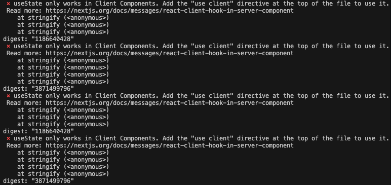
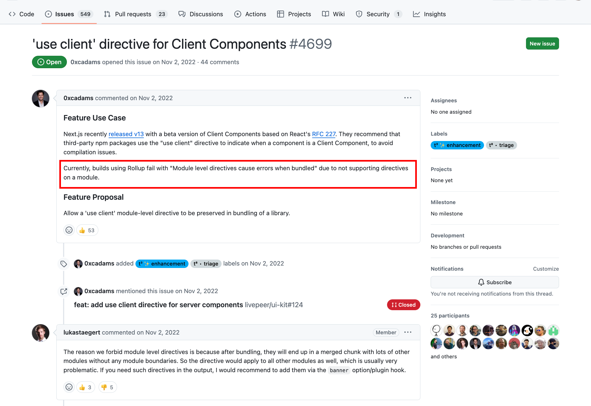
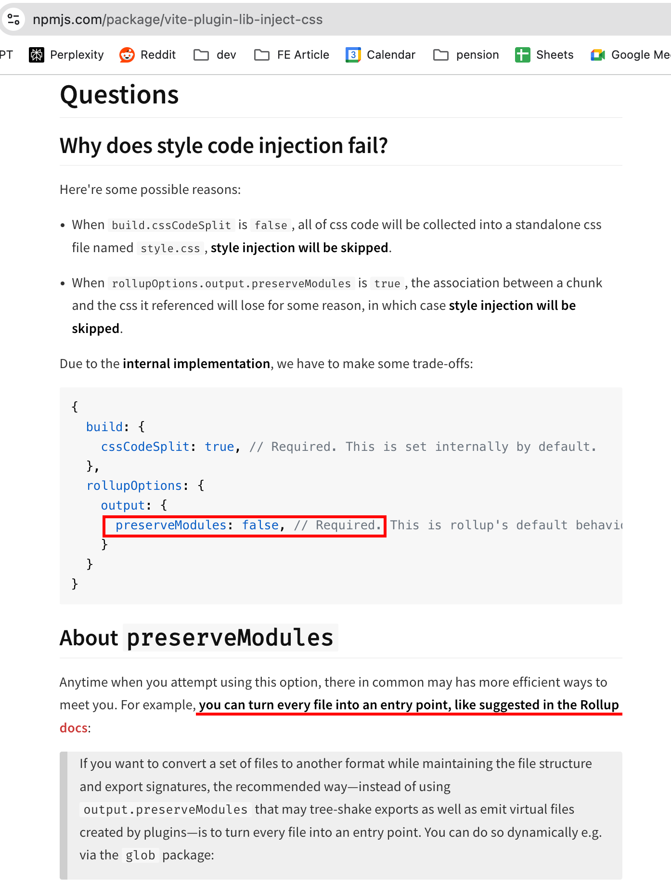
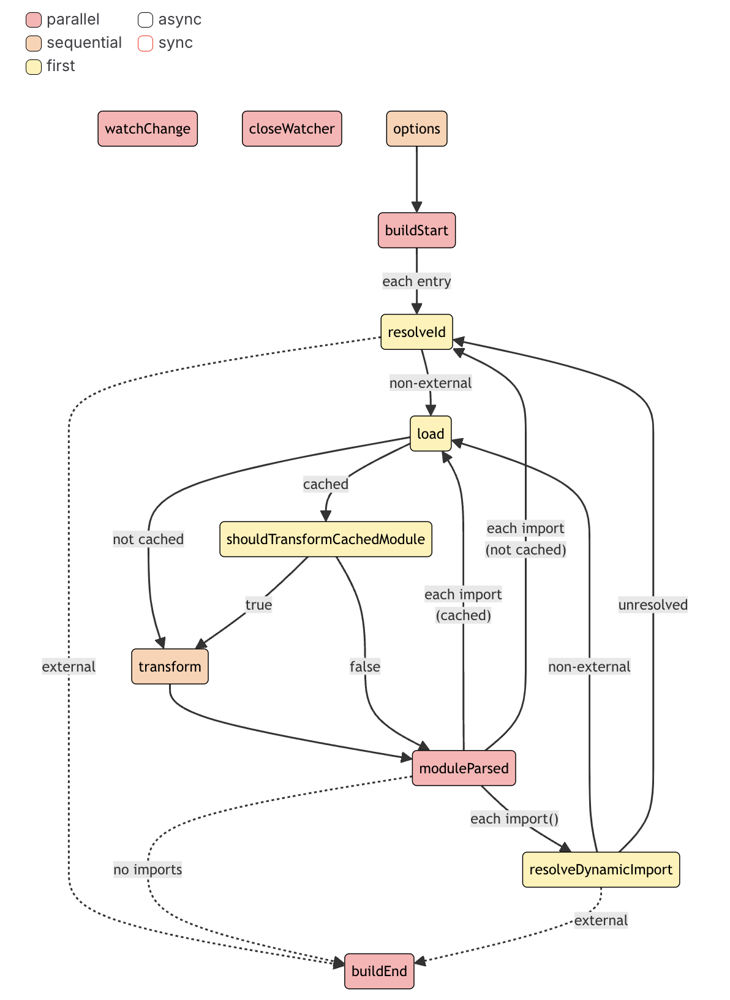
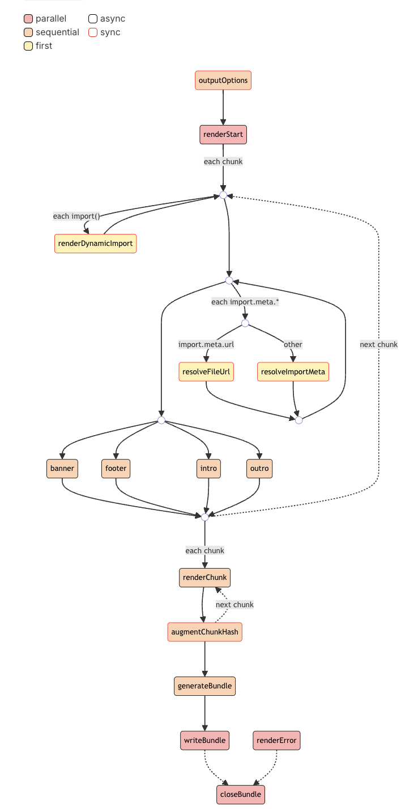
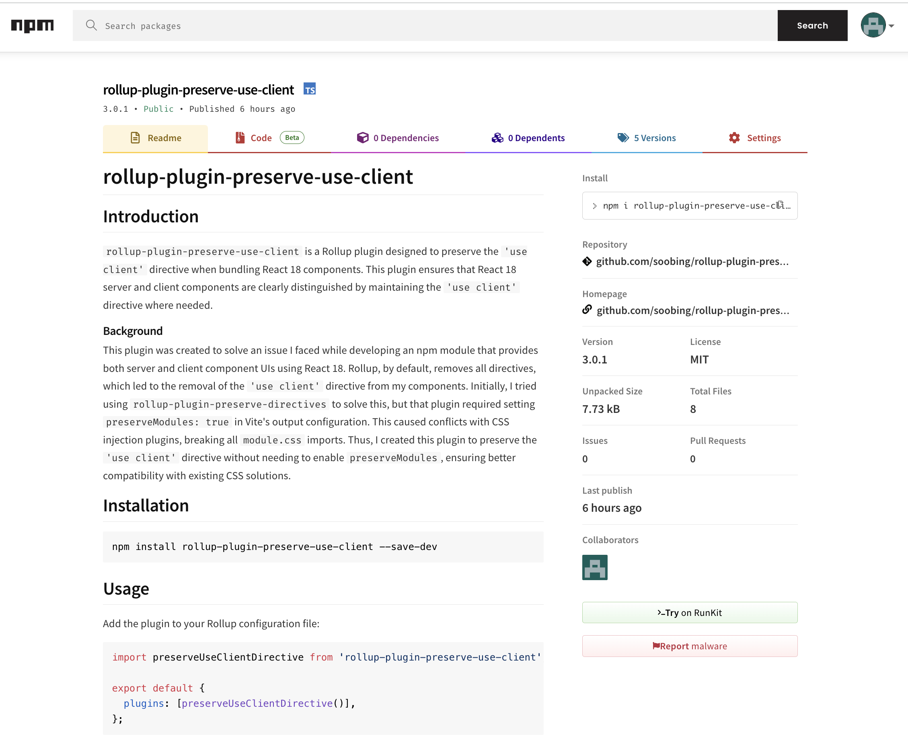

## TL;DR;

Next.js에서 React 18 라이브러리를 사용하면서 `'use client'` 디렉티브 문제를 해결하기 위해 [**rollup-plugin-preserve-use-client**](https://www.npmjs.com/package/rollup-plugin-preserve-use-client) 플러그인을 개발한 과정을 공유합니다.  [rollup-plugin-preserve-directives](https://github.com/Ephem/rollup-plugin-preserve-directives) 을 사용할 수 없었던 이유와, `preserveModules` 옵션을 `false`로 사용하면서 *클라이언트 컴포넌트*에만 `'use client'` 디렉티브를 유지할 수 있는 방법을 찾는 과정을 설명합니다.


## 1. 개발하게 된 배경

저는 React 18을 활용한 UI 라이브러리를 개발하여 npm 모듈을 만들었습니다. 이 UI 라이브러리를 활용하여 Next.js 프로젝트에서 사용하려던 중 아래와 같은 문제를 마주치게 되었습니다.


*useState only works in Client Components... 에러 발생*

문제의 원인을 파악하다가, 처음에는 UI 라이브러리에 클라이언트 컴포넌트와 서버 컴포넌트를 분리하여 번들링하지 않아서 발생하는 문제라고 생각했습니다. 관련해서 아래와 같은 글을 참고했었습니다.

- [How to support React Server Components in your library](https://www.bekk.christmas/post/2023/19/keep-up-with-react-server-components-how-to-support-it-in-your-library)

그러나 UI 라이브러리는 파일마다 청크를 생성하고 있었기 때문에 이는 잘못된 접근임을 알 수 있었습니다. 다시한번 에러 로그에 집중해서 문제의 원인을 찾기 위한 삽질을 하다보니, 아래와 같은 이슈를 확인할 수 있었습니다.

* [‘use client’ directive for Client Components #4699](https://github.com/rollup/rollup/issues/4699)


*'use client' directive for Client Components issue #4699*

[**@0xcadams**](https://github.com/0xcadams)가 제기한 이슈 내용을 살펴보면,

  * [Next.js 13](https://nextjs.org/blog/next-13)의 클라이언트 컴포넌트는 React의 [RFC 227](https://github.com/reactjs/rfcs/blob/main/text/0227-server-module-conventions.md#basic-example)을 기반으로 클라이언트 전용 컴포넌트임을 표시하기 위해 `use client` 디렉티브가 필요합니다. 그러나 현재, Rollup을 사용한 빌드에서 모듈 수준의 디렉티브가 지원되지 않아 빌드 오류가 발생하고 있음을 이슈 제기하고 있습니다.


이에 대해 [**@lukastaegert**](https://github.com/lukastaegert)는,
  * **번들링 시 여러 모듈이 경계 없이 하나의 청크로 합쳐지기 때문**에 모듈 수준 디렉티브를 금지하고 있다고 설명합니다. **모듈 수준 디렉티브를 허용할 경우, 청크 내 모든 모듈에 해당 디렉티브가 적용**되어 문제가 발생할 수 있다는 점도 지적했습니다. 만약 이러한 디렉티브가 출력에 꼭 필요하다면, **배너 옵션**이나 **플러그인 훅**을 통해 추가할 것을 권장합니다.

이 쓰레드를 쭉 읽다보면 [**@Ephem**](https://github.com/Ephem)는 [ollup-plugin-preserve-directives](https://github.com/Ephem/rollup-plugin-preserve-directives) 플러그인을 만들어서 소개했고, 저도 이 플러그인을 통해 문제를 해결될 것이라는 부푼 기대감으로 시도를 해보았습니다.

그러나, 위 플러그인은 Rollup의  `preserveModules: true` 설정을 필수로 요구하고 있습니다. 해당 옵션을 `true`로 설정하는 경우 directive는 정상적으로 보존되지만, [vite-plugin-lib-inject-css](https://www.npmjs.com/package/vite-plugin-lib-inject-css) 플러그인과 충돌이 일어나 모든 module.css의 링크가 끊기고 스타일이 제대로 적용되지 않는 새로운 이슈를 발생시켰습니다.

[vite-plugin-lib-inject-css](https://www.npmjs.com/package/vite-plugin-lib-inject-css)의 공식문서를 살펴보면 `preserveModules`가 `true`인 경우, **청크와 참조된 CSS 간의 연관성이 어떤 이유로 인해 손실되며, 이 경우에도 스타일 주입이 생략**된다고 설명하고 있습니다.


*vite-plugin-lib-inject-css 플러그인 옵션*

결국 모든 파일을 entry로 설정하여 preserveModules를 우회하는 방법을 설명하며, 해당 옵션은 필수적으로 `false`로 설정해야 정상적으로 css가 연결됨을 확인 할 수 있었습니다.

이에 `preserveModules` 옵션을 `false`로 사용하면서 클라이언트 컴포넌트에 한해 `"use client"` 디렉티브를 주입하는 플러그인을 직접 개발하기로 결심했습니다.

## 2. Rollup 플러그인 개발을 위한 지식

### [**플러그인 개념과 컨벤션**](https://rollupjs.org/plugin-development/#plugins-overview)

Rollup 플러그인은 properties, build hooks, output generation hooks 중 하나 이상을 포함하는 **객체**입니다. 그래서 작성한 코드를 살펴보면 Plugin 객체를 리턴하는 간단한 함수임을 확인할 수 있습니다.

또한, 작성한 플러그인은 공식문서에서 제공하는 [컨벤션](https://rollupjs.org/plugin-development/#conventions)을 따라야 합니다. 간략하게 소개하면 아래와 같습니다.

- 플러그인 이름은 `rollup-plugin-` 접두사를 사용하여 명확하게 지어야 합니다.
- `package.json`에 `rollup-plugin` 키워드를 포함해야 합니다.
- 플러그인은 테스트되어야 하며 mocha 또는 ava 사용을 권장합니다.
- 문서는 영어로 작성해야 합니다.

### [**Build Hooks**](https://rollupjs.org/plugin-development/#build-hooks)

Rollup은 번들링 과정에서 여러 단계에 걸쳐 다양한 빌드 훅을 제공합니다. 빌드 훅은 Rollup이 번들링을 시작하고 종료하는 과정의 특정 지점에서 호출되며, 플러그인을 통해 이 단계들을 커스터마이징할 수 있습니다. 주요 빌드 훅은 다음과 같습니다.

- `buildStart`: 번들링이 시작될 때 호출되며, 초기화 작업을 수행할 수 있습니다.
- `resolveId`: 모듈 ID를 해결할 때 호출되며, 사용자 정의 모듈 로딩을 구현할 수 있습니다.
- `transform`: 각 모듈을 번들에 포함하기 전에 호출되어 코드를 수정할 수 있습니다.
- `moduleParsed`: 모듈이 파싱된 후 호출되며, 모듈의 메타데이터를 사용할 수 있습니다.
- `buildEnd`: 번들링이 완료된 후 호출되며, 정리 작업을 수행할 수 있습니다.


*Build Hooks 과정*

### [Output Generation Hooks](https://rollupjs.org/plugin-development/#output-generation-hooks)

출력 생성 단계는 번들을 생성하고 최종 출력을 준비하는 중요한 과정으로, 이 단계에서도 다양한 훅이 호출됩니다. 출력 생성 훅을 통해 번들이 만들어지는 방식과 최종 결과물을 커스터마이징할 수 있습니다. 주요 출력 생성 훅은 다음과 같습니다.

- `renderStart`: 출력 생성이 시작되기 전에 호출됩니다.
- `banner`: 번들의 맨 앞부분에 배너를 추가할 때 사용됩니다.
- `renderChunk`: 각 청크가 렌더링될 때 호출되며, 청크의 내용을 수정할 수 있습니다.
- `generateBundle`: 번들이 생성된 후 호출되며, 최종 번들에 대한 추가 작업을 수행할 수 있습니다.


*Output Generation Hooks 과정*

## 3. 플러그인 개발


*rollup-plugin-preserve-use-client 플러그인 완성✨*

플러그인을 개발하기 전, `preserveModules` 옵션을 `false`로 사용하면서 클라이언트 컴포넌트에만 `'use client'` 디렉티브를 유지하는 것이 목표로 삼았습니다. 이를 위해 Rollup의 훅을 어떻게 활용할지, 그리고 디렉티브를 탐지하고 유지하는 방법과 위에서 살펴본 [#4699](https://github.com/rollup/rollup/issues/4699) 이슈의 [**@lukastaegert**](https://github.com/lukastaegert) **우려를 최소화 할 수 있는 방법**이 무엇일지 고민했습니다. 

이에 적용한 방법은 아래와 같습니다.

**1. `moduleParsed` 훅을 통한 초기 모듈 식별**

- `moduleParsed` 훅을 통해 Rollup이 각 모듈을 파싱할 때 `'use client'` 디렉티브가 포함된 모듈을 식별하고, 해당 모듈의 ID를 `useClientFiles`라는 집합(Set)에 저장합니다.
- 이렇게 하면 `'use client'` 디렉티브가 필요한 모듈들을 미리 식별하여 저장합니다.

**2. `generateBundle` 훅을 통한 청크별 모듈 검사**

- `generateBundle` 훅에서는 최종 생성된 각 청크를 순회하며, 청크에 포함된 모든 모듈의 ID를 검사합니다. 여기서 청크에 포함된 모듈 ID 중 하나라도 `useClientFiles`에 포함된 ID가 있다면, 그 청크 상단에만 `'use client';` 지시문을 추가합니다.
- 이 방식은 **필요한 청크에만** `'use client'`를 삽입하므로, 불필요하게 모든 청크에 일괄적으로 지시문이 추가되는 일을 방지합니다.

제가 작성한 플러그인 코드는 아래와 같으며, [`tsup`](https://tsup.egoist.dev/)을 사용해 빠르게 번들링하고 npm에 배포해 보았습니다.

- [**rollup-plugin-preserve-use-client**](https://www.npmjs.com/package/rollup-plugin-preserve-use-client)
- [**github repo**](https://github.com/soobing/rollup-plugin-preserve-use-client#readme)

```tsx
import type { Plugin } from 'rollup';

export default function preserveUseClientDirective(): Plugin {
  const useClientFiles = new Set<string>();

  return {
    name: 'preserve-use-client-directive',
    moduleParsed({ ast, id }) {
      if (ast && ast.body && ast.body[0]?.type === 'ExpressionStatement') {
        const expression = ast.body[0].expression;
        if (
          expression.type === 'Literal' &&
          expression.value === 'use client'
        ) {
          useClientFiles.add(id);
        }
      }
    },
    generateBundle(options, bundle) {
      for (const [, fileData] of Object.entries(bundle)) {
        if (
          fileData.type === 'chunk' &&
          fileData.moduleIds.some((id) => useClientFiles.has(id))
        ) {
          fileData.code = `'use client';\n${fileData.code}`;
        }
      }
    },
  };
}
```

### 4. 마무리

Rollup 플러그인을 직접 개발해보니, 번들링 과정에 대해 깊이 이해할 수 있었습니다. 플러그인 개발이 매우 어렵고 특별한 지식이 필요할 거라 생각했지만, 실제로 플러그인은 간단한 함수이며 Rollup에서 제공하는 다양한 훅을 활용하면 원하는 기능을 쉽게 구현할 수 있음을 경험할 수 있었습니다. 오랜만에 오픈소스에 기여하게 되어 기쁘고, 이 코드가 많은 사람에게 유용하게 쓰이길 바라는 기대감과 테스트 코드도 하루빨리 추가해야겠다는 숙제를 남겨두며 이 글을 마칩니다.