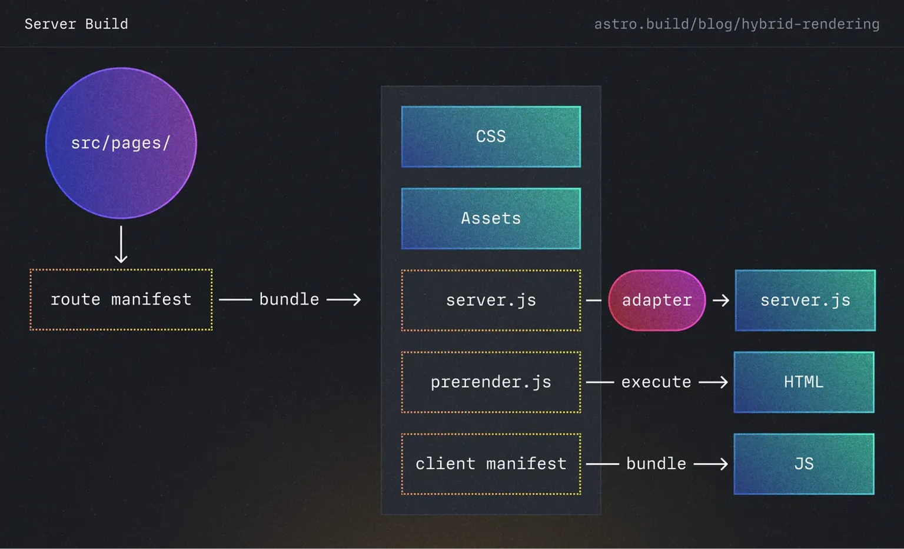
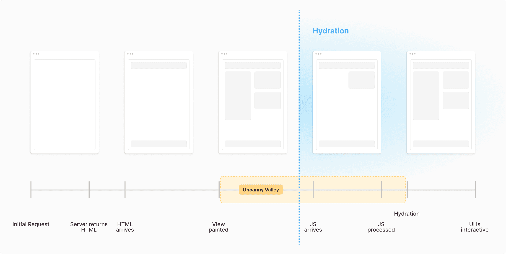
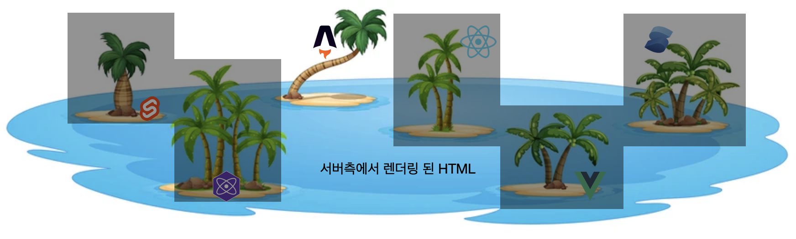

[Astro](https://astro.build/)는 애플리케이션을 구축이 아닌 [콘텐츠에 중점](https://docs.astro.build/ko/concepts/why-astro/#%EC%BD%98%ED%85%90%EC%B8%A0-%EC%A4%91%EC%8B%AC)을 두고 설계된 **정적 사이트 빌더**입니다. 따라서 블로그, 포트폴리오, 이벤트용 마케팅 성격의 사이트 개발에 매우 적합한 프레임워크 입니다.

Astro 컴포넌트에 대해 먼저 간략히 알아보고, 어떻게 여러 프레임워크(React, Preact,Svelte, Vue, SolidJS)를 하나의 프로젝트에서 혼합해서 사용할 수 있는지 알아보도록 하겠습니다.

## Astro 컴포넌트


[Astro 컴포넌트](https://docs.astro.build/ko/basics/astro-components/)는 모든 Astro 프로젝트의 기본 구성 요소입니다. 이는 클라이언트 측 런타임이 없는 HTML 전용 템플릿 컴포넌트로 `.astro` 파일 확장자 사용합니다.

Astro 컴포넌트에 대해 알아야 할 가장 중요한 점은 **클라이언트에서 렌더링되지 않는다**는 것입니다. HTML로 렌더링되며, **컴포넌트 스크립트는 브라우저로 전송되는 최종 페이지에서 모두 제거**됩니다.

### 구성(스크립트 + 템플릿)
`.astro` 파일은 **스크립트와 템플릿**으로 구성됩니다.

- src/components/Pokemon.astro
    
    ```md
    ---
    // 컴포넌트 스크립트 (JavaScript)
    import Banner from '../components/Banner.astro';
    import ReactPokemonComponent from '../components/ReactPokemonComponent.jsx';
    const myFavoritePokemon = [
      /* ... */
    ];
    const { title } = Astro.props;
    ---
    <!-- 컴포넌트 템플릿 (HTML + JS 표현식) -->
    
    <!-- HTML 주석 지원 -->{/* JS 주석 또한 지원 */}
    
    <Banner />
    <h1>안녕하세요!</h1>
    
    <!-- 컴포넌트 스크립트의 props 및 기타 변수를 사용합니다. -->
    <p>{title}</p>
    
    <!-- `client:` 지시어를 사용하여 다른 UI 프레임워크 컴포넌트 렌더링 -->
    <ReactPokemonComponent client:visible />
    
    <!-- JSX와 유사하게 HTML과 JavaScript 표현식을 혼합 -->
    <ul>
      {myFavoritePokemon.map((data) => <li>{data.name}</li>)}
    </ul>
    
    <!-- 템플릿 지시어를 사용하여 여러 문자열이나 객체로부터 클래스 이름을 만들기 -->
    <p class:list={['add', 'dynamic', { classNames: true }]}></p>
    ```
    

## 서버 우선 렌더링

Astro는 **클라이언트 측 렌더링보다 [서버 렌더링](https://docs.astro.build/ko/basics/rendering-modes/)을 최대한 활용**합니다. 기본값인 [정적 사이트 생성(SSG)](https://docs.astro.build/ko/basics/rendering-modes/#%EC%82%AC%EC%A0%84-%EB%A0%8C%EB%8D%94%EB%A7%81)방식을 통해 빌드 시 HTML을 생성하며, [서버 사이드 렌더링(SSR)](https://docs.astro.build/ko/guides/server-side-rendering/)을 사용하는 경우에도 사용자 요청마다 서버에서 HTML을 동적으로 생성합니다.

서버 렌더링을 최대한 활용한다면, 클릭 이벤트 핸들러 연결 등 **interactive한 기능**은 사용하지 못하는 것일까요? 그렇지 않습니다. 이러한 기능은 HTML의 **`<script>`** 태그 내부에 포함되기 때문에 렌더링 이후 클라이언트 측에서 실행되어 hydration 됩니다.

> https://astro.build/blog/hybrid-rendering/



*Astro 2.0 하이브리드 렌더링의 작동 방식*


위의 그림은 Astro 2.0 하이브리드 렌더링의 작동 방식에 관한 도식으로, 정적 분석을 통해 페이지를 사전 렌더링과 서버 렌더링 청크로 분리하여 각각 최적화된 방식으로 처리하는 기술을 설명하고 있습니다.

사전 렌더링을 위한 결과물로는 HTML이 생성되며, **interactive 하게 하기 위한 JS(prerenderer.js) 또는 CSR용 컴포넌트 관련 JS(client manifest)들은 따로 번들화되어 브라우저로 전송**됩니다. [어댑터(adapter)](https://docs.astro.build/ko/reference/configuration-reference/#adapter)는 server.js를 Netlify, Vercel과 같은 특정 호스팅 제공업체와 연결하여 SSR을 처리할 수 있게 합니다. 

이러한 하이브리드 렌더링 방식은 SSG와 SSR의 유연성을 모두 활용할 수 있게 해줍니다.

Astro에서는 위와 같이 서버 우선 접근 방식을 사용하면서 **필요한 경우에 클라이언트 사이드 렌더링(CSR)을 선택할 수 있습니다.** 이는 Astro 아일랜드에서 더 자세히 알아보도록 하겠습니다.

### Uncanny Valley

> 서버 렌더링..! 정말 모든 문제를 해결해주는 최고의 솔루션일까?   
> 🙅🏻‍♀️ Nope!

서버 렌더링은 더 빠른 First Contentful Paint를 제공하지만 항상 더 빠른 Time To Interactive를 제공하지는 않습니다. **웹사이트와 상호 작용하기 위해 필요한 JavaScript 번들이 로드되고 처리된 후에야** 핸들러가 연결 됩니다. 버튼은 상호 작용이 가능해 보일 수 있지만 hydration 전까진 상호 작용이 불가능합니다.


*Hydration 작동 방식*

사용자가 화면에서 non-interactive UI를 보는 시간을  **Uncanny Valley(불편한 골짜기)** 라고 합니다. UI가 화면에 보이기에, 사용자는 웹사이트와 상호 작용할 수 있다고 생각하지만 아직 구성 요소에 핸들러가 연결되어 있지 않아 정지된 것처럼 보일 수 있어 실망스러운 경험이 될 수 있습니다.

Uncanny Valley 문제를 해결하기 위해 **Selective(Partial) Hydration, Progressive Hydration** 개념이 등장하게 되었습니다.

### Selective(Partial) Hydration

Selective Hydration은 페이지의 **특정 부분만** 하이드레이션하는 기술입니다.

- **무엇(WHAT)을 하이드레이션 할 것인가**에 초점을 맞춥니다.
- 개발자나 컴파일러가 애플리케이션의 구조를 분석하여 JavaScript가 필요한 부분만 선별적으로 하이드레이션합니다.
- 정적인 부분과 동적인 부분을 구분하여 필요한 부분(동적인 부분)만 하이드레이션함으로써 전체적인 JavaScript 사용량을 줄일 수 있습니다.

Astro에서는 컴포넌트 수준에서 Partial Hydration을 구현합니다. `client:*` 지시어를 사용하여 특정 컴포넌트만 클라이언트 사이드에서 하이드레이션 되도록 지정할 수 있습니다.

### Progressive Hydration

Progressive Hydration은 페이지의 하이드레이션을 **점진적으로 수행**하는 기술입니다.

- **언제(WHEN) 하이드레이션을 수행할 것인가**에 초점을 맞춥니다.
- 애플리케이션을 한 번에 완전히 하이드레이션하지 않고, 데이터의 일부분씩 클라이언트로 전송하여 부분적으로 하이드레이션합니다.
- 특정 이벤트(예: 버튼 클릭)나 컴포넌트가 뷰포트에 들어올 때 등 특정 조건에 따라 하이드레이션이 진행됩니다.

Astro에서는 `client:visible`이나 `client:idle` 등의 지시어를 사용하여 Progressive Hydration을 구현합니다. 이를 통해 컴포넌트가 화면에 표시될 때나 브라우저가 유휴 상태일 때 하이드레이션을 수행할 수 있습니다.

Astro는 [Katie Sylor-Miller](https://twitter.com/ksylor)가 처음 만든 [컴포넌트 아일랜드](https://docs.astro.build/ko/concepts/islands/) 아키텍처 패턴을 사용하여 Selective Hydration 기능이 내장된 최초의 주류 JavaScript 웹 프레임워크로 인기를 얻었습니다.

Selective Hydration과 Progressive Hydration을 제어할 수 있는 기본 단위인 [Astro 아일랜드](https://docs.astro.build/ko/concepts/islands/)의 개념을 살펴보면서 어떠한 Hydration 제어기능이 있는지 살펴보도록 합시다.

## Astro 아일랜드

Astro 아일랜드는 `서버 측에서 렌더링된 static HTML` 바다 위에 떠있는 `대화형 UI 컴포넌트 섬(island)`으로 생각하면 됩니다. 


*다양한 프레임워크 컴포넌트가 존재하는 Astro 아일랜드*

아일랜드는 항상 페이지의 다른 아일랜드와 별개로 실행됩니다.위에서 설명한 **Selective(Partial) Hydration** 덕분에 페이지에 여러 아일랜드가 존재할 수 있습니다. 각 아일랜드는 독립적이기 때문에 [React](https://ko.react.dev/), [Preact](https://preactjs.com/), [Svelte](https://svelte.dev/), [Vue](https://ko.vuejs.org/), [SolidJS](https://www.solidjs.com/)와 같은 여러 UI 프레임워크를 혼합하여 사용할 수 있습니다.

### Astro에서 Selective Hydration

기본적으로 Astro는 서버 우선 렌더링을 하기 때문에, 컴포넌트의 **모든 클라이언트 측 JS를 제거하고** HTML 및 CSS로 렌더링 합니다. 그러나 Selective Hydration을 통해 CSR이 필요한 기존 SPA 프레임워크 또한 선택적으로 클라이언트 렌더링이 가능하도록 지원하고 있습니다.

- src/pages/index.astro
    
    ```tsx
    <MyReactComponent client:load />
    ```
    

즉, Astro에서 선택적 하이드레이션은 CSR을 지원하는데 초점을 맞추고 있다고 이해하면 됩니다. 따라서 대화형 아일랜드로 바꾸려면 `client:*` 지시어를 사용하여 클라이언트 측에서 렌더링 및 hydration 되도록 수 있도록 표시가 필요합니다. 만약 표시하지 않는다면, [UI 프레임워크 컴포넌트](https://docs.astro.build/ko/guides/framework-components/)는 **클라이언트에서 수화되지 않으며,** HTML이 JavaScript 없이 페이지에 렌더링됩니다.



*클라이언트에서 렌더링 되는 아일랜드들*

### 템플릿 지시어

위에서 소개한 `client:*` 지시어는 Astro의 [템플릿 지시어](https://docs.astro.build/ko/reference/directives-reference/) 중 하나로, 요소나 컴포넌트의 동작을 제어하는 데 사용 됩니다. 기타 지시어에 대한 내용은 생략하고, [클라이언트 지시어](https://docs.astro.build/ko/reference/directives-reference/#%ED%81%B4%EB%9D%BC%EC%9D%B4%EC%96%B8%ED%8A%B8-%EC%A7%80%EC%8B%9C%EC%96%B4)만 중점적으로 살펴 보도록 하겠습니다.

[클라이언트 지시어](https://docs.astro.build/ko/reference/directives-reference/#%ED%81%B4%EB%9D%BC%EC%9D%B4%EC%96%B8%ED%8A%B8-%EC%A7%80%EC%8B%9C%EC%96%B4)는 컴포넌트가 페이지에서 hydration되는 방식을 제어합니다. 위에서 Selective 하이드레이션의 케이스만 이야기했는데, `client:visible`이나 `client:idle`를 통해 Progressive 하이드레이션을 제어 할 수 있습니다.

| 지시어 | 우선순위 | 로드 시점 | 사용 상황 |
| --- | --- | --- | --- |
| `client:load` | 높음 | 페이지 로드 시 즉시 | 즉시 표시되는 대화형 UI 요소 |
| `client:media` | 낮음 | 특정 CSS 미디어 쿼리 충족 시 | 특정 화면 크기에서만 표시되는 요소 |
| `client:only` | - | 클라이언트에서만 렌더링 | 서버 렌더링을 건너뛰어야 하는 컴포넌트 |
| `client:visible` | 낮음 | 컴포넌트가 뷰포트에 들어갈 때 | 페이지 하단의 리소스 집약적 요소 |
| `client:idle` | 중간 | 페이지 초기 로드 완료 후 | 즉시 상호작용이 불필요한 낮은 우선순위 UI |

## Summary

Astro는 콘텐츠 중심의 정적 사이트 빌더로, 여러 UI 프레임워크를 혼합하여 사용할 수 있는 유연성을 제공합니다. 서버 우선 렌더링을 통해 SSG와 SSR의 장점을 결합하며, Selective 및 Progressive Hydration을 통해 효율적인 클라이언트 렌더링을 지원합니다. 이러한 기능들은 개발자가 대화형 UI 컴포넌트를 효과적으로 관리할 수 있도록 하고, 웹사이트의 성능을 향상시켜 빠른 로딩 시간과 우수한 사용자 경험을 제공합니다.

이 글이 Astro와 Selective(Partial) / Progressive Hydration을  이해하는데 도움이 되었길 바랍니다.

## 참고

- https://www.patterns.dev/react/progressive-hydration
- https://www.patterns.dev/react/react-selective-hydration
- https://ajcwebdev.com/what-is-partial-hydration/