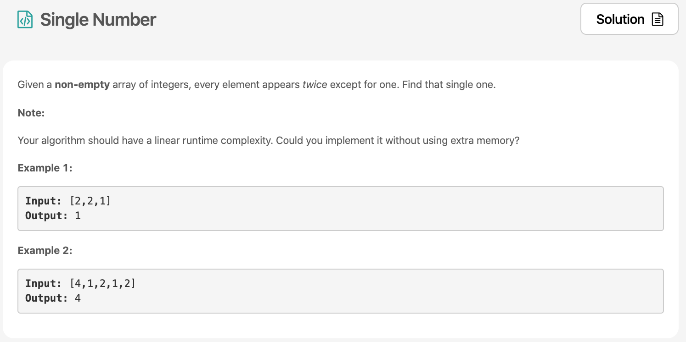

Day1 첫번째 문제는 single number 이다.



# 문제 요약
문제를 요약하면 array 속에 한개만 있었던 숫자를 찾아내라는 것!
단, 시간복잡도는 O(n)이여야 하고, 공간복잡도는 O(1)이여야 한다.

# 문제 해결
시간복잡도는 O(n)이여야 하고, 공간복잡도는 O(1)을 지키며 문제를 푸는 방법은 하나다. 4번 XOR 연산자로 찾는 방법!
나머지 문제의 자세한 [솔루션](https://leetcode.com/problems/single-number/solution/)은 여기에 있으니 참고하면 좋다.
## 1) List operation
  - 시간 복잡도:  O(n^2)
  - 공간 복잡도: O(n)

## 2) Hash Table
  - 시간 복잡도: O(n)
  - 공간 복잡도: O(n)

## 3) 수학적으로 해결 (2∗(a+b+c)−(a+a+b+b+c)=c)
  - 시간 복잡도: O(n)
  - 공간 복잡도: O(n)

## 4) XOR로 해결 (Bit Manipulation)
XOR 연산자를 사용하면 `6 ^ 6 ^ 1 ^ 2 ^ 2` 의 경우 결과는 `1`이 된다.
  - 시간 복잡도: O(n)
  - 공간 복잡도: O(1)

```js
/**
 * @param {number[]} nums
 * @return {number}
 */
var singleNumber = function(nums) {
    let xor = 0;
    nums.forEach(item => xor ^= item);
    return xor;
};
```
