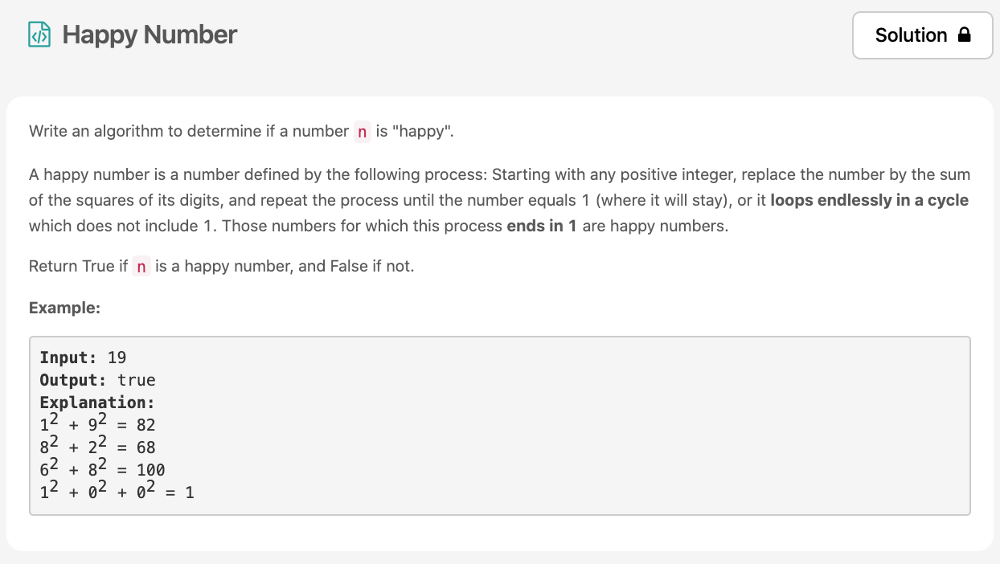

오늘의 마지막 문제풀이😆 이것은 happy number에 대한 지식이 있으면 좀 더 풀기 쉬웠을 [문제](https://leetcode.com/explore/challenge/card/30-day-leetcoding-challenge/528/week-1/3284/)이다.



# 문제 요약
happy number이면 true 아니면 false를 반환해라!
그렇다면 happy number는 무엇인가? happy number는 숫자를 모두 쪼개서 제곱하고 그 결과들을 더하는 것을 반복했을 때, 1이 되는 숫자를 말한다. 


# 문제 해결
happy number를 알면 문제를 풀기 쉬워진다. 
happy number가 될 수 없는 숫자를 알아내야 무한루프의 늪에 빠지지 않는데,
happy number가 될 수 없는 숫자가 있는데 바로 4이다. 4는 계속 돌고돌아 또 4가되어 무한루프를 돌게 된다.
아래 그림을 보면 이해하기 쉽다. happy number가 아닌 수들은 여러개 있지만 결국 4가 제일 작은 숫자고 4로 귀결된다.


## 1) Recursion
그래서 나는 재귀를 이용하여 문제를 해결하였다.
```js
/**
 * @param {number} n
 * @return {boolean}
 */

var isHappy = function(n) {
    const arr = String(n).split('').map(n => n*n);
    const sum = arr.reduce((a, b) => a+b);
    let result = false;
    if(sum === 1) {
        return true;
    } else if(sum === 4) {
        return false
    } else {
        result = isHappy(sum);
    }
    return result;
};

```