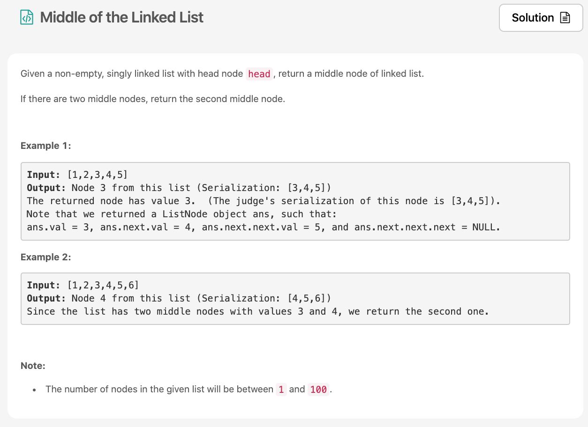

2주차가 시작됬습니다 💛 오늘 [문제](https://leetcode.com/explore/challenge/card/30-day-leetcoding-challenge/529/week-2/3290/)는 나 또한 나쁘지 않게 풀었다고 생각했는데 solution을 보니 완전 ㅋㅋ 대박 입이 떡벌어졌다 (오우~ 이렇게도 생각할 수 있구나~!)



# 문제 요약
링크드 리스트의 head를 input으로 주고 링크드리스트의 중앙을 찾는 문제


# 문제 해결
일단 확실한건 length를 모르니 길이를 알아야 한다. 그러려면 무조건 링크드리스트를 처음부터 끝까지 순회해야한다.
내 풀이는 전체 순회후 length값을 얻어서 중간 노드를 구했고, 솔루션의 두번쨰 문제풀이는 순회시 slow pointer와 faster pointer를 둬서 2배속 빠르게 순회하고 순회가 끝나면 바로 중간노드를 찾을 수 있도록 했다. 와우 굳굳🐧


## 1) Traverse and Get Length and then Traverse again
링크드리스트의 길이는 전체를 순회하는 수 밖에 없다. 그런 다음 다시 반만큼 순회하여 그 노드를 리턴하면 된다고 생각했다.
  * 시간 복잡도: O(N)
  * 공간 복잡도: O(1)

문제에서 제시하는 첫번째 솔루션은 나와 비슷한데, length를 찾기위해 순회할때 모든 노드를 배열에 저장한다. 그래서 순회가 완료되면 length의 반을 잘라 반을 기준으로 오른쪽 배열을 리턴하도록 한다. 이렇게 풀면
  * 시간 복잡도: O(N)
  * 공간 복잡도: O(N)

이 된다. 공간복잡도는 늘어나지만 다시 순회할 필요가 없기에 내가 푼 풀이보다 빠르려나? 
```js
/**
 * Definition for singly-linked list.
 * function ListNode(val) {
 *     this.val = val;
 *     this.next = null;
 * }
 */
/**
 * @param {ListNode} head
 * @return {ListNode}
 */
var middleNode = function(head) {
    let length = 0;
    let node = head;
    while(node.next) {
        length++;
        node = node.next;
    }
    node = head;
    for(let i=0; i<length/2; i++) {
        node = node.next;
    }
    return node;
};

```

## 2) Fast and Slow Pointer
위에서 대략 설명했듯이 2배속으로 순회하는 포인터와 1배속으로 순회하는 포인터를 둬서 2배속으로 순회하는 포인터가 끝에 다다르면 1배속 포인터는 링크드리스트의 중앙을 기르키니, 1배속 포인터를 리턴하는 방식이다.
```js
/**
 * Definition for singly-linked list.
 * function ListNode(val) {
 *     this.val = val;
 *     this.next = null;
 * }
 */
/**
 * @param {ListNode} head
 * @return {ListNode}
 */
var middleNode = function(head) {
    slow = fast = head;
    while (fast && fast.next) {
        slow = slow.next;
        fast = fast.next.next;
    }
    return slow;
};
```

## 소감
왼지 모르게 자꾸만 릿코드 유료결제를 하고싶다. ㅋㅋㅋ 솔루션이 너무 좋아서 보고싶어진다 물론 무료인 것들도 많지만 🐶