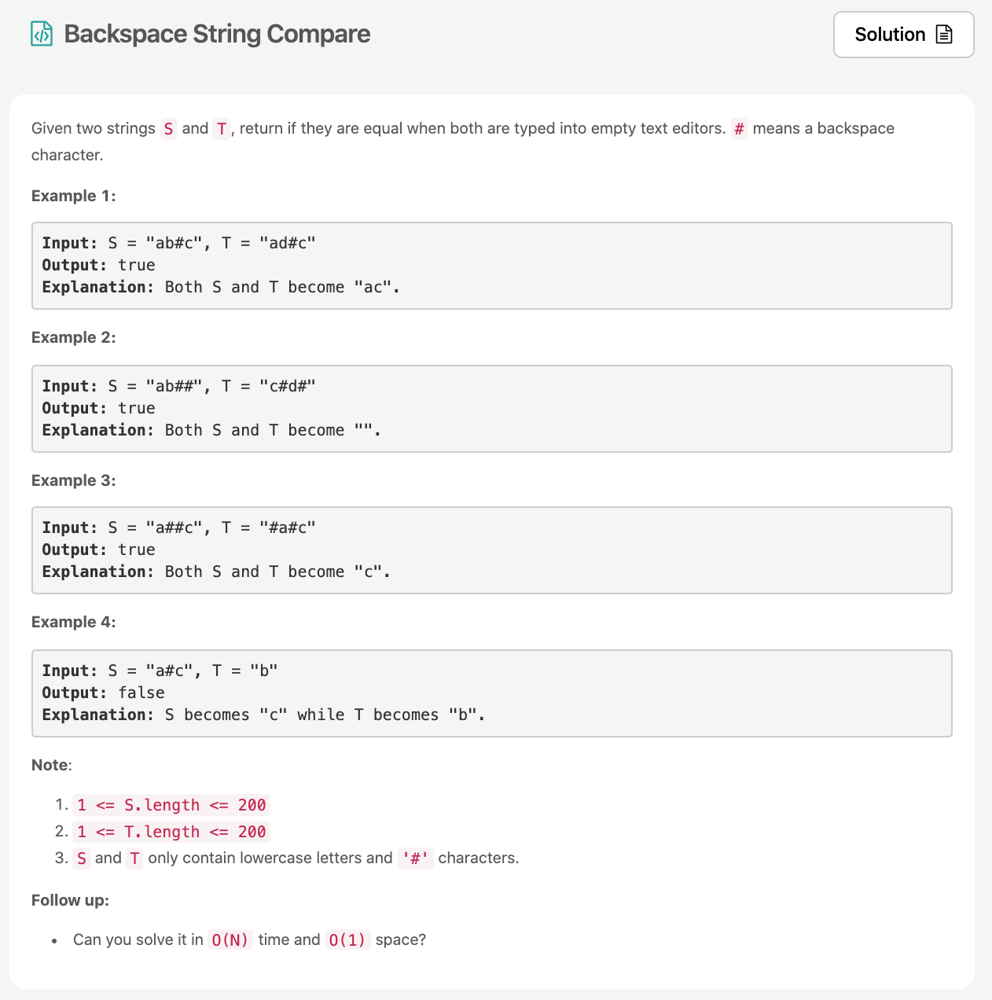

어제 문제만 풀고 포스팅을 못해서 잔디를 못심었네 ㅠㅠ 속상☔️ 오늘 [문제](https://leetcode.com/problems/backspace-string-compare/)는 easy 문제라서 그런지 쉽고 빠르게 풀 수 있었다. (easy를 풀때는 언제나 즐겁지요~~~)



# 문제 요약
문제에서 두개의 string이 주어진다.
각 문자열에는 #가 포함되어있다. 이것은 백스페이스를 의미해서 바로 앞의 글자를 지우는 역할을 하는데
글자를 지우고 남은 결과가 같은지 확인하는 문제이다.


# 문제 해결
일단 순회를 해야하는데 뒤에서 부터 순회를 할꺼다.(백스페이스 니까) 그리고 #가 나오면 그 갯수를 카운팅하고 #가 아닐 경우 백스페이스(#)의 갯수가 0개이면 해당 문자는 지워질 수 없으니 저장하는 방식으로 구현했다.
input으로 주어진 두 개의 문자열을 위의 방법대로 각각 돌려보고 그 결과를 비교해보면 된다.


## 1) Traverse and Get Length and then Traverse again
링크드리스트의 길이는 전체를 순회하는 수 밖에 없다. 그런 다음 다시 반만큼 순회하여 그 노드를 리턴하면 된다고 생각했다.
  * 시간 복잡도: O(N + M)
  * 공간 복잡도: O(1)

문제에서 제시하는 솔루션은 나와 비슷해서 패스~

```js
/**
 * @param {string} S
 * @param {string} T
 * @return {boolean}
 */
const getString = function(str) {
    let count = 0;
    let erasedStr = ''
    for(let i=str.length - 1; i>=0; i--) {
        if(str[i] === '#') count++;
        else {
            if(count === 0) erasedStr = str[i] + erasedStr;
            else count--;
        }
    }
    return erasedStr;
}
var backspaceCompare = function(S, T) {
    return getString(S) === getString(T)
};
```

## 소감
진짜 잘하는 사랆들 보면 코드가 정말 심플하던데 나도 그렇게 하고싶다 🧞‍♂️