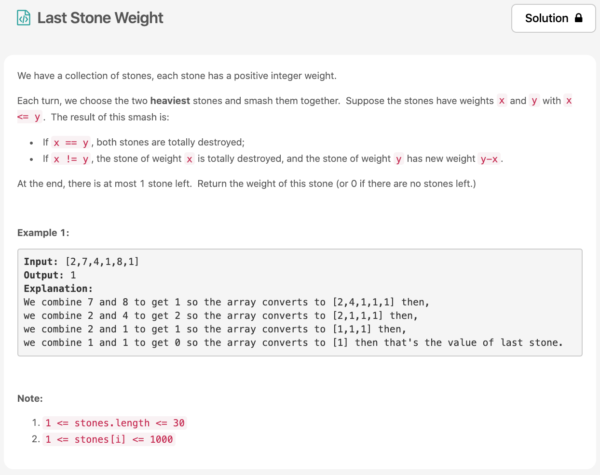

벌써 Day13 이다!!😳 오늘 [문제](https://leetcode.com/problems/last-stone-weight/)는 easy 문제이고, 나는 바로 풀진 못했지만 우선순위 큐를 이용하면 금방 해결할 수 있는 문제였다.



# 문제 요약
input으로 array가 들어온다. 그중에서 큰 숫자 2개를 선택하고 그 두 숫자가 다를 경우에 숫자를 부순다! 
부순다는 것은 그 두 수는 없애고 두 수의 차를 array에 추가하는 방식이다. 이렇게 반복을 해서 선택된 두 수가 같을때까지 반복한다.
최종적으로 부숴진 수를 리턴하는 것이 문제다.


# 문제 해결
먼저 내림차순 정렬을 하고, 첫번째와 두번째 값을 비교해서 부수는 과정을 진행한다. 그리고 부순 숫자를 배열에 넣고 다시한번 정렬. 이 과정을 반복한다.
언제까지 반복하냐면? 배열의 크기가 1보다 클 때까지 반복한다.
그러다가 배열의 크기가 0이면 0을 리턴하고 1개일 경우에는 하나 남은 항목 `stones[0]`을 리턴해준다.

## 1) Priority Queue

이 문제가 왜 우선순위 큐 문제냐면,
큐는 보통 FIFO을 따르지만 우선순위큐는 들어간 순서에 상관없이 우선순위가 높은 데이터가 먼저 나오기 떄문이다. (sorting을 통해)

  * 시간 복잡도: O(N)
  * 공간 복잡도: O(1)

문제집 솔루션은 락이 잠겨있어서 확인하지 못했다.
```js
/**
 * @param {number[]} stones
 * @return {number}
 */
var lastStoneWeight = function(stones) {
    stones.sort((a, b) => b-a);
    while(stones.length > 1) {
        if(stones[0] === stones[1]) {
            stones.shift();
            stones.shift();
        } else {
            const s1 = stones.shift();
            const s2 = stones.shift();
            stones.unshift(Math.abs(s1 - s2));
            stones.sort((a, b) => b-a);
        }
    }
    return stones.length === 0 ? 0 : stones[0];
};
```

## 소감
쉬운 문제여서 풀 수 있었을 것 같은데 알고리즘 한 지 몇일 됬다고 벌써 권태기가 왔다;;;