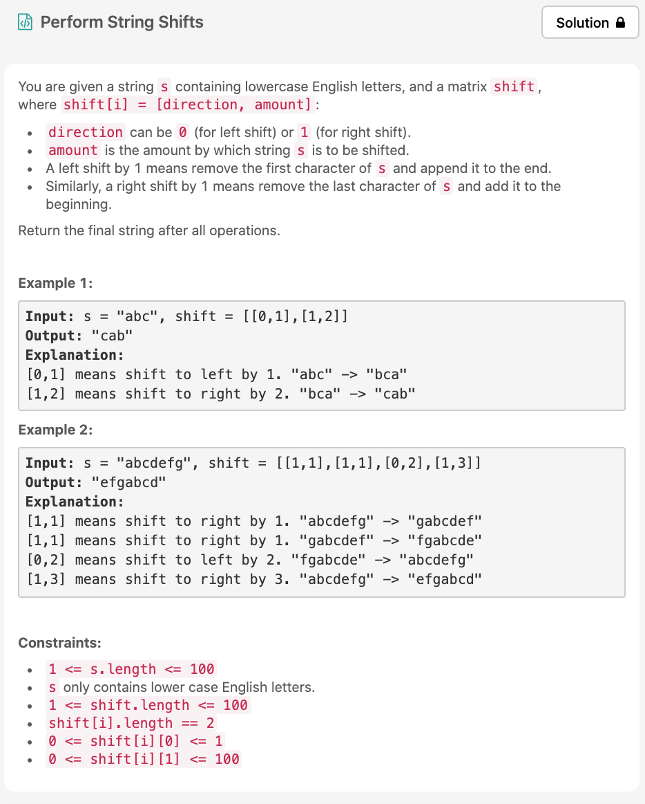

벌써 Day14!! 뜨악 =_= 오늘 [문제](https://leetcode.com/explore/challenge/card/30-day-leetcoding-challenge/529/week-2/3299/)는 easy 문제일것 같은데, 검색해도 나오지않고 day30에만 존재하는 문제이다.



# 문제 요약
0이 들어오면 왼쪽으로 shift(사실상 index는 1 증가), 1이 들어오면 오른쪽으로 shift(사실상 index는 1감소)하여 최종 string을 구하는 것.


# 문제 해결
실제로 shift 시키는 작업은 굳이 필요없다고 생각이 들었고, 인덱스를 저장하는 포인터를 둬서 시뮬레이션을 돌리도록했다.
그래서 나온 결과의 포인터로 해당 인덱스부터 ~ 끝까지, 0부터 ~ 해당 인덱스 -1 까지 출력하도록 했다.

## 1) Pointer Simulation
  * 시간 복잡도: O(N)
  * 공간 복잡도: O(N)

```js
/**
 * @param {string} s
 * @param {number[][]} shift
 * @return {string}
 */
var stringShift = function(s, shift) {
    let startPtr = 0;
    let result = '';
    for(let i=0; i<shift.length; i++) {
        const isLeft = shift[i][0] === 0 ? true : false;
        const cnt = shift[i][1];
        for(let j=0; j<cnt; j++) {
            if(isLeft) {
                startPtr = startPtr + 1 >  s.length - 1 ? 0 : startPtr + 1;
            } else {
                startPtr = startPtr - 1 < 0 ? s.length - 1 : startPtr - 1;
            }
        }
    }
    for(let i=startPtr; i<s.length; i++) {
        result += s[i];
    }
    for(let i=0; i<startPtr; i++) {
        result += s[i];
    }
    return result;
};
```
