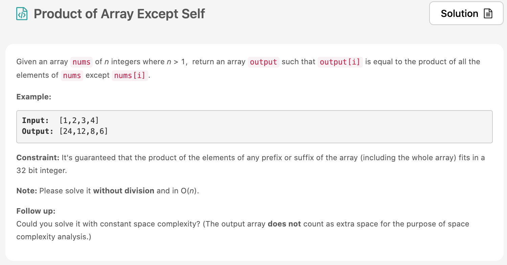

벌써 Day15!! 헤헤 그래도 어제 릿코드는 못풀었지만 알고리즘 문제 3개나 풀었다 ㅋㅋ 얼렁 밀린거 풀어야지~~ 오늘의 [문제](https://leetcode.com/problems/product-of-array-except-self/)는 easy 문제일것 같았는데, medium!! 근데 심지어 풀었따!! 드디어 실력이 조금 느는건가??



# 문제 요약
자기 자신의 index 빼고 나머지를 다 곱하는 문제

# 문제 해결
다 곱한 값은 똑같다. 항상. 그래서 먼저 곱해놓고 자기자신을 `divide(나누기)` 하는 방식으로 문제를 풀었다.
다만 0이란 놈이 골치가 아픈데, 0의 갯수와 자기자신이 0인지에 따라서 분기처리를 좀 해줬다.

솔루션은 봤는데 무슨말인지 모르겠어서 껐다.

## 1) Multiply all items and divide only self
  * 시간 복잡도: O(N) ? 이라고 해야하나?
  * 공간 복잡도: O(1)
  
```js
/**
 * @param {number[]} nums
 * @return {number[]}
 */
var productExceptSelf = function(nums) {
    const totalMultiply = nums.reduce((a, b) => a*b);
    const filtered = nums.filter(item => item !== 0);
    const filteredMultiply = filtered.length === 0 ? 0 : filtered.reduce((a, b) => a*b, 1);;
    const result = [];
    for(let i=0; i<nums.length; i++) {
        if(totalMultiply === 0 && nums[i] === 0) {
            result.push(nums.length - filtered.length > 1 ? 0 : filteredMultiply);
        } else if(totalMultiply === 0 && nums[i] !== 0) {
            result.push(0);
        } else {
            result.push(totalMultiply/nums[i]);
        }
    }
    return result;
};
```
