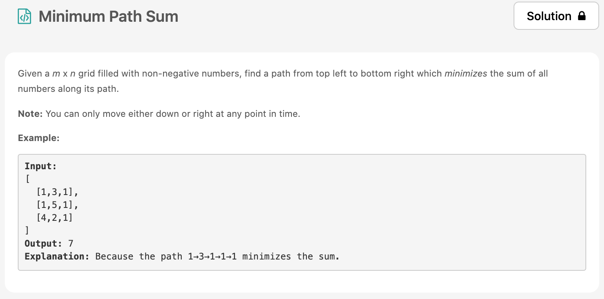
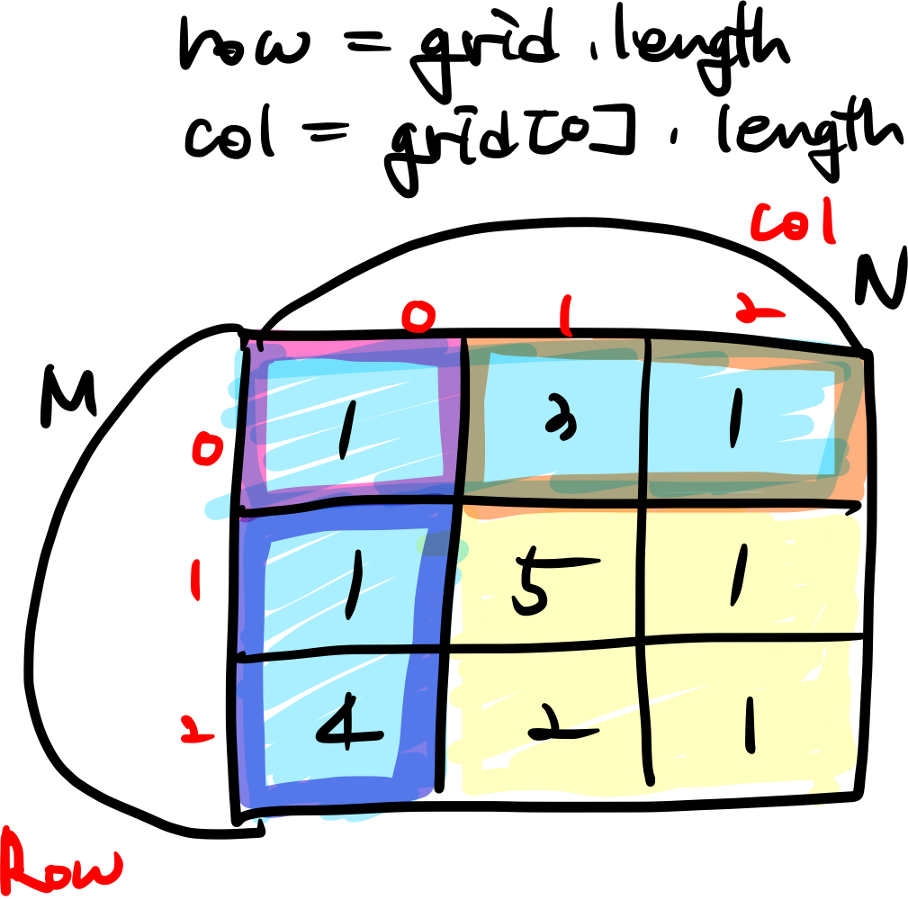
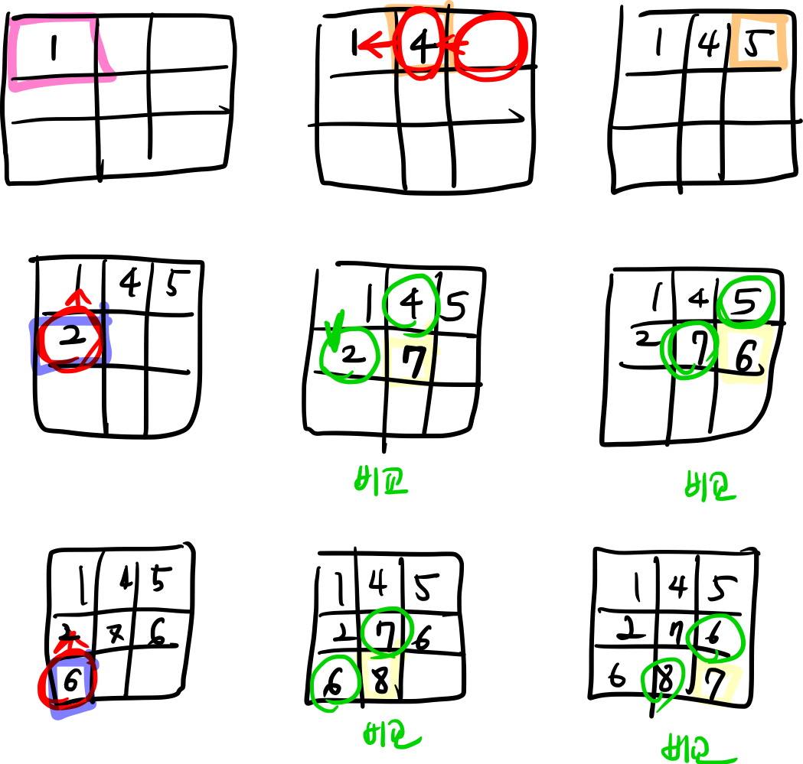

요즘 좀 풀려서 알고리즘을 열심히 안했다 👿 한 3일치는 밀린듯! 근데 밀린걸 다풀려고하니까 마음이 무거워서 계속 안하게 되는것 같다.
반성반성~

오늘의 [문제](https://leetcode.com/problems/minimum-path-sum/solution/)는 medium 문제이고 dp 유형이다. 처음부터 해결한것은 아니었지만 조금 규칙을 찾고 오랫동안 생각해보니 직접 구현이 가능했다.



# 문제 요약
최단 경로의 가장 작은 합을 구하기

# 문제 해결
일단 문제를 잘 살펴보면 규칙이 있다. 최단거리로 가기위해선 아래에서 위 기준으로 이동한다고 치면, 자신의 위치에서 오른쪽과 아래로 밖에 갈 수 없다.
근데 문제는 최단경로중의 최소합을 구해야한다. 그래서 좀 거꾸로 가야한다. 자신의 위치에서 위와 왼쪽을 확인하면서 최솟값의 누적합을 구해서 맨 마지막 행과 열까지 구하면 되는 문제이다.



구역은 크게 pink, orange, yellow, blue로 나눌 수 있다.
pink는 원래 자신의 값을 가질 수 밖에 없고, orange는 왼쪽의 누적합(위쪽이 없으니까), blue는 위쪽의 누적합(왼쪽이 없으니까), yellow는 왼쪽과 위쪽을 비교해보고 작은값을 계속 더하는 방식이다.

조금 더 순서대로 진행과정을 써보았으니 참고하면 좋을 것 같다.



## code
  * 시간 복잡도: O(N^2)
  * 공간 복잡도: O(N^2)
  
```js
/**
 * @param {number[][]} grid
 * @return {number}
 */
var minPathSum = function(grid) {
    const row = grid.length;
    const col = grid[0].length;
    const arr = Array.from(grid);
    for(let r=0; r<row; r++) {
        for(let c=0; c<col; c++ ) {
            const left = c-1;
            const top = r-1;
            if(left < 0 && top < 0 ) {
                arr[r][c] = grid[r][c];
            } else if(left < 0 && top >= 0) {
                arr[r][c] += arr[top][c];
            } else if(left >= 0 && top < 0) {
                arr[r][c] += arr[r][left];
            } else if(left >=0 && top >= 0) {
                const min = Math.min(arr[top][c], arr[r][left]);
                arr[r][c] += min;
            }
        }
    }
    return arr[row-1][col-1]
};
```
