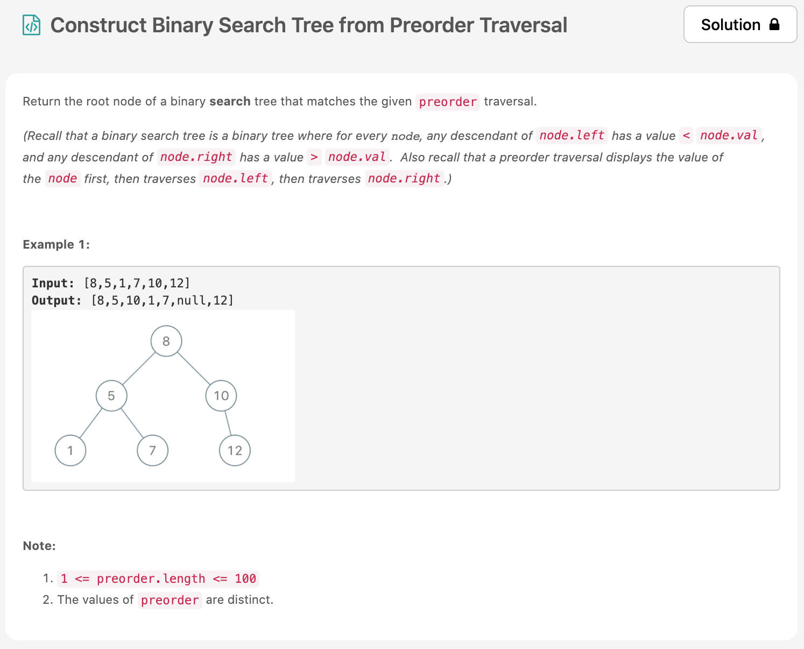

아주아주 한없이 풀어지는 이 마음을 어찌할꼬~🌩 일단 밀린걸 다풀려고는 마음은 안가지려고하다보니 꾸역꾸역 맨날 새벽 두시까지 놀다가 문제를 푼다....
조만간 대책 마련이 시급하다 엉엉

오늘의 [문제](https://leetcode.com/problems/construct-binary-search-tree-from-preorder-traversal/)는 medium 문제이고 문제가 장황하긴 한데, 그냥 BST를 구성하고 root 노드를 리턴하면 된다.



# 문제 요약
pre-order로 구성된 트리를 BST로 다시 재구성 해보는 문제

# 문제 해결
BST는 각 노드를 기준으로 왼쪽 노드는 더 작은것, 오른쪽 노드는 더 큰것으로 구성된다. 이런 방식으로 루트노드부터 구성하면 된다.
코드를 보면 더 이해하기 쉽다. 재귀로 문제를 해결했고, 내가 해결한 것은 아니고 다른 사람의 답지를 보았따 🍯


## code
  * 시간 복잡도: O(N^2) ??? ⁉️ 정확히 맞는지 모르겠다.
  * 공간 복잡도: O(1)
  
```js
/**
 * Definition for a binary tree node.
 * function TreeNode(val) {
 *     this.val = val;
 *     this.left = this.right = null;
 * }
 */
/**
 * @param {number[]} preorder
 * @return {TreeNode}
 */
var bstFromPreorder = function(preorder) {
    var go = (root, x) => {
        if(root.val > x) {
            if(!root.left) {
                root.left = new TreeNode(x);
            } else {
                go(root.left, x);
            }
        } else {
            if(!root.right) {
                root.right = new TreeNode(x);
            } else {
                go(root.right, x);
            }
        }
    }
    let root = new TreeNode(preorder[0]);
    for(let i=1; i<preorder.length; i++) {
        go(root, preorder[i])
    }
    return root;
};
```
