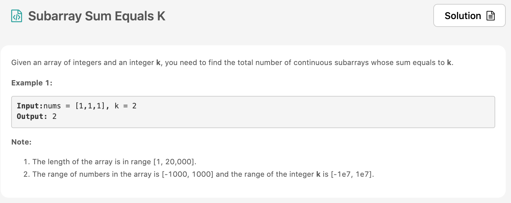

오늘의 [문제](https://leetcode.com/problems/subarray-sum-equals-k/)또한 너무 하기 싫었지만, 스스로 해결했다. 난의도는 medium 이었다 :) 실력이 늘긴 늘었나봄



# 문제 요약
더해서 k가 되는 모든 부분집합 구하기 문제

# 문제 해결
Brute Force로 문제를 해결했는데, 젤 쉬운방법으로 해결한 것이고 Hashmap을 사용해서는 시간복잡도를 어마무지하게 줄일 수 있었다.

## code
  * 시간 복잡도: O(N^3)
  * 공간 복잡도: O(1)
  
```js
/**
 * @param {number[]} nums
 * @param {number} k
 * @return {number}
 */
var subarraySum = function(nums, k) {
    let sums = Array.from(nums);
    let cnt = 0;
    for(let i=1; i<nums.length; i++) {
        sums[i] += sums[i-1];
    }
    console.log(sums)
    for(let i=nums.length-1; i>=0; i--) {
        if(sums[i] === k) cnt++;
        for(let j=i-1; j>=0; j--) {
            if(k === (sums[i]-sums[j]))  {
                cnt++;
            }
        }
    }
    return cnt;
};
```
