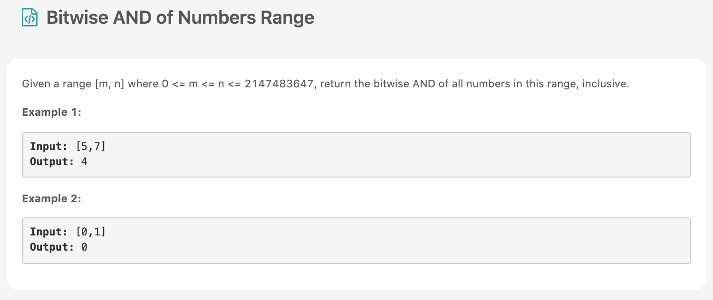

끄악 너무 많이 밀려버렸다 🍗 밀렸던 [문제](https://leetcode.com/problems/bitwise-and-of-numbers-range/)부터 하나씩 이번달 끝나기전에 다풀기 도전한다. 오 이 문제도 풀었는데 난이도 medium 이었음!



# 문제 요약
m부터 n까지 비트연산한 결과 출력

# 문제 해결
또, Brute Force로 문제를 해결ㅋㅋㅋㅋㅋ 이정도면 미디움이 난이도가 맞나 싶네;;;
정말로 m부터 n가지 다해봤다. 근데 다만 0일 경우 비트연산을 계속 할 필요가 없기때문에 그만 하도록했다.
## code
  * 시간 복잡도: O(N)
  * 공간 복잡도: O(1)
  
```js
/**
 * @param {number} m
 * @param {number} n
 * @return {number}
 */
var rangeBitwiseAnd = function(m, n) {
    let result = m;
    for(let i=m+1; i<=n; i++) {
        result &= i;
        if(result===0) break;
    }
    return result
};
```
