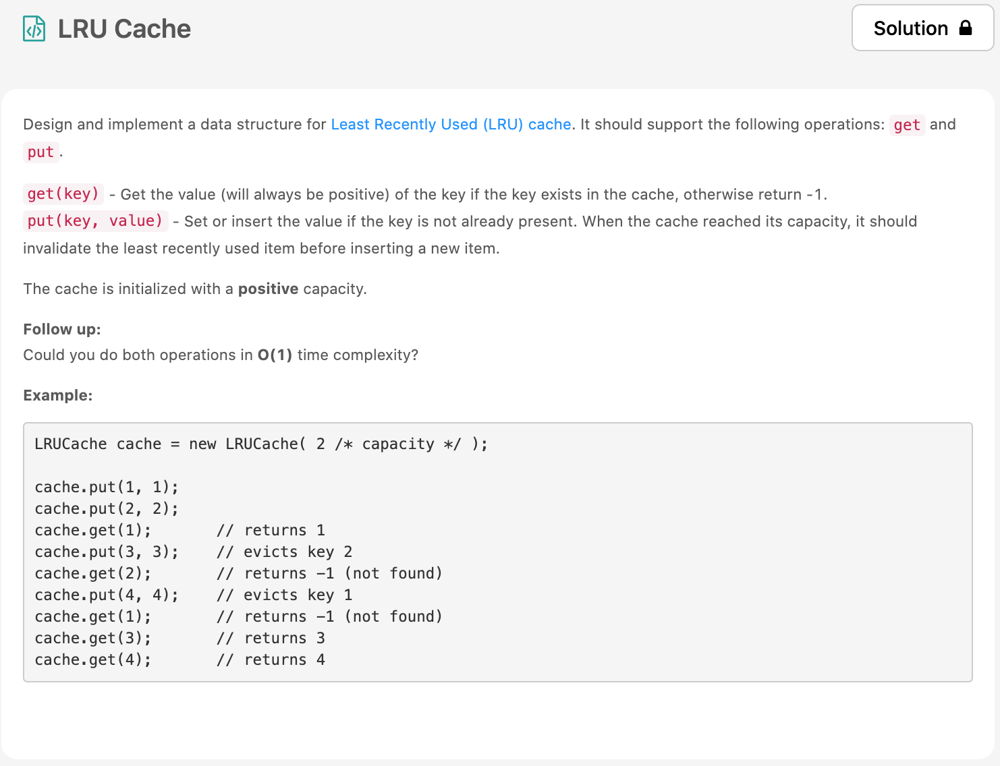
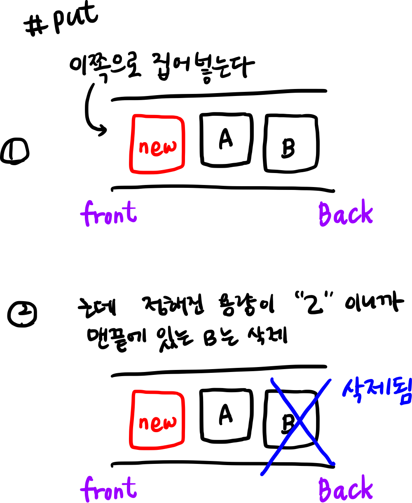
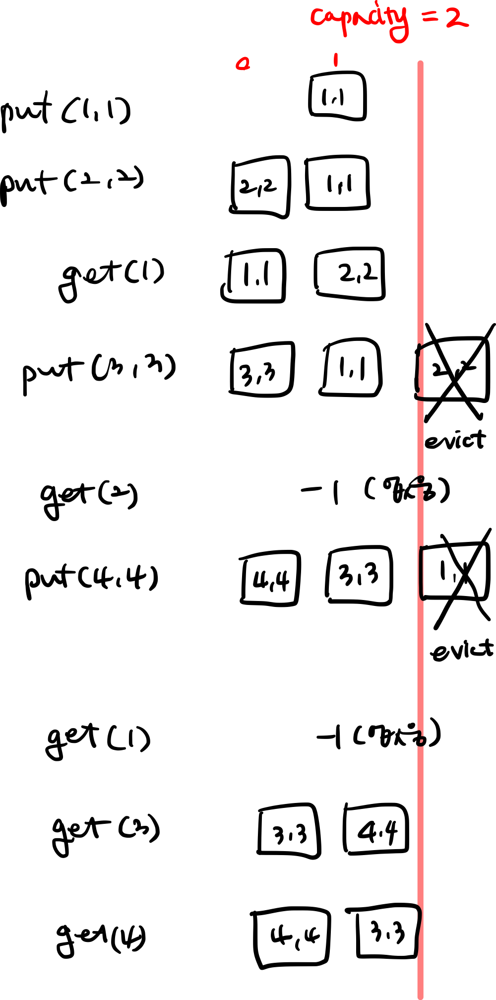

밀렸던거 다풀라니까 마음이 안따라줘서 쉽지가 않네 😋. 
어제의 두번째 [문제](https://leetcode.com/problems/lru-cache/)는 [Least Recently Used (LRU) cache](https://en.wikipedia.org/wiki/Cache_replacement_policies#LRU) 문제였다. 어디서 많이 봤다~ 싶었는데 운영체제에서 배웠었다 ㅋㅋㅋ 운체 ㅜㅜ 짱싫어했었다... 지금처럼 공부했으면 참 좋았을텐데!란 갑분 아쉬움이 남는 문제.



# 문제 요약
Least Recently Used(LRU) 알고리즘을 구현하는 문제
근데!!! 😎 LRU가 뭔질 알아야 문제를 풀지;;;

그래서 이것저것 유투브에 찾아봤는데 [이 영상](https://www.youtube.com/watch?v=S6IfqDXWa10)이 도움이 많이 되었다.
예제를 잘 보면 `put`과 `get`이 나온다. 간단히 요약하면 `put`은 메모리에 할당하는 것이고, `get`은 이미 메모리에 할당되있는 값을 반환하는 것이다.
조금 더 자세히 어떻게 구현할지 알아보자. 

## 0. 자료구조는? queue

queue를 사용해서 구현하면 쉽다.


## 1. put

`put`을 할 때, 이미 메모리가 꽉 차있는 경우에는 가장 최근에 사용안했던 부분을 제거하고 새로운 메모리를 할당하는 것이다. 근데 새로운 메모리를 할당한다는 것은 가장 최근에 사용한 의미가 아닌가? 그래서 가장 앞쪽으로 위치해주는 작업을 함께 해주어야한다.


## 2. get
`get`의 경우에는 찾으려고하는 key의 value를 리턴해주면 되고, 만약 찾으려는 key값이 없는 경우에는 -1을 리턴해준다. 여기서 찾으려했던 값이 있었으면 그 값을 읽는 작업은 해당 메모리가 사용된거니까 앞쪽으로 위치해주는 작업을 해줘야한다.


## 예제 이해하기
그래서 예제를 이해하면 다음과 같다.


# 문제 해결
생성자에서 호출될때 용량이 얼마인지를 `this.capacity`에 저장하고 `this.keys`에 데이터들을 저장하도록 했다.

## code
```js
/**
 * @param {number} capacity
 */
var LRUCache = function(capacity) {
    this.keys = [];
    this.capacity = capacity;
};

/** 
 * @param {number} key
 * @return {number}
 */
LRUCache.prototype.get = function(key) {
    for(let i=0; i<this.keys.length; i++) {
        if(key === this.keys[i].key) {
            const tmp = this.keys[i];
            this.keys.splice(i, 1);
            this.keys.push(tmp);
            return tmp.value;
        }
    }
    return -1;
};

/** 
 * @param {number} key 
 * @param {number} value
 * @return {void}
 */
LRUCache.prototype.put = function(key, value) {
    for(let i=0; i<this.keys.length; i++) {
        if(key === this.keys[i].key) {
            this.keys.splice(i, 1);
            this.keys.push({
                key: key,
                value: value
            });
            return;
        }
    }
    
    this.keys.push({key: key, value: value});
    if(this.keys.length > this.capacity) {
        this.keys.shift();
    }
};

/** 
 * Your LRUCache object will be instantiated and called as such:
 * var obj = new LRUCache(capacity)
 * var param_1 = obj.get(key)
 * obj.put(key,value)
 */
```
