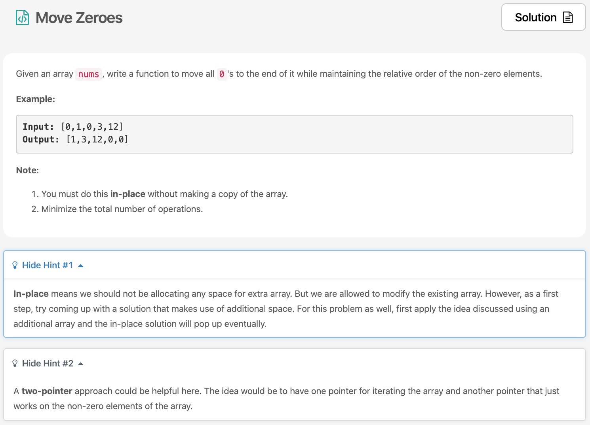

자 매일매일 알고리즘을 계쏙해서 실천하고 있습니다.🔥 leetcode의 30Day Challenge [문제](https://leetcode.com/explore/challenge/card/30-day-leetcoding-challenge/528/week-1/3286/)를 풀어봅시다. 



# 문제 요약
0을 맨뒤로 옮기기. 단, 공간 복잡도는 O(1)으로 유지하고, operation은 최대로 줄이라고 되어있다.

# 문제 해결
문제는 해결했는데 공간 복잡도 O(1), 시간 복잡도 O(n^2)으로 해결했다. O(n)으로 해결할 수 있는 방법들이 솔루션에 있었는데 해당 방법들도 다시 검토 해 볼 필요가 있다.

## 1) two pointer 이용
```js
/**
 * @param {number[]} nums
 * @return {void} Do not return anything, modify nums in-place instead.
 */
var moveZeroes = function(nums) {
    for(let i=0; i<nums.length; i++) {
        let zeroIdx = -1;
        let nonZeroIdx = -1;
       for(let j=i; j<nums.length; j++) {
           if(nums[j] === 0) {
               zeroIdx = j;
               break;
           }
       }
        for(let j=i; j<nums.length; j++) {
           if(nums[j] !== 0) {
               nonZeroIdx = j;
               break;
           }
       }
        if(zeroIdx >= 0 && nonZeroIdx >= 0 && zeroIdx < nonZeroIdx) {
            const zero = nums[zeroIdx];
            nums[zeroIdx] = nums[nonZeroIdx];
            nums[nonZeroIdx] = zero;
        }
    }
    return nums;
};
```