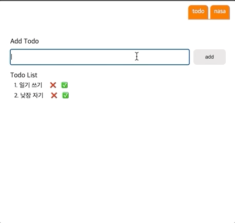
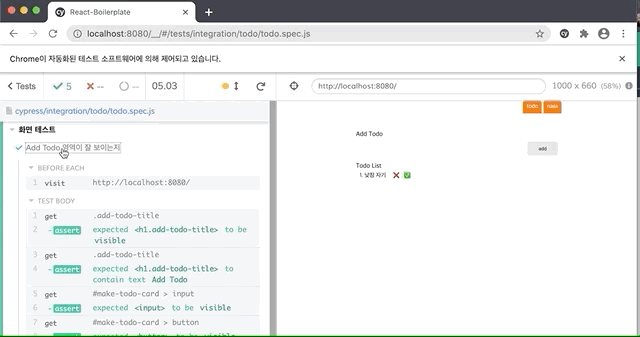

cypress를 이용해서 e2e 테스트를 작성하는 법을 정리해보려고 한다.
디테일한 설정보다는 테스트를 작성하기 위한 큰틀과 작성 방법 위주로 설명하려고 한다.

## cypress가 뭔가요?
cypress란 오픈소스 프로젝트로 e2e 테스트를 위한 도구이다.
통합 테스트를 하면 사용자의 입장에서 테스트를 진행할 수 있어서 뭔가를 수정했는데 다른곳에서 사이드이펙트가 생긴다거나 할 경우 문제가 없는지 확인하는데 매우 효과적인것 같다.

## e2e 테스트 코드를 어떤식으로 짜야할까?
테스트 코드는 화면에 특정 DOM이나 텍스트가 잘 표시되는지를 결과적으로 검사한다.

api 요청 후 결과가 온다고 가정을 하고 그 데이터를 잘 뿌려주는지,
input에 특정 값을 입력하고 그 값으로 뭔가 버튼을 클릭했을때 일어나는 동작에 대해서도 테스트 할 수 있다. 

정리하면 이정도 테스트 코드를 짜는것 같다.
- 화면 표시 테스트
- UI 조작 테스트
  - input 입력
  - click
- api stubbing
  - fixture로 response 값 세팅
  - 대기시켜놓기(cy.wait)

## 준비

예시로 Todo List를 구현한 페이지와 오늘의 우주 동영상을 보여주는 페이지의 e2e 테스트 코드를 짜면서 설명을 해보려고 한다. 

### test 코드를 추가할 어플리케이션
테스트 코드를 넣기 위한 ReactApp을 미리 준비했다.

## cypress 환경 설정
그리고 cypress 설치한다.

```
npm i -D cypress
```

이건 해도되고 안해도 되는데, `node_modules/.bin/cypress open` 커멘드를 실행하면 예제와 테스트코드를 작성하기 위한 폴더가 쫘악 만들어진다.
난 빠른 환경설정을 위해 실행 시켜주었다.

package.json의 script에 cypress 실행 관련 커멘드를 추가해준다.
```
"cypress": "cypress open"
```

npm run cypress 하면 아래와 같이 켜진다.


## 시나리오 작성하기




테스트를 짜기 전 어떤식으로 테스트를 작성할지 시나리오를 작성해야 한다.
일단 화면테스트, ui 조작테스트, api 모킹 이렇게 나눈건 그냥 항목별로 나눠본거고 페이지 별로 아래의 각각의 시나리오를 넣어서 작성한다고 생각하면 된다.

### 1. 화면 테스트
테스트를 짜기위해 동작들을 좀 정의해보자. 이대로 짜면되니까!

* Add Todo 영역이 잘 보이는지
  - todo 페이지에 들어가면 
  - `Add Todo 텍스트`와 `input`, 그리고 `add 버튼`이 보여야한다.
* Todo List 영역이 잘 보이는지
  - todo 페이지에 들어가면 
  - 기본적으로 `일기 쓰기`, `낮잠 자기 `항목이 보여야 한다.

### 2. ui 조작 테스트
* Todo 추가 기능 테스트
  - input에 `빨래하기`를 넣고 `add 버튼`을 클릭하면
  - Todo List에 `빨래하기` 항목이 추가되서 보여야한다.
* Todo 완료 기능 테스트
  - `낮잠 자기`의 `완료 버튼` 클릭시 낮잠 자기에 줄이 그어지는지
* Todo 삭제 기능 테스트
  - `일기 쓰기`의 `삭제 버튼` 클릭시 TodoList에서 더이상 안보이는지

### 3. api stubbing
nasa 페이지에 들어가면 api를 호출하고 그 결과로 온 동영상 링크를 보여주도록 구현이 되어있다.
이거는 어떻게 보면 1번 화면테스트에 포함되는 영역이긴 한데, api를 모킹하는 부분에 대해 좀 설명하기위해 따로 뺐다.
* 화면에 오늘의 우주 영상이 보여지는지 테스트
  - nasa 페이지 접속
  - 한 1초 후, api 요청이 완료되었다고 가정하고
  - 오늘의 우주 비디오가 화면에 보여야 함.


## 테스트 코드 짜보기
일단 cypress/integration 아레에 todo폴더를 만들고 그아레에 todo.spec.js 파일을 만들어 주었다.
이제 todo.spec.js 파일에 테스트를 추가하면 된다.

### 1. 화면 테스트
`화면 테스트` 라는 제목은 `context`를 이용하면 된다.
그리고 테스트에 대한 제목은 `it`을 이용해서 정의해주면 된다.

```
context('화면 테스트', () => {
  it('Add Todo 영역이 잘 보이는지', () => {
    // todo 페이지에 들어가면 
    // Add Todo 텍스트와 input, 그리고 add 버튼이 보여야한다.
  })
  it('Todo List 영역이 잘 보이는지', () => {
    // todo 페이지에 들어가면 
    // 기본적으로 `일기 쓰기`, `낮잠 자기 `항목이 보여야 한다.
  })
})
```

테스트를 정의했으니 하나하나 테스트를 하기위한 코드를 작성해보자
어떤 페이지에 들어가려면 방문(visit)을 해야한다. 이 방문하는 코드는 context의 모든 테스트(it)에서 중복적으로 사용하고 있다. `beforeEach`를 이용하여 it 내부의 테스트를 실행하기 전에 항상 실행하는 부분을 공통으로 작성할 수 있다.

```
context('화면 테스트', () => {
  beforeEach(() => {
    cy.visit('http://localhost:8080/')
  })

  it('Add Todo 영역이 잘 보이는지', () => {
    // Add Todo 텍스트와 input, 그리고 add 버튼이 보여야한다.
  })
  it('Todo List 영역이 잘 보이는지', () => {
    // 기본적으로 `일기 쓰기`, `낮잠 자기 `항목이 보여야 한다.
  })
})
```

이제는 DOM을 쿼리해서 실제 존재하는지 확인해보도록 하자. 쿼리하기 위해서는 classname이나 id를 활용 하면 된다.

이렇게 Todo 페이지의 코드가 작성되어 있다면 
```
<Wrapper>
    <h1 className="add-todo-title">Add Todo</h1>
    <MakeTodoCard id="make-todo-card">
      <input ref={inputRef}
        autoFocus
        onKeyDown={(e) => {
          if (e.key === 'Enter') {
            console.log('enter', e.target.value)
            addItem();
          }
        }} />
      <button onClick={addItem}>add</button>
    </MakeTodoCard>
    <List id="todo-list">
      <h1 className="todo-list-title">Todo List</h1>
      {
        list.map((todo, index) => (
          <TodoItem className="todo-list-item" key={index} did={todo.did}>
            <p>{index + 1}. {todo.value}</p>
            <span onClick={() => deleteItem(index)}>❌</span>
            <span onClick={() => checkItem(index)}>✅</span>
          </TodoItem>
        ))
      }
    </List>
  </Wrapper>
```

테스트 코드에서 다음과 같이 id, classname을 가지고 쿼리해 올 수 있다.
```
context('화면 테스트', () => {
  beforeEach(() => {
    cy.visit('http://localhost:8080/')
  })

  it('Add Todo 영역이 잘 보이는지', () => {
    // Add Todo 텍스트와 input, 그리고 add 버튼이 보여야한다.
    cy.get('.add-todo-title').should('be.visible');
    cy.get('.add-todo-title').should('contain.text', 'Add Todo');
    cy.get('#make-todo-card > input').should('be.visible');
    cy.get('#make-todo-card > button').should('be.visible');
  })
  it('Todo List 영역이 잘 보이는지', () => {
    // 기본적으로 `일기 쓰기`, `낮잠 자기 `항목이 보여야 한다.
    cy.get('.todo-list-item').should('contain.text', '일기 쓰기');
    cy.get('.todo-list-item').should('contain.text', '낮잠 자기');
  })
})
```



### 2. ui 조작 테스트
 ui 조작 테스트를 추가해보자. context를 추가하고 테스트를 주석으로 표시하면 다음과 같다.
```
context('ui 조작 테스트', () => {
  beforeEach(() => {
    cy.visit('http://localhost:8080/')
  })

  it('Todo 추가 기능 테스트', () => {
    // input에 빨래하기를 넣고 add 버튼을 클릭하면
    // Todo List에 빨래하기 항목이 추가되서 보여야한다.
  })
  it('Todo 완료 기능 테스트', () => {
    // 낮잠 자기의 완료 버튼 클릭시 낮잠 자기에 줄이 그어지는지
  })
  it('Todo 삭제 기능 테스트', () => {
    // 일기 쓰기의 삭제 버튼 클릭시 TodoList에서 더이상 안보이는지
  })
})
```

여기서 selector를 이용하여 DOM을 쿼리하고 class name을 통해 돔쿼리를 했을 경우 돔이 여러개일 수 있는데 `eq()`를 사용해서 몇번째 element 인지 가져올 수 있다. 또한 가지고오 온 돔내부에서 또 selector로 검색이 필요하면 `find`를 사용하면 된다. 어무튼 세부적인 테스트를 모두 작성하면 아래와 같다.
```
context('ui 조작 테스트', () => {
  beforeEach(() => {
    cy.visit('http://localhost:8080/')
  })

  it('Todo 추가 기능 테스트', () => {
    // input에 빨래하기를 넣고 add 버튼을 클릭하면
    cy.get('#make-todo-card > input').type('빨래 하기');
    cy.get('#make-todo-card > button').click().then(() => {
      // Todo List에 빨래하기 항목이 추가되서 보여야한다.
      cy.get('.todo-list-item').should('contain.text', '빨래 하기');
    })
  })
  it('Todo 완료 기능 테스트', () => {
    // 낮잠 자기의 완료 버튼 클릭시 
    cy.get('.todo-list-item').eq(1).find('>span:last-of-type').click().then(() => {
      // 낮잠 자기에 줄이 그어지는지
      cy.get('.todo-list-item').eq(1).find('>p').should('have.css', 'text-decoration', 'line-through solid rgb(0, 0, 0)');
    })
  })
  it('Todo 삭제 기능 테스트', () => {
    // 일기 쓰기의 삭제 버튼 클릭시 TodoList에서 더이상 안보이는지
    cy.get('.todo-list-item').eq(0).find('>span:first-of-type').click().then(() => {
      // 낮잠 자기에 줄이 그어지는지
      cy.get('.todo-list-item').should('not.contain.text', '일기 쓰기');
    })
  })
})
```


### 3. api stubbing
사실 api stubbing 하는 부분을 보여주기 위해서 어거지로 nasa 페이지를 만들었다. ㅋㅋ api를 억지로 요청하는 페이지를 만들었달까..?
페이지가 다르니 cypress/integration 아레에 nasa폴더를 만들고 그아레에 nasa.spec.js 파일을 만들어 주었다.
그리고 context를 추가하고 테스트를 주석으로 표시하면 다음과 같다.
```
context('api stubbing', () => {
  beforeEach(() => {
    // nasa 페이지 접속
    cy.visit('http://localhost:8080/nasa')
  })

  it('화면에 오늘의 우주 영상이 보여지는지 테스트', () => {
    // 한 1초 후, api 요청이 완료되었다고 가정하고
    // 오늘의 우주 비디오가 화면에 보여야 함.
  })
})
```
response로 올 데이터를 fixture에 json 파일로 만들어준다.
cypress/fixture/space.json 경로에 실제 response를 넣어놨다. 이게 온다고 가정하고 코딩을 할 것이기 떄문이다.
```
{
  "date": "2020-07-19",
  "explanation": "No one, presently, sees the Moon rotate like this. That's because the Earth's moon is tidally locked to the Earth, showing us only one side.",
  "media_type": "video",
  "service_version": "v1",
  "title": "Rotating Moon from LRO",
  "url": "https://www.youtube.com/embed/sNUNB6CMnE8?rel=0"
}
```

이렇게 우리가 사용할 api에 대한 내용을 정의한다.
fixture든, route든 alias를 지정할 수 있는데, `as`를 이용하면 된다.
```
function setTodaySpaceApi() {
    cy.server()
    cy.fixture('space.json').as('spaceData')
    cy.route({
      method: 'GET',
      url: `https://api.nasa.gov/planetary/apod?api_key=API_KEY`,
      response: '@spaceData'
    }).as('getTodaySpace')
  }
```

그래서 마지막으로 완성된 테스트 코드는 아래와 같다.

```
context('api mocking', () => {
  beforeEach(() => {
    // nasa 페이지 접속
    cy.visit('http://localhost:8080/nasa')
  })

  function setTodaySpaceApi() {
    cy.server()
    cy.fixture('space.json').as('spaceData')
    cy.route({
      method: 'GET',
      url: `https://api.nasa.gov/planetary/apod?api_key=fpM0K7ecLamWrtaEoif2ipn4HJXv57CsGMdTCEta`,
      response: '@spaceData'
    }).as('getTodaySpace')
  }

  it('화면에 오늘의 우주 영상이 보여지는지 테스트', () => {
    setTodaySpaceApi()
    // api 요청이 완료되었다고 가정하고
    cy.wait('@getTodaySpace');

    // 오늘의 우주 비디오가 화면에 보여야 함.
    cy.get('#nasa > iframe').should('be.visible');
  })
})
```

## 참고한 문서
- https://css-tricks.com/using-cypress-to-write-tests-for-a-react-application/