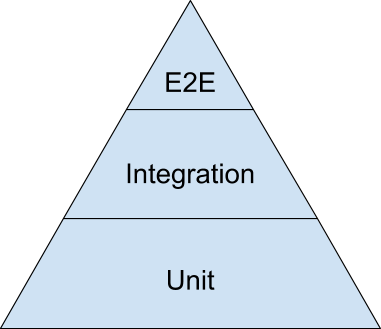

# 글 작성 계기
> 테스트 코드 그게 머야??? 😫
> 왜하는 고야???

이렇게 생각하는 개발자 있을꺼다 👉🏻~~댓츠미~~

테스트 코드 작성에 대해서 1도 모르는 사람이 작성하는 `테스트 코드 입문기`라고 생각하고 읽어주시면 감사하겠습니다. 👩🏻‍💻(꾸벅)

# 테스트 코드 왜 작성해야하는가?
> Testing is about making sure that the code in your application does what you expect it to do, and keeps doing what you expect it to do when you make changes so you have a working product when you’re done.

테스트 코드를 작성하는 이유는 <b>개발자가 의도한 대로 코드가 작동하도록 보장하기 위해서</b> 이다. 처음 코드를 작성했을때 뿐만 아니라 <b>예전에 작성한 코드와 관련된 무언가를 변경했을때도 계속해서 개발자가 의도한대로 작동하는지 보증하기 위해서 작성</b>한다고 생각하면 된다.
즉, 장기적으로 유지 및 관리를 위해서이다.

잠깐😼
나는 왜 그동안 테스트 코드를 작성할 일이 없었을까? ㅋㅋㅋㅋㅋ 쩝..
뭐 일단 왜해야되는지 몰랐고 진짜로 테스트 코드를 통해 지속적으로 유지 및 관리가 잘되는건지(?) 잘 몰랐었기 때문에 팀원들에게 장점을 어필할 수가 없었다.
근데 지금 생각해보면 진즉에 했었어야 했다. 
왜냐면 어떤 루틴을 반복했었냐면

* A부분 기능 추가 → QA → 확인 완료!
* B부분 기능 추가 (A 부분도 관련있어서 A도 조금 수정) → QA (해당 기능 위주로 테스트하니까 B만 집중적으로 테스트) → 확인 완료!
* 잉 갑자기?? A 왜안되져?? → 버그발견 → 수정

이런 상황이 한두개가 아니라 나중에 갈수록 어마어마하게 많아졌었다... 이런 상황을 위해서 테스트 코드를 짜는 것이었다 ㅋㅋㅋ

# 용어 정리
> unit, e2e... TDD, BDD.... 

## 테스트 종류
unit, integration, e2e 모두 역할이 다르기 때문에 다음과 같이 [testing-pyramid를 잘 형성](https://testing.googleblog.com/2015/04/just-say-no-to-more-end-to-end-tests.html)하는 것이 중요하다고 한다.

> Google은 70% 단위 테스트, 20% 통합 테스트, 10% e2e 테스트를 제안

테스트 종류에 대한 내용은 [해당 글](https://medium.com/@lawrey/unit-tests-ui-tests-integration-tests-end-to-end-tests-c0d98e0218a6)에서 굉장히 잘 설명해 주고 있는데, 개인적인 견해로는 E2E 테스트에 Integration, UI 테스트를 포함 시키는 경우가 많은 것 같다.
### 단위 테스트(Unit tests)
* 분리 된 코드의 기능을 검증 (주로 클래스나 함수 단위로 실행 됨)
* 네트워크 액세스, 데이터베이스 액세스와 같은 종속성과 분리되어야 한다.

### 통합 테스트(Integration tests)
* 네트워크 액세스, 데이터베이스 액세스를 통해 특정 기능의 작동에 대한 흐름이나 구성 요소의 상호작용을 확인하는 테스트

### UI 테스트(Integration tests)
* 통합 테스트를 UI 상에서 진행

### E2E 테스트(End-to-End tests)
* UI 테스트를 하는데 <b>실서버</b>에서 테스트 하는 것
* 그래서 end중 하나는 사용자를 뜻하고 다른 end는 서버를 의미하는 것 같다.

## 테스트 개발 방법론
> TDD, BDD...

> 하... 이것은 좀 이해가 안된다... 어렵다 ㅋㅋㅋ 차이를 이해하는게 [여기서](https://softwareengineering.stackexchange.com/questions/135218/what-is-the-difference-between-writing-test-cases-for-bdd-and-tdd#135246) 이 차이에 대해서 이야기하고있는데 BDD는 제대로된 TDD다 어쩌고저쩌고... 더어렵게 만든다 ㅋㅋㅋ

그냥 내가 이곳 저곳에서 찾아봤을때 가장 [명쾌하게 정리되어 있는 포스팅](https://m.blog.naver.com/PostView.nhn?blogId=genycho&logNo=221546874461&proxyReferer=https:%2F%2Fwww.google.com%2F)을 인용하자면 아래와 같다.
###  TDD
* Test-Driven Development
* 코드 구조나 리펙토링(low-level) 관점에서 접근

### BDD
* Behaviour-Driven Development
* 시나리오, 비즈니스 레벨과 같은 통합적인 관점(high-level)에서 접근
* BDD가 TDD에 기반을 두고 있다고 함..

차이를 아시는분은 알려주시면 감사하겠습니다.🦁

# 테스트 관련 라이브러리
> jest, mocha

mocha에 기여까지 했것만 차이점을 잘 설명하지 못하겠다. 내가 열심히 안써봐서 그런거같다. 이것도 내가 좀 더 써보고 추가하도록 하겠다 ㅋㅋ

### mocha
* 가벼움 → 내가 좋아하는 기능을 제공하는 라이브러리들을 요렇게 저렇게 레고처럼 조립해서 쓸 수 있다.

### jest
* 무거움 → 엥간한건 다있고 다 해준다는 의미가 될 수도 있음.

# 테스트 관련 툴
> cypress.. 

### cypress
* Javascript e2e 테스트를 위한 Framework

# 테스트 코드 작성 방법
> describe, it...
여기서 TDD, BDD 방식에 따라서 용어가 좀 다르게 사용하는거 같다.
이것은 내가 좀 더 써보고 추가하도록 하겠다.
