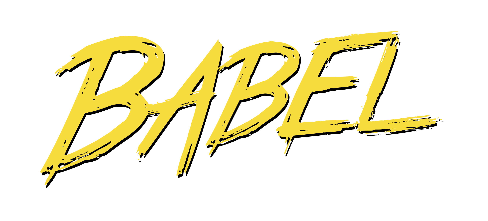

# 글 작성 계기
바벨 [7.10.0이 release](https://babeljs.io/blog/2020/05/25/7.10.0) 되었다! 그중에 좀 재미있는 항목이 `babel-polyfills` 지원 이었는데 바벨의 <b>polyfills architecture에 대한 새로운 실험 스토리</b>를 포스팅 해보려고 한다.


미리 참고한 링크를 공유하면 아래와 같다.
* [babel 7.10.0 Release 노트](https://babeljs.io/blog/2020/05/25/7.10.0)
* [babel-polyfills를 만든 사람이 제안한 내용](https://github.com/babel/babel/issues/10008#user-content-annex-b)
* [babel-polyfills repository](https://github.com/babel/babel-polyfills)

# 바벨과 core-js 관계
> 폴리필이 뭔지 잘 모르는 사람도 있을것(~~예전의 나~~)같아서 아래에 개념정리한 내용을 추가했으니 먼저 읽어보고 와도 좋다.

babel-polyfills를 만든 사람이 [babel과 core-js의 관계](https://github.com/babel/babel/issues/10008#user-content-annex-b)에 대해 문제(?)를 제기했다.
core-js는 polyfill 중 하나인데 왜 바벨 너는 polyfill 중 core-js만 선택하냐 이런 내용이다 ㅎㅎ
나도 몰랐는데 polyfill 중에 요런 라이브러리들도 있는데 `core-js`, `es-shims`, `polyfill.io` 개발자들이 마음대로 선택하지 못하게 하고 `core-js` 사용만 쉽게 해놨다!!! 요런 내용이다.

그래서 discussion을 살펴보면 엄청나게 토론의 흔적을 볼 수 있고 맨끝에 `babel-polyfills`를 만들었다고 하고 이 이슈는 끝이난다.

## 바벨과 폴리필 개념
바벨은 transpiler(compiler)이다. 개발자들이 자바스크립트를 최신 문법으로 작성하면, 모든 브라우저는 그 최신 문법을 알아듣지 못하기 때문에 대부분의 브라우저가 알아들을 수 있도록 우리가 작성한 최신 문법 코드를 옛날 문법(대부분의 브라우저들이 알아듣는 JS 문법)으로 작성한 코드를 바꾼다.

근데 옛날 문법으로 다 못바꾸는 최신 문법들이 있다. (예를들면 Promise 같은것) 그런것들은 그 기능을 하는 코드를 짜서 넣어줘야되는데 (코드조각을 넣어줘야함) 그게 polyfill 이다.

# 그래서 babel-polyfills는 어케 쓰는거임?
위에서 다 이야기했겠지만, 일단 여러 폴리필 라이브러리를 쓸 수 있게 되었다.

사용방법은 [babel-polyfills 레파지토리](https://github.com/babel/babel-polyfills)를 살펴보면 더 자세히 나와있지만 간략하게 이전과 now를 비교하자면

## 이전
기존에는 요런 세가지 방법으로 babel에서 core-js를 사용하게끔 지원했었다. ([나또한 이런 방법으로 polyfill 설정한 이력이 있다](https://blog.naver.com/qls0147/221837110424))

* By using @babel/preset-env's useBuiltIns: "entry" option, it is possible to inject polyfills for every ECMAScript functionality not natively supported by the target browsers;
* By using useBuiltIns: "usage", Babel will only inject polyfills for unsupported ECMAScript features but only if they are actually used in the input souce code;
* By using @babel/plugin-transform-runtime, Babel will inject ponyfills (which are "pure" and don't pollute the global scope) for every used ECMAScript feature supported by core-js. This is usually used by library authors.

## now (babel-polyfills)
[babel-polyfills](https://github.com/babel/babel-polyfills)를 사용하면 
`core-js@2`,	`core-js@3`, `es-shims`, `regenerator-runtime` 모두 사용이 가능하다.

설정방법은 요렇게 하면 된다.
```
{
  "plugins": [
    ["polyfill-es-shims", {
      "method": "usage-global",
      "targets": {
        "firefox": 65
      }
    }]
  ]
}
```