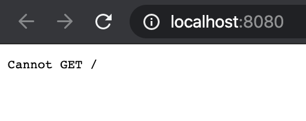
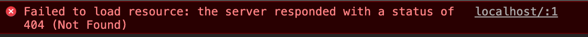

# 에러
프로젝트를 구성하는 중 이런에러가 발생했다. 처음 보는 에러였다. 무엇이 문제일까?




favicon 없다는 둥 쌸라쌸라 뜨는 에러와 함께 에러 콜스텍의 맨밑에 Failed to load resource 404 와 같은 에러가 뜬다면



# 해결방법
나의 경우에는 webpack.config.js 파일에서 output의 publicPath를 './'로 했더니 발생했던 문제였다.
아래쳐럼 publicPath를 '/'로 고쳐보면 문제를 해결할 수 있다.
```json
// webpack.config.js
...
output: {
    filename: '[name].js',
    path: path.resolve("./dist"),
    publicPath: '/'
  },
...
```