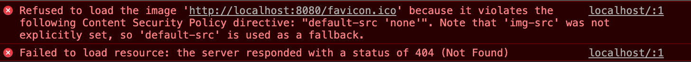

# 이 이슈를 알아보게 된 계기
[이 전의 포스팅](http://soobing.github.io/javascript/failed-to-load-resource-404/)을 보면 이런 에러가 떴음 볼 수 있다.


favicon에 접근할 수 없다는 에러인데 결론적으로 먼저 말하면 저 에러는 웹팩 설정 때문에 발생했던 이슈였다. 그 수식어들이 오우~ 공포 그자체 ㅠ `콘텐츠 보안 정책` 어쩌고저쩌고 이야기를하는데 이 에러를 해결하려고 검색하다 보니 콘텐츠 보안 정책이 있다는 사실을 알았다.  
이 포스팅에서는 ~~덕분에 알게된~~ `콘텐츠 보안 정책`에 대해서 이것은 왜 나온 것이며, 어떻게 쓰면 되는지 다뤄보려고 한다.

# 콘텐츠 보안 정책(Content Security Policy)
## 왜 나온 것인가?
  * <b>XSS 공격의 방어책</b> 
  * XSS 공격은 들어본 적이 있을 것이다. 기본적으로 웹의 보안 모델은 [동일 출처 정책(Same Origin Policy)](https://developer.mozilla.org/ko/docs/Web/Security/Same-origin_policy)을 따르는데, 어떤 출처에서 불러온 문서(HTML)나 스크립트(JS)가 다른 출처에서 가져온 리소스와 상호작용하는 것을 제한하는 중요한 보안 방식이다. <br/>즉, 간략히 말하면 다른 URL의 리소스와 함부로 상호작용할 수 없다는 것이다.
  * [용어] `동일한 출처`라는 것은 URL의 프로토콜, 포트, 호스트가 모두 같은 것을 의미

<br/>

  * 그치만 공격자는 영리하게도 Cross-site scripting(XSS) 기법을 사용해서 동일 출처 정책(Same Origin Policy)을 우회하는데, Cross-site scripting(XSS) 기법이란 클라이언트 측 스크립트(= javascript)를 웹 페이지 에 삽입하는 것을 말한다. 
  * 공격자인데 좋은 코드를 삽입하진 않겠지? 공격자는 악의적인 스크립트를 웹 페이지에 주입하는 방법을 찾아 민감한 페이지 콘텐츠, 세션 쿠키 및 사용자 대신 브라우저에서 유지 관리하는 다양한 기타 정보에 대한 높은 액세스 권한을 얻을 수 있다. 

어쨌든 이런 XSS 공격을 방어하기 위한 방어책이 `콘텐츠 보안 정책(CSP)`라는 것이다.

## 지원
콘텐츠 보안 정책(Content Security Policy)은 [모든 모던 브라우저](https://caniuse.com/#search=CSP)에서 지원한다.

## 방식
이 보안 정책은 허용되는 것과 허용되지 않는 것을 정리하여 `허용 목록`을 클라이언트에게 알려준다.
  * ex) 수빈 생일파티에 guest list가 있고 여기에 이름이 있으면 입장할 수 있지만, 없으면 입장할 수 없는 방식
  * ex) guest list에 작성된 리스트를 보니, https로만 요청해야 들어올 수 있고, img는 '가'라는 출처에서온 애들만 가능하고, font는 'google'에서 온애들만 가능하고 ~ 이런식으로 쫙 적혀있음

# 구체적인 사용 방법
콘텐츠 보안 정책을 선언할 수 있는 두가지 방법이 있다.
1. Content-Security-Policy를 HTTP header에 포함하는 방법
2. `<meta http-equiv="Content-Security-Policy">` 태그를 이용하는 방법

## 1. Content-Security-Policy를 HTTP header에 포함하는 방법
서버에서 제공하는 모든것을 맹목적으로 신뢰하는 대신 신뢰할 수 있는 콘텐츠 소스의 허용 목록을 생성할 수 있게 Content-Security-Policy HTTP 헤더를 정의하고 브라우저에는 이런 소스에서 받은 리소스만 실행하거나 렌더링할 것을 지시한다. 공격자가 스크립트를 주입할 허점을 찾을 수도 있겠지만, 그 스크립트가 허용 목록과 일치하지 않을 것이므로 실행할 수 없다.

예) HTTP 헤더에 코드의 출처가 자신과 동일한 출처(self) 이거나 https://apis.google.com 두 가지 소스 중 하나일 때만 스크립트 실행을 허용하도록 정책을 정의해보자.
```
// HTTP header
Content-Security-Policy: script-src 'self' https://apis.google.com
```
쉽게말하면 위에서 말했던 guest list를 HTTP 헤더에 정의한다는 소리. 아마도 요청에 대한 응답으로 리소스를 주니까 서버에서 CSP를 정의할 수 있는 방법일 것 같다. (이건 내생각. 정확하진 않음.)

## 2. `<meta http-equiv="Content-Security-Policy">` 태그를 이용하는 방법

우리는 HTTP 헤더를 제어할 수 없으므로 (프론트 개발자니까 >ㅁ<) 마크업에서 페이지에 대한 정책을 직접 설정하는 방법을 주로 사용하게 될 것이다.
`http-equiv` 속성을 포함한 `<meta> 태그`를 사용하여 설정할 수 있다. `meta 태그`는 `head 태그` 안에 넣어주면 된다.

예) 안전하지 않은 inline이나 eval 함수를 disable 시키고, https를 통해서만 resources(images, fonts, scripts, etc.)를 로딩 가능하게 하자
```html
<meta http-equiv="Content-Security-Policy" content="default-src https:">
```

## 리소스별로 정책 적용
[폭넓고 다양한 리소스에 정책을 적용](https://developers.google.com/web/fundamentals/security/csp?hl=ko#%ED%8F%AD%EB%84%93%EA%B3%A0_%EB%8B%A4%EC%96%91%ED%95%9C_%EB%A6%AC%EC%86%8C%EC%8A%A4%EC%97%90_%EC%A0%95%EC%B1%85_%EC%A0%81%EC%9A%A9)할 수 있는데, 자세한 사항은 링크를 참고하면 된다. 
크게 HTTP 메세지에 CSP를 정의할 수 있고, meta 태그에도 정의할 수 있다는 것을 알면된다.

# 참고
  * https://developers.google.com/web/fundamentals/security/csp?hl=ko
  * http://telerik.com/blogs/on-cross-site-scripting-and-content-security-policy
  * https://developer.mozilla.org/ko/docs/Web/HTTP/Headers/Content-Security-Policy