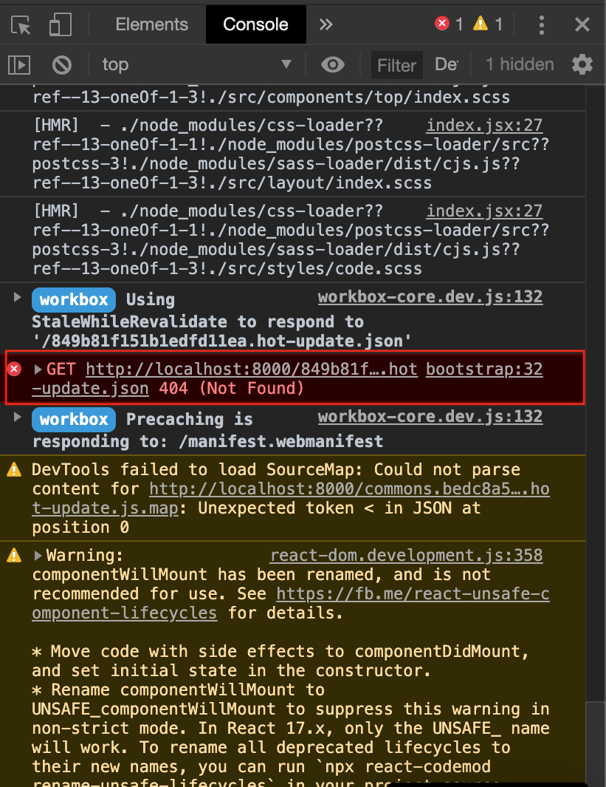

하이 나 참~ 🍝
gatsby develop 을 실행시키면 크롬 브라우저에서(safari에서는 이상 없음) 계속 무한루프를 돌며 라우팅 처리를 하는 현상이 있었다.

그래서 에러를 캡쳐하기도 어려웠지만 열심히 캡쳐했을때 hot-update.json 404 에러가 발생하고 있었다.



여러 구글링 결과 이 [해결방법](https://github.com/gatsbyjs/gatsby/issues/864#issuecomment-297744295)을 참고했다.

그래서 포트번호를 바꿔주니까 8000 포트에서만 에러가 나고 다른 포트에서는 에러가 나지 않았다;;


```json
// package.json
"scripts": {
    ...
    "develop": "gatsby develop --host localhost --port 8002",
    ...
  }
```
정확히 왜 해결이 됬는지는 파악하지못했지만 나와 비슷한 분들이 있으실 수 있으니까 ㅎㅎ 포스팅 남겨본다.