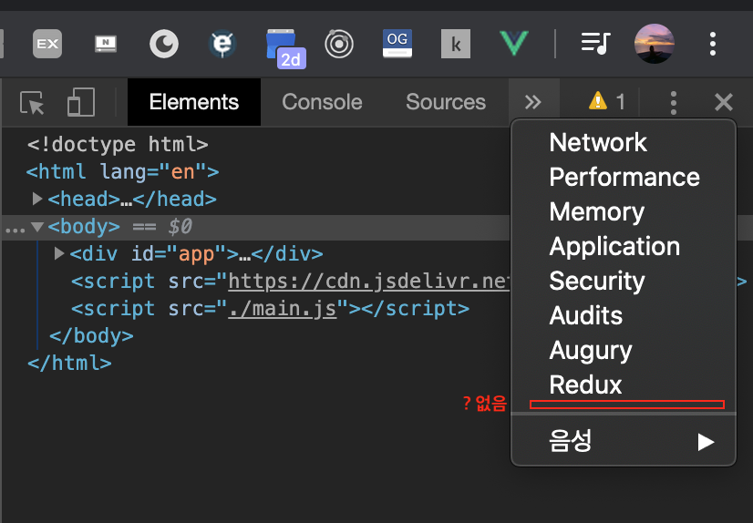
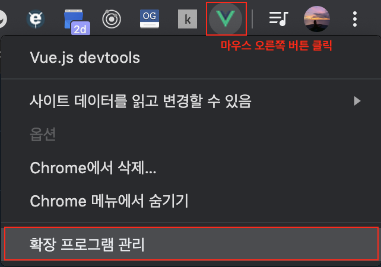
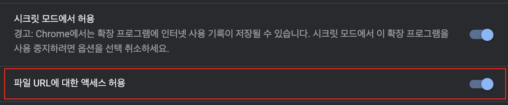
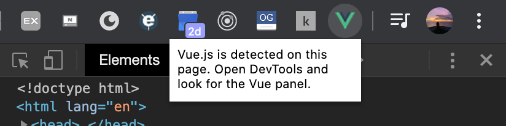
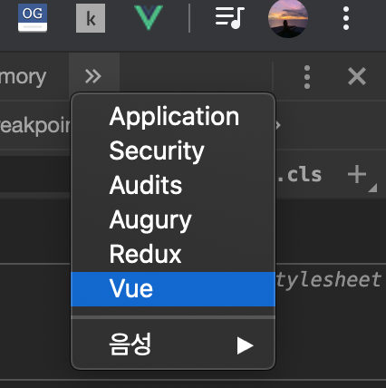

이 [동영상](https://www.vuemastery.com/courses/intro-to-vue-js/vue-instance)을 참고해서 공부중인데
아래처럼 devtool을 설치했는데도 불구하고 `개발자도구`에서도 안뜨고, `panel`에서도 안뜬다!!! 

# 문제 발생


# 해결
이 [링크](https://github.com/vuejs/vue-devtools/issues/190)를 통해서 문제를 해결했는데,
production 모드가 아닌 경우나 CDN을 통해서 vue를 가지고오는 경우 발생하는 모양이다. 
그래서 요렇게 devtools의 값을 true로 셋팅해줘야한다.

```js
Vue.config.devtools = true
```

나는 main.js에다가 js를 몰아서 작업중이라 위의 코드를 main.js에 넣어줬다!

## 파일 URL에 대한 엑세스 허용
위에처럼 했는데도 안될때는 `확장 프로그램 관리`에 들어가서 



`파일 URL에 대한 엑세스 허용`을 해준다.


# 인증
vue 아이콘을 클릭하면 제대로 로드되었고, 패널도 확인해보라는 것을 알 수 있다.


이렇게 누르면 쫘라란 ~ 패널이 생긴다!



이렇게 나의 첫 vue 포스팅을 마칩니다. ^ㅡ^