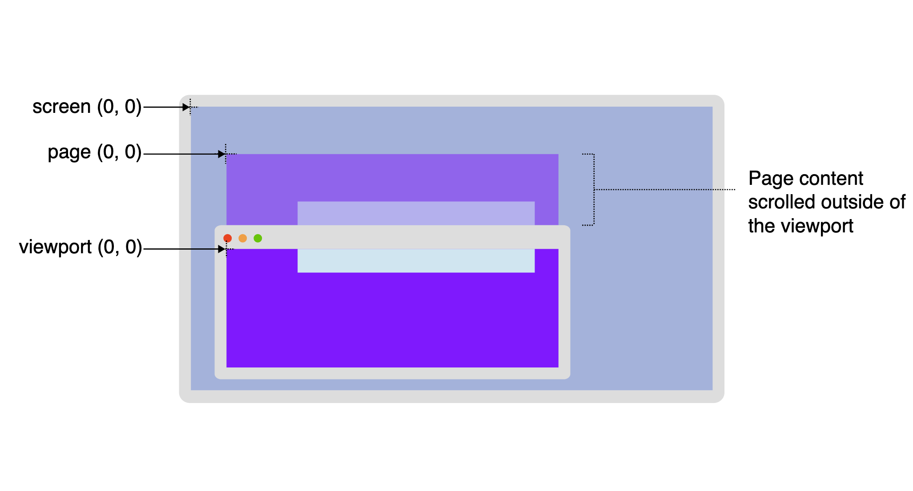

프론트 개발을 하다보면 웹 페이지의 다양한 요소들을 직접 제어해야 하는 경우가 있습니다.  이 글에서는 CSSOM의 네 가지 주요 좌표 체계인 Offset, Page, Viewport, Screen에 대해 자세히 알아보고, 위치와 크기 관련 API는 어떤것이 있는지 살펴볼 예정입니다. 이 글을 통해 웹 페이지 내에서 요소의 위치와 크기를 정밀하게 제어하는 데 도움이 되길 바랍니다.

## **표준 CSSOM 좌표 체계**

보통 클라이언트 개발에서 좌표의 원점은 왼쪽 하단이 아닌, **왼쪽 상단** 입니다.

CSS 객체 모델에서는  Offset, Page, Viewport, Screen 네 가지 표준 좌표 체계가 있습니다.

[*출처: MDN Coordinate_systems*](https://developer.mozilla.org/en-US/docs/Web/CSS/CSSOM_view/Coordinate_systems)

### **Offset**

- **정의**: 오프셋 좌표 체계는 특정 요소의 상대적 위치를 나타내는 데 사용됩니다. 이는 요소의 왼쪽 상단 모서리를 시작점(원점)으로 합니다.
- 특징: 이 좌표 체계는 요소의 부모 요소를 기준으로 한 상대적 위치를 제공합니다. 마우스 이벤트가 발생한 위치는 이벤트 대상 요소의 `offsetX`와 `offsetY` 속성을 통해 확인할 수 있습니다.
- **용도**: 드래그 앤 드롭 인터페이스나 요소 내의 상세한 위치 정보가 필요할 때 유용하게 사용됩니다.

### **Page**

- **정의**: 페이지 좌표 체계는 전체 문서(document)의 왼쪽 상단 모서리를 원점으로 합니다.
- 특징: 문서 내에서 요소의 절대적 위치를 나타내며, 사용자가 문서를 스크롤 하더라도 요소의 페이지 좌표는 변하지 않습니다. 이는 `pageX`와 `pageY` 속성을 통해 접근할 수 있습니다.
- 용도: 스크롤 위치와 상관없이 문서 내에서의 절대적 위치가 필요할 때 사용됩니다. 이는 특히 페이지 상의 특정 위치로 스크롤하는 기능을 구현할 때 유용합니다.

### Viewport

- 정의: 뷰포트 좌표 체계는 브라우저 창의 왼쪽 상단 모서리를 원점으로 하여, 뷰포트 내에서의 상대적 위치를 나타냅니다.
- 특징: 스크롤 동작에 영향을 받지 않으며, 뷰포트 내에서의 위치는 `clientX`와 `clientY` 속성을 통해 접근할 수 있습니다.
- 용도: 사용자가 페이지를 스크롤 하더라도 변경되지 않는, 뷰포트 내의 상대적 위치 정보가 필요할 때 사용됩니다.

### Screen

- 정의: 브라우저 창이 아닌 사용자의 전체 스크린을 기준으로 합니다. 여기서 원점은 스크린의 왼쪽 상단 모서리입니다.
- 특징: 스크린 좌표는 `screenX`와 `screenY` 속성을 통해 접근할 수 있으며, 스크린 내의 브라우저 창의 위치나 사용자의 스크린 해상도에 따라 달라질 수 있습니다.
- 용도: 웹 애플리케이션이 브라우저 창의 위치나 사용자의 스크린 해상도에 따른 위치 정보를 필요로 할 때 사용됩니다. 예를 들어, 팝업 창을 스크린 중앙에 위치

### 참고: 상대적 위치 vs 절대적 위치

- 정의
    - 상대적 위치: 요소의 위치가 다른 요소나 지점에 대해 상대적으로 정의. 요소의 위치는 기준점이나 조건에 따라 변할 수 있습니다.
    - 절대적 위치: 고정된 기준점에 대한 요소의 위치. 이 기준점은 변하지 않으므로, 요소의 위치도 그 기준점으로부터 항상 일정하다.
- 예시
    
    
    | 장소 | 상대 위치 | 절대 위치 |
    | --- | --- | --- |
    | 에펠탑(프랑스) | 세느 강 유역에서 | 48°51′29.6″N 2°17′40.2″E |
    | Cheops 피라미드 (이집트) | 나일강에서 서쪽으로 8km | 29°58′45″N 31°08′03″E |
    | 자유의 여신상(미국) | 맨해튼 남서쪽 리버티 섬 | 40°41′21″N 74°2′40″W |
    | 로마 콜로세움(이탈리아) | 바티칸에서 동쪽으로 3km | 41°53′25″N 12°29′32″E |
    | 파르테논 신전(그리스) | 하드리아누스 아치 서쪽 | 37°58′17″N 23°43′36″E |

## 브라우저 제공 API

> 💻 window 제공 API,  🌱 Element 제공 API
> 

### 1. 브라우저 창 크기와 뷰포트

- 💻 `outerWidth, outerHeight`**(Screen)**: 브라우저의 전체 창 크기를 나타냅니다. 이는 브라우저 UI(툴바, 스크롤바, 개발자 도구 영역 등)를 포함한 외부 창의 크기입니다. 모니터(Screen) 상에서 브라우저 창이 차지하는 전체 크기를 의미합니다.
- 💻 `innerWidth, innerHeight`**(Viewport)**: 문서가 실제로 표시되는 영역인 뷰포트(Viewport)의 크기를 나타냅니다. 스크롤바를 제외한, CSS에서 사용 가능한 실제 렌더링 영역의 크기 입니다.

### 2. 요소의 크기와 경계

- 🌱 `offsetWidth, offsetHeight`: 요소의 전체 크기를 나타내며, padding, border, scrollbar를 포함합니다. 요소의 물리적 크기를 제공합니다.
- 🌱 `offsetLeft, offsetTop`: 해당 요소와 가장 가까운 조상 요소(position이 static이 아닌 offsetParent)로부터 얼마나 떨어져 있는지를 픽셀 단위로 나타냅니다. (padding, border, scrollbar는 포함하지 않음)
- 🌱 `clientWidth, clientHeight`: 요소의 내부 영역(컨텐츠 영역) 크기를 나타내며, padding은 포함하지만 border와 scrollbar는 제외합니다.
- 🌱 `clientLeft, clientTop`: 요소의 왼쪽 및 상단 테두리(border)의 두께를 나타냅니다. 이 값들은 요소의 내부 영역에서의 상대적 위치를 제공합니다.
- 🌱 `getBoundingClientRect()`**(Viewport)**: 요소의 크기와 뷰포트에 대한 상대적 위치에 대한 정보를 제공하는 DOMRect 객체를 반환하는 메서드. DOMRect 객체의 `width`와 `height` 속성은 컨텐츠의 width, height 뿐만 아니라 padding, border-width를 포함합니다.
- 🌱 `getClientRects()`**(Viewport)**: 요소의 크기와 뷰포트에 대한 상대적 위치에 대한 정보를 제공하는 DOMRect 객체를 반환하는 메서드. 대부분의 엘리먼트는 각각 하나의 border box만을 갖지만, 여러 줄의 인라인은 각각의 줄을 감싸는 테두리 박스를 갖습니다. 이런 경우 이 요소와 관련된 CSS 테두리 박스 컬렉션을 반환하기 위해 사용합니다.

### 3. 스크롤 관련 정보

- 🌱 `scrollWidth, scrollHeight`**(Offset)**: 요소의 스크롤 가능한 영역의 전체 크기를 나타냅니다. 이는 요소의 내부 스크롤 영역 크기를 제공합니다.
- 🌱 `scrollTop, scrollLeft`**(Offset)**: 요소의 현재 스크롤 위치를 나타냅니다. 요소 내부에서 스크롤된 만큼의 픽셀 수를 제공합니다.
- 💻 `scrollX, scrollY`**(Page)**: 전체 문서 기준으로 윈도우의 현재 스크롤 위치를 나타냅니다. `PageXOffset, PageYOffset`라는 별칭(alias)이 존재하며, 구형 브라우저와의 호환성을 위해 여전히 사용됩니다.
- 💻 `scrollTo(), scrollBy()`**(Page)**: 주어진 좌표로 스크롤하거나 현재 위치에서 주어진 값만큼 스크롤하는 메서드입니다.
- 🌱 `scrollIntoView()`**(Viewport**): 호출된 요소가 사용자에게 보이도록 뷰포트 내로 스크롤합니다.

### 4. 마우스 위치

- `clientX, clientY`**(Viewport)**: 마우스 이벤트가 발생한 지점의 뷰포트 기준 좌표입니다.
- `pageX, pageY`**(Page)**: 마우스 이벤트가 발생한 지점의 문서 기준 좌표입니다.
- `screenX, screenY`**(Screen)**: 마우스 이벤트가 발생한 지점의 모니터 기준 좌표입니다.
- `offsetX, offsetY`**(Offset)**: 이벤트 대상 요소 기준 마우스 위치입니다. 이벤트 대상 요소 내에서의 마우스 위치를 나타냅니다.

### 5. 스타일 정보

- 💻 `getComputedStyle()`: 요소에 적용된 모든 CSS 속성 값을 계산하여 반환합니다. 이는 스타일 정보에 접근하는 일반적인 방법으로, CSSOM을 통해 렌더링 시점의 최종 스타일 값을 얻을 수 있습니다. 요소에 실제로 적용된 스타일을 반영합니다.