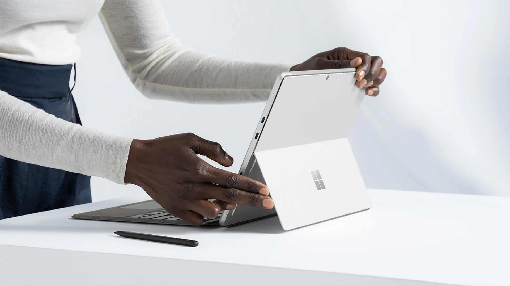
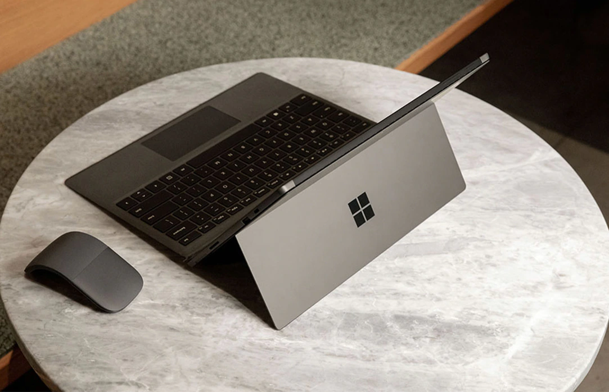
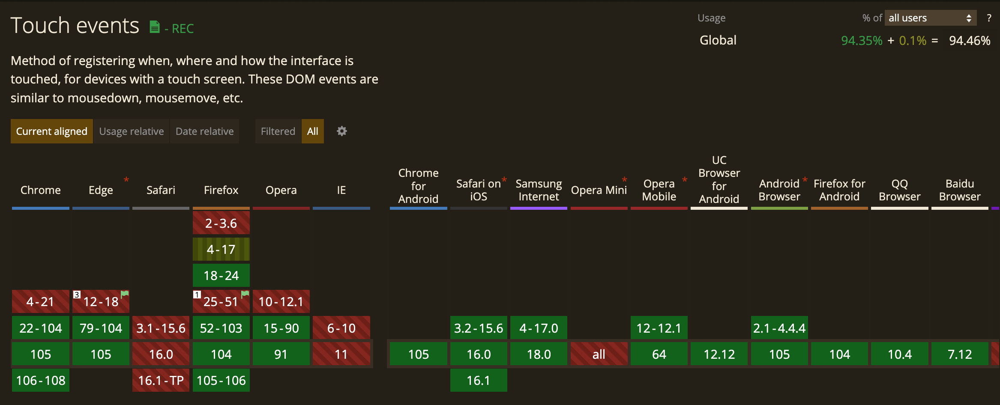

## 문제상황

dropdown 컴포넌트를 만들었는데, focus가 다른곳으로 이동하면 펼쳐져있던 dropdown이 접혀져야 해서 `blur` 이벤트 발생시 접히도록 했다.

그랬더니 펼쳐져 있는 항목 중 하나를 `click` 했을때, 위에서 설정한 `blur` 이벤트가 먼저 발생하면서 `click` 이벤트가 호출되지 않는 이슈가 문제였다.


### 문제의 코드

```jsx
import React, { useState } from "react";
import "./dropdown.scss";

export default function Dropdown({ list, onClickItem }) {
  const [selectedItem] = list.filter(({ isSelected }) => isSelected);
  const [showDropdown, setShowDropdown] = useState(false);

  return (
    <div
      className={`c-n-dropdown ${showDropdown ? "c-n-dropdown--selected" : ""}`}
      onBlur={() => setShowDropdown(false)}
    >
      <label id="dropdown" className="sr-only">
        성별선택
      </label>
      <div
        role="combobox"
        aria-controls="dropdown-list"
        aria-expanded={showDropdown}
        aria-haspopup="listbox"
        aria-labelledby="dropdown"
        className="c-n-dropdown__option"
        onClick={() => setShowDropdown(!showDropdown)}
      >
        <button type="button" className="c-n-dropdown__button">
          {selectedItem.text}
        </button>
      </div>
      <div
        role="listbox"
        id="dropdown-list"
        aria-labelledby="dropdown-label"
        className="c-n-dropdown__list"
      >
        {list.map(({ text, isSelected }, i) => (
          <button
            key={text}
            role="option"
            aria-selected={isSelected}
            className="c-n-dropdown__item"
            onClick={() => {
              onClickItem(i);
            }}
          >
            {text}
          </button>
        ))}
      </div>
    </div>
  );
}
```

## TL;DR

### Touch, mouse 이벤트 순서

1. touchstart
2. touchmove
3. touchend
4. mouseover
5. mousemove
6. mousedown
7. mouseup
8. click

### 해결방법

`click`시 처리해줘야 하는 이벤트 핸들러를 click 이 아닌 `mousedown` 에서 처리해준다.


```jsx
import React, { useState } from "react";
import "./dropdown.scss";

export default function Dropdown({ list, onClickItem }) {
  const [selectedItem] = list.filter(({ isSelected }) => isSelected);
  const [showDropdown, setShowDropdown] = useState(false);

  return (
    <div
      className={`c-n-dropdown ${showDropdown ? "c-n-dropdown--selected" : ""}`}
      onBlur={() => setShowDropdown(false)}
    >
      <label id="dropdown" className="sr-only">
        성별선택
      </label>
      <div
        role="combobox"
        aria-controls="dropdown-list"
        aria-expanded={showDropdown}
        aria-haspopup="listbox"
        aria-labelledby="dropdown"
        className="c-n-dropdown__option"
        onClick={() => setShowDropdown(!showDropdown)}
      >
        <button type="button" className="c-n-dropdown__button">
          {selectedItem.text}
        </button>
      </div>
      <div
        role="listbox"
        id="dropdown-list"
        aria-labelledby="dropdown-label"
        className="c-n-dropdown__list"
      >
        {list.map(({ text, isSelected }, i) => (
          <button
            key={text}
            role="option"
            aria-selected={isSelected}
            className="c-n-dropdown__item"
            onMouseDown={() => {
              onClickItem(i);
            }}
          >
            {text}
          </button>
        ))}
      </div>
    </div>
  );
}
```

### Dropdown CodeSandbox
<iframe src="https://codesandbox.io/embed/dropdown-smrngb?fontsize=14&hidenavigation=1&theme=dark"
     style="width:100%; height:500px; border:0; border-radius: 4px; overflow:hidden;"
     title="dropdown"
     allow="accelerometer; ambient-light-sensor; camera; encrypted-media; geolocation; gyroscope; hid; microphone; midi; payment; usb; vr; xr-spatial-tracking"
     sandbox="allow-forms allow-modals allow-popups allow-presentation allow-same-origin allow-scripts"
   ></iframe>

---
# **Touch and mouse 이벤트**

그러면 지금부터는 [web.dev 문서](https://web.dev/mobile-touchandmouse/)를 살펴보면서 알게된 `touch` 이벤트의 도입 배경과 touch, mouse 이벤트를 함께 다루기 위해 필요한 주의 사항을 좀 정리해보려고 한다.

## Introduction

거의 30년 동안은 브라우저가 데스크톱 에서만 돌아갔으므로 입력 장치로는 `키보드, 마우스, 트랙패드` 정도 였다. 그러나 지난 20년 동안 스마트폰과 태블릿이 나오면서 `touch` 라는 새로운 입력 장치가 추가 되었다. 뿐만아니라 마우스, 트랙패드, touch 모두 다 지원하는 디바이스도 나오면서~~(요즘은 유행 끝났듯)~~ touch는 단순 스마트폰과 태블릿용도 뿐만 아니라 데스크톱에서도 지원해야하는 이벤트가 되었다.

그러므로 브라우저에  touch 기능이 어떻게 내장되어 있는지, 이 새로운 인터페이스 메커니즘을 기존 앱에 어떻게 통합할 수 있었는지, 마우스 입력으로 touch가 어떻게 작동할 수 있는지 이해해보도록 하자!

## Touch, Mouse 이벤트는 따로 놀지 않는다

많은 개발자들은 브라우저의 touch 이벤트 지원여부 확인 후, touch 이벤트만 지원하면 된다고 가정하고 사이트를 구축했다. 이렇게 코딩을 하진 않았지만 주로 모바일 개발을 하는 나는 mouse 이벤트 보다는 touch 이벤트에 더 신경을 썼고, 이 두가지 이벤트는 각각 따로 동작한다고 오해했다.

mouse와 touch이벤트를 모두 사용가능하게 하는 디바이스(Chromebook Pixel, Windows 8 laptops 등등)가 등장함에 따라 마우스와 터치 스크린을 모두 사용하는 것을 고려하여 touch interface가 설계되었다는 점을 기억해야 한다. 즉, “touch 이벤트 지원은 mouse 이벤트 지원이 불필요함”이 틀린 이야기라는 것이다. 

[참고] Touch screen laptops 예시 -  Microsoft Surface




## 역사

아이폰은 웹 브라우저에 자체 구현한 touch APIs 를 내장한 최초의 인기 플랫폼이었다. 몇몇 다른 브라우저 개발 회사들은 iOS 구현과 호환되도록 유사한 API interface를 개발했고, 그 구현 명세는 “[W3C Touch Events version 1](https://www.w3.org/TR/touch-events/)”에 의해 설명되어 있다. 

## 지원범위

touch 이벤트는 왠만한 브라우저가 다 지원한다. 그러나 이와중에 멋지게 지원안하는 IE와 Safari ^^…  그래도 모바일 Safari 에서는 touch 이벤트를 지원하고 있다.



[출처] [https://caniuse.com/?search=touch](https://caniuse.com/?search=touch)

## Touch Event 종류와 data 정보

### Touch Events

1. `[touchstart](https://developer.mozilla.org/ko/docs/Web/API/Element/touchstart_event)` : DOM에 손가락이 닿을때
2. `[touchmove](https://developer.mozilla.org/ko/docs/Web/API/Element/touchmove_event)`: DOM에 손가락이 닿은 채로 움직일 때
3. `[touchend](https://developer.mozilla.org/ko/docs/Web/API/Element/touchend_event)` : DOM에서 손가락을 뗄 때
4. `[touchcancel](https://developer.mozilla.org/ko/docs/Web/API/Element/touchcancel_event)` : 시스템에서 이벤트를 취소시킬 때 (정확한 발생 조건은 브라우저마다 다름)

### Touch Information

`touch` 인터페이스는 크게 아래와 같은 정보들을 담고 있다. 더 자세한 정보는 [MDN Touch API](https://developer.mozilla.org/en-US/docs/Web/API/Touch) 를 살펴보면 된다.

- **identifier**: touch를 발생시킨 손가락의 고유 식별 번호
- **target**: touch 이벤트가 발생한 target DOM
- **client/page/screen coordinates**: touch 이벤트가 발생한 영역의 좌표 정보
- **radius coordinates and rotationAngle**: 손가락 모양에 가까운 타원 정보

참고 자료

- [MDN Touch events](https://developer.mozilla.org/ko/docs/Web/API/Touch_events)
- [Multi-touch web development](https://web.dev/mobile-touch/)
- [터치 이벤트를 이용한 사용자 제스처 분석](https://d2.naver.com/helloworld/80243)

## touch, mouse 이벤트 순서

`touch`는 일반적으로 마우스 `click` 이벤트를 모방하려고 한다. 왜냐하면 이전에 mouse 이벤트와 상호 작용한 적이 있는 애플리케이션에서도 touch 이벤트가 작동해야 하기 때문이다. 사용자가 마우스를 사용할 때는 `click` 이벤트를 통해 반응하지만 사용자가 화면을 touch 할 때는 `touch 및 click` 이벤트가 모두 발생한다. 한번 click 시, 발생하는 이벤트의 순서는 아래와 같다.

1. touchstart
2. touchmove
3. touchend
4. mouseover
5. mousemove
6. mousedown
7. mouseup
8. click

## Research 하면서 알게된 점

### mouse 이벤트는 무시하고 touch 이벤트만 처리하고 싶을때

touch 이벤트 발생시, 위의 순서대로 실행되기 때문에 mouse 이벤트가 발생되지 않길 원한다면 touch 이벤트 핸들러에서 `event.preventDefault()` 를 호출한다.

### touchmove 이벤트에서 scroll을 막고 싶을때

 scroll 영역에서 touch 이벤트를 통해 scroll 되는 것을 막고 싶을 때는, `touchmove` 이벤트에서 `event.preventDefault();`를 호출해주면 된다. 아래 예제는 데스크탑에서는 scroll이 정상작동하며 모바일에서는 scroll이 정상작동하지 않음을 보여주고 있다. mousemove

 

CodeSandbox
<iframe src="https://codesandbox.io/embed/touchmove-prevent-scroll-zi5jm5?fontsize=14&hidenavigation=1&theme=dark"
     style="width:100%; height:500px; border:0; border-radius: 4px; overflow:hidden;"
     title="touchmove-prevent-scroll"
     allow="accelerometer; ambient-light-sensor; camera; encrypted-media; geolocation; gyroscope; hid; microphone; midi; payment; usb; vr; xr-spatial-tracking"
     sandbox="allow-forms allow-modals allow-popups allow-presentation allow-same-origin allow-scripts"
   ></iframe>

### viewport zooming을 막고 싶을때

기본적으로 touch 이벤트 발생시 zoom 기능을 사용할 수 있는데, 메타 태그를 사용하여 viewport zooming(확대/축소) 비활성화 하도록 설정할 수 있다.

```html
<meta name="viewport" 
  content="width=device-width, initial-scale=1.0, user-scalable=no>
```

### **Mousemove 이벤트는 Touch 이벤트를 발생시키진 않는다.**

mousemove 관련 구현을 touchmove에서 하지 말자.

### **Touchmove와 MouseMove는 다르다.**

touch 이벤트는 항상 해당 touch 시작된 element를 대상으로 하는 반면, mouse 이벤트는 현재 마우스 커서 아래에 있는 element를 대상으로 한다. 그러므로 mouseover, mouseout 이벤트가 있는 반면에 touchover, touchout 이벤트는 존재하지 않고 touchend 이벤트만 존재하는 이유이기도 하다.

### **Touch와 :Hover**

마우스 포인터는 hover 상태를 사용하여 사용자와 관련된 정보를 숨기고 표시할 수 있다. 그러나 현재 대부분의 touch interface는 대상 위에 손가락을 "hovering"하는 것을 감지하지 못한다. 따라서 hover를 통해중요한 정보를 제공하는 것은 이 정보에 액세스할 수 있는 touch 친화적인 방법을 제공하지 않는 한 불가능하다. 

CSS `:hover` pseudoclass CAN은 touch에 의해 트리거 될 수 있다. 경우에 따라 element를 두드리면 손가락이 닿는 순간 `:active` 상태가 되고 `:hover` 상태로도 인지 된다. 주의해야 할 점은, element를 `:acitve`  상태로 만들 경우 `:hover` 상태시 작동하기 위한 코드도 적용된다는 점이다.

### **Multi-touch**

대부분의 브라우저는 한 번에 두 개 이상의 touch input을 제공한다.

[https://youtu.be/6wL-pLX9Kq0](https://youtu.be/6wL-pLX9Kq0)

### 기타 궁금증

타이벤트(focus/blur, scroll 등등)과의 연관성

- mouseup 호출되는 시점에 이미 blur 이벤트가 호출되는거보니까 그쯤인거같다.

## 참고

- [https://web.dev/mobile-touchandmouse/](https://web.dev/mobile-touchandmouse/)
- [https://ui.toast.com/weekly-pick/ko_20220106](https://ui.toast.com/weekly-pick/ko_20220106)