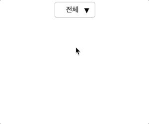
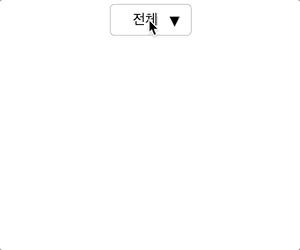

## 문제상황

dropdown 컴포넌트를 만들었는데, focus가 다른곳으로 이동하면 펼쳐져있던 dropdown이 접혀져야 해서 `blur` 이벤트 발생시 접히도록 했다.

그랬더니 펼쳐져 있는 항목 중 하나를 `click` 했을때, 위에서 설정한 `blur` 이벤트가 먼저 발생하면서 `click` 이벤트가 호출되지 않는 이슈가 문제였다.



### 문제의 코드

```jsx
import React, { useState } from "react";
import "./dropdown.scss";

export default function Dropdown({ list, onClickItem }) {
  const [selectedItem] = list.filter(({ isSelected }) => isSelected);
  const [showDropdown, setShowDropdown] = useState(false);

  return (
    <div
      className={`c-n-dropdown ${showDropdown ? "c-n-dropdown--selected" : ""}`}
      onBlur={() => setShowDropdown(false)}
    >
      <label id="dropdown" className="sr-only">
        성별선택
      </label>
      <div
        role="combobox"
        aria-controls="dropdown-list"
        aria-expanded={showDropdown}
        aria-haspopup="listbox"
        aria-labelledby="dropdown"
        className="c-n-dropdown__option"
        onClick={() => setShowDropdown(!showDropdown)}
      >
        <button type="button" className="c-n-dropdown__button">
          {selectedItem.text}
        </button>
      </div>
      <div
        role="listbox"
        id="dropdown-list"
        aria-labelledby="dropdown-label"
        className="c-n-dropdown__list"
      >
        {list.map(({ text, isSelected }, i) => (
          <button
            key={text}
            role="option"
            aria-selected={isSelected}
            className="c-n-dropdown__item"
            onClick={() => {
              onClickItem(i);
            }}
          >
            {text}
          </button>
        ))}
      </div>
    </div>
  );
}
```

## TL;DR

### Touch, mouse 이벤트 순서

1. touchstart
2. touchmove
3. touchend
4. mouseover
5. mousemove
6. mousedown
7. mouseup
8. click

### 해결방법

`click`시 처리해줘야 하는 이벤트 핸들러를 click 이 아닌 `mousedown` 에서 처리해준다.



```jsx
import React, { useState } from "react";
import "./dropdown.scss";

export default function Dropdown({ list, onClickItem }) {
  const [selectedItem] = list.filter(({ isSelected }) => isSelected);
  const [showDropdown, setShowDropdown] = useState(false);

  return (
    <div
      className={`c-n-dropdown ${showDropdown ? "c-n-dropdown--selected" : ""}`}
      onBlur={() => setShowDropdown(false)}
    >
      <label id="dropdown" className="sr-only">
        성별선택
      </label>
      <div
        role="combobox"
        aria-controls="dropdown-list"
        aria-expanded={showDropdown}
        aria-haspopup="listbox"
        aria-labelledby="dropdown"
        className="c-n-dropdown__option"
        onClick={() => setShowDropdown(!showDropdown)}
      >
        <button type="button" className="c-n-dropdown__button">
          {selectedItem.text}
        </button>
      </div>
      <div
        role="listbox"
        id="dropdown-list"
        aria-labelledby="dropdown-label"
        className="c-n-dropdown__list"
      >
        {list.map(({ text, isSelected }, i) => (
          <button
            key={text}
            role="option"
            aria-selected={isSelected}
            className="c-n-dropdown__item"
            onMouseDown={() => {
              onClickItem(i);
            }}
          >
            {text}
          </button>
        ))}
      </div>
    </div>
  );
}
```

### Dropdown CodeSandbox
<iframe src="https://codesandbox.io/embed/dropdown-smrngb?fontsize=14&hidenavigation=1&theme=dark"
     style="width:100%; height:500px; border:0; border-radius: 4px; overflow:hidden;"
     title="dropdown"
     allow="accelerometer; ambient-light-sensor; camera; encrypted-media; geolocation; gyroscope; hid; microphone; midi; payment; usb; vr; xr-spatial-tracking"
     sandbox="allow-forms allow-modals allow-popups allow-presentation allow-same-origin allow-scripts"
   ></iframe>
   
