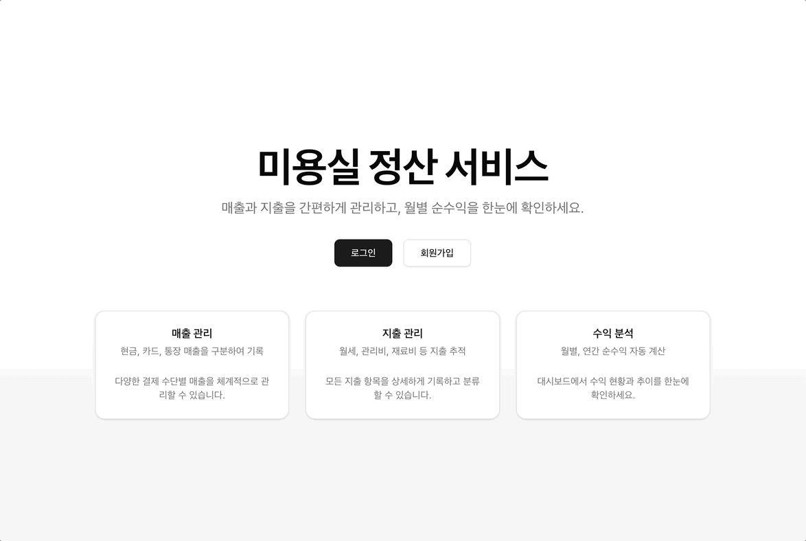
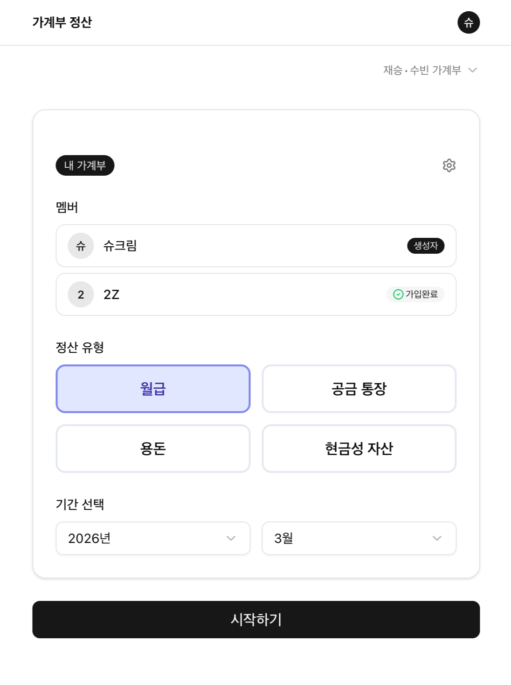

## 1. 처음엔 클코의 필요성을 못 느꼈다.

25년 3월쯤 MCP가 나오며 업계에 큰 충격을 줬을 때, 나는 이미 VS Code에서 Cursor로 IDE를 바꾸고 넘어간 상태였다.
기존 Copilot과는 다르게 프로젝트 전체를 파악하고 코드를 추천해주는 Cursor의 능력에 놀랐고, MCP 연동으로 이것저것 많이 해볼 수 있다는 점에도 또 한 번 놀랐다.
그렇게 이미 agentic coding을 사용하고 있었기 때문에, 굳이 Claude Code를 써야 하나 싶었다. 어차피 프로젝트를 파일 단위 이상으로 파악하는 컨셉은 비슷하다고 생각했으니까.

## 2. 링크드인에서 하도 난리길래.. 입문

25년 말부터 내 링크드인에는 Claude Code 사용법 관련 글밖에 뜨지 않았다. 다들 하도 대단하다고 하길래, Pro를 구독하기 전에 일단 API로 먼저 써보기 시작했다.
그런데 막상 뭘 만들어야 할지 모르겠었다.
만들고 싶은 게 딱히 없어서 토큰을 썩히고 있었는데,
어느 날 친한 친구가, 미용실을 하는 동생을 위해 **엑셀 시트로 순수익을 계산할 수 있도록 수식을 세팅해줬다**는 얘기를 했다.

"오, 미용실 정산 프로그램…?"

주변 자영업자들이 매출을 내는 데만 급급해서 정작 **자신의 순수익을 제대로 계산하지 못하는 경우**가 많다는 걸 옆에서 본 적이 있기 때문에, 그런 분들을 위해 한번 무언가 만들어봐야겠다는 생각이 들었다.
그래서 친구가 만든 엑셀 시트를 받아, 웹사이트 형태로 구현해봤다.

## 3. '자영업자를 위한 순수익 정산 프로그램'

이 프로젝트를 시작하면서 API 요금제로 쓰던 토큰을 다 써버렸고, 결국 Pro 라이선스를 구매했다.
중간중간 제한에 걸리긴 했지만, 육아하면서 틈날 때마다 프롬프트를 입력하는 식으로 사용하다 보니 그렇게까지 불편하진 않았다.
이걸 하면서 두 가지 큰 충격을 받았다.

1. Claude Code의 능력
2. 열심히 만들었는데… 친구 동생이 필요 없다고 함

엑셀 스프레드시트가 이미 있어서였는지, 자세한 기획을 주지 않았는데도 꽤 그럴듯하게 만들어냈다. Supabase를 붙여 DB를 연동하니 테이블 구조도 명확하게 잡아줬고, 이메일 가입 기능도 금방 만들어줬다.
프론트는 말할 것도 없었다. 진짜 한 번도 코드를 보지 않았다.
서비스 하나를 프롬프트 몇 번으로, 그것도 깔끔하고 반응형으로 턱 만들어내는 걸 보니 너무 충격적이어서 머리가 멍해졌다.

"와… 나는 이제 필요 없어지는 건가? ㅋㅋㅋ"

**그런데 또 한 번의 충격이 있었다.**

신나서 친구에게 보여주며 "내가 이거 만들었다!" 하고 자랑했는데, 
친구가 친구 동생에게 한 번 써보라고 보여준 뒤 돌아온 반응이 완전 싸늘했다.

와.. ㅋㅋ 충격이 어마어마 했다.
프론트 구현 능력은 AI에게 뒤쳐진다고 쳐도.. 앞으로 세상에 필요한 많은 서비스를 만들 수 있겠다고 생각하며 들떠 있었는데, 순식간에 쭈구리가 됐다.

마침 이런 뉴스도 떴다.

[[사스포칼립스 위기 ㊥] SaaS에서 AI 플랫폼으로…글로벌 기업 '대이동'](https://zdnet.co.kr/view/?no=20260224162240)

> 전 세계적으로 소프트웨어 업계에서 생성형 인공지능(AI)가 빠르게 확산되면서 기존 서비스형 소프트웨어(SaaS) 중심의 매출 구조가 흔들리고 있다. AI가 단순 기능 추가 수준을 넘어 비즈니스 모델 자체를 재편할 수 있다는 인식이 커지면서 개인을 넘어 소프트웨어(SW) 기업을 대체할 것이란 우려가 커지고 있기 때문이다.
> 이로 인해 일각에서는 SaaS와 멸망(Apocalypse)을 합친 '사스포칼립스(SaaSpocalypse)'라는 표현까지 등장했다. AI 에이전트가 업무를 자율적으로 수행하는 구조로 발전함에 따라 서비스 사용자 수를 기준으로 과금하던 기존 구독 모델이 붕괴할 수 있다는 전망이 힘을 얻고 있다.

## 4. 유저가 한 명이라도 있는 서비스를 만들어보자

일단 대충 Claude Code의 능력은 파악했고, 뭐라도 만들고 싶은 마음이 가득했다.
그런데 내가 세상에 필요하다고 생각한 걸 만든다고 해서, 사람들이 당연히 써주는 건 아니었다.
왜 내가 만든 소프트웨어를 써야 하는지 설명하고, 결국에는 내가 직접 PR도 하고 마케팅도 해야 한다는 걸 알게 됐다.
늘 요구사항만 받아서 개발하던 내가, 마케팅까지 해보겠다고 Threads에 "미용실 정산 시스템" 써볼 사람 있냐는 글도 올려봤는데…

아무도 댓글을 달지 않았다…^^..

그래서 방향을 바꿨다.
**유저가 한 명이라도 있는 서비스를 만들자.**

바로 **우리 집 가계부 정산 시스템**.

일단 무조건 사용하는 유저는 두 명이다. 
나랑 남편. ㅋㅋ

우리는 5년째 가계부를 빡세게 쓰고 있는데, 월급이 들어오면 고정비, 변동비를 하나하나 나눠서 통장 간 정산을 해야 하는 금액이 꽤 크고 복잡하다.

이건 실제로 복잡한 정산 로직이 들어가다 보니, 이전처럼 뚝딱 만들어지진 않았다. QA까지 포함해서 한 15일 정도 걸린 것 같다.

그 얘기는 2탄에서 이어서 써보려고 한다.
