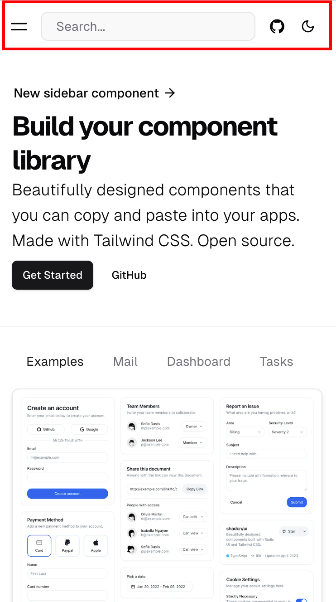

프론트엔드 개발을 하다 보면 z-index 때문에 겪는 문제를 피하기 어렵습니다. 특히 프로젝트 규모가 커질수록 z-index는 예상치 못한 충돌을 일으키며, 가독성을 떨어뜨리곤 합니다. 예를 들어, 특정 UI 요소가 다른 요소에 의해 가려지거나, 의도한 대로 화면에 표시되지 않는 문제를 종종 경험하게 됩니다. 이 글에서는 CSS 변수를 활용하여 이러한 z-index 문제를 체계적으로 관리하는 방법을 공유해 보고자 합니다.

## Floating UI

대부분의 프로젝트에는 여러 개의 floating UI가 존재합니다. 예를 들어, Header, [Drawer](https://ui.shadcn.com/docs/components/drawer), [Dialog(Modal)](https://ui.shadcn.com/docs/components/dialog), [Tooltip](https://ui.shadcn.com/docs/components/tooltip), [Dropdown Menu](https://ui.shadcn.com/docs/components/dropdown-menu) 등을 생각해볼 수 있습니다. 이러한 UI들은 동시에 여러 개가 겹칠 수 있으며, 이들의 레이어 순서를 명확히 정의하지 않으면 화면에서 엉뚱한 위치에 겹쳐 보이거나 클릭이 되지 않는 문제가 발생할 수 있습니다.


*Header UI*


*Drawer UI*


*Dialog UI*


*Toast UI*


*Tooltip UI*

## 레이어 정의

z-index 값을 무작위로 부여하는 대신 레이어의 목적에 따라 층위를 나누어 설계하면 더욱 체계적인 관리가 가능합니다. 예를 들어, 다음과 같이 레이어를 나눌 수 있습니다.

1. **기본 레이어**: 페이지의 주요 콘텐츠 (– `-z-index-base`)
2. **UI 레이어**: 드롭다운, 메뉴 (– `-z-index-dropdown`)
3. **알림 레이어**: 툴팁, 팝업 (– `-z-index-tooltip`)
4. **상호작용 레이어**: 모달, 다이얼로그 (– `-z-index-modal`)
5. **오버레이 레이어**: 전체 화면을 덮는 요소 (– `-z-index-overlay`)

아래와 같이 미리 레이어의 종류를 정의하고 CSS 변수로 관리하면 새로운 요소를 추가할 때도 쉽게 일관된 구조를 유지할 수 있습니다.

```
:root {
  --z-index-base: 0;
  --z-index-dropdown: 10;
  --z-index-tooltip: 20;
  --z-index-modal: 30;
  --z-index-overlay: 40;
}
```

## z-index 변수 사용

CSS 변수(`var()`)를 사용하면 z-index 값을 중앙에서 관리할 수 있어 레이아웃의 레이어를 쉽게 예측하고 수정할 수 있습니다. 이 방법을 활용할 경우 아래와 같은 장점이 있습니다.

1. **가독성 향상**: `var(--z-index-tooltip)`과 같이 명확한 이름의 변수를 사용하면, 각 요소의 z-index가 무슨 목적으로 정의되었는지 쉽게 알 수 있습니다. 단순히 숫자만 있는 코드보다 가독성이 높아집니다.
2. **일관성 유지**: 프로젝트가 커질수록 각 컴포넌트마다 임의의 z-index를 설정하다 보면 예기치 않은 레이어 충돌이 발생할 수 있습니다. CSS 변수로 일관되게 z-index 값을 관리하면 이러한 문제를 예방할 수 있습니다.
3. **유지보수 용이성**: 만약 모달과 관련된 모든 z-index를 조정해야 하는 경우, 변수 하나만 변경하면 전체가 반영됩니다. 수십 개의 CSS 파일을 수정할 필요가 없으며, 실수를 줄일 수 있습니다.

위에서 정의한 변수들을 사용해 스타일을 적용하면 다음과 같이 작성할 수 있습니다.

```
.header {
  z-index: var(--z-index-base);
}

.dropdown-menu {
  z-index: var(--z-index-dropdown);
}

.tooltip {
  z-index: var(--z-index-tooltip);
}

.modal {
  z-index: var(--z-index-modal);
}

.modal-close-button {
  z-index: calc(var(--z-index-modal) + 1);
}

.overlay {
  z-index: var(--z-index-overlay);
}

```

모달 안의 닫기 버튼과 같은 특정 요소에 대해서는 `calc()`를 사용하여 모달보다 높은 z-index 값을 부여할 수 있습니다. 예를 들어, `.modal-close-button`에 `z-index: calc(var(--z-index-modal) + 1)`을 적용하면 모달 내부의 다른 요소들 위에 자연스럽게 배치할 수 있습니다.

## 마무리

CSS 변수를 사용하여 겹치는 UI들의 z-index를 효과적으로 관리할 수 있는 방법을 고민해보았습니다. 프로젝트 내에서 사용되는 floating UI들을 기준으로 정리를 시작해보면, 복잡했던 레이어 관리가 훨씬 단순해질 것입니다. 이 전략이 여러분의 프로젝트에 도움이 되었길 바라면서 이번 글을 마치겠습니다.

## 참고자료

- [Z-색인 및 스택 컨텍스트](https://web.dev/learn/css/z-index?hl=ko)
- [Understanding Z-Index in CSS](https://ishadeed.com/article/understanding-z-index/)