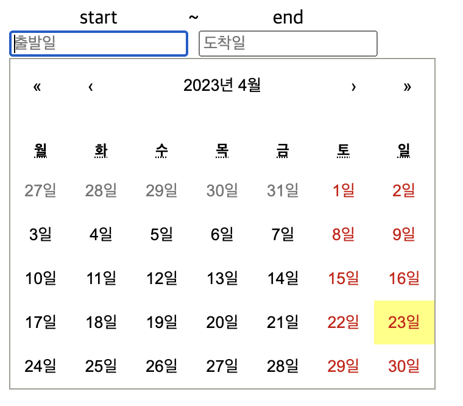

Date와 인연이 깊은지 `날짜 선택 UI`를 custom 해서 개발해야 하는 경험을 두 번째 하게 되었다.

mui datepicker를 붙이기엔 너무 과해서  [react-calendar](https://github.com/wojtekmaj/react-calendar) 라이브러리를 사용하려고 했는데, 문제는 input은 함께 딸려오지 않기 때문에 input 관련 interaction은 직접 구현해야 했다. 인 하우스용 서비스라 여러 라이브러리 참고해서 직접 인터렉션을 정의하고 구현해 보았는데 기록 차 경험을 남겨본다!



## TL;DR;

- 전체 구현 결과물은 [code sandbox](https://codesandbox.io/s/date-input-zux23t?file=/src/components/DatePicker.tsx:0-3603)에서 확인할 수 있다.
- DatePicker 컴포넌트를 개발해 보자! (calendar는 라이브러리를 사용)
- 딱히 input에 대한 큰 요구사항이 없이 기능 개발을 해야 하는 경우 그냥 [react-date-picker](https://projects.wojtekmaj.pl/react-date-picker/)를 써라

## DatePicker 컴포넌트 개발

<iframe src="https://codesandbox.io/embed/date-input-zux23t?fontsize=14&hidenavigation=1&theme=dark"
     style="width:100%; height:500px; border:0; border-radius: 4px; overflow:hidden;"
     title="date-input"
     allow="accelerometer; ambient-light-sensor; camera; encrypted-media; geolocation; gyroscope; hid; microphone; midi; payment; usb; vr; xr-spatial-tracking"
     sandbox="allow-forms allow-modals allow-popups allow-presentation allow-same-origin allow-scripts"
   ></iframe>
   
### dependency

- [react-calendar](https://github.com/wojtekmaj/react-calendar)
- [dayjs](https://day.js.org/)

### props 설계

- `minDate, maxDate`: date range를 지원해야하므로 최소/최대 날짜 값 필요
- `placeholder`: input의 placeholder
- `value, setValue`: 현재 선택된 Date
    - 부모가 value값을 controll

### Input 요구사항

- 일단 숫자만 받도록 할 것
- input 값이 들어올때마다 구분자 dash로 `년-월-일`을 구분한다
- input value의 maxlength는 10자리 (ex. 2023-04-23)
- 비정상적인 value의 경우 `dayjs` 이용해서 보정이 필요 (ex. 2023-90-10 → 2030-06-10)

## Input 인터렉션

아래와 같이 정의해서 구현해보았다.

- 1자리 (ex. 1) → 월
- 2자리 (ex. 10) → 일
- 3, 4자리 (ex. 202, 2023) → 년
- 5, 8자리 → 체크할 필요 없음 `-` 로 구분되는 케이스
- 6, 7자리 (ex. 2023-1, 2023-11) → 월
- 9, 10자리 (ex. 2023-11-2, 2023-11-20) → 일

```jsx
import React, { useState, useRef } from "react";
import Calendar from "react-calendar";
import "react-calendar/dist/Calendar.css";
import useOnClickOutside from "../hooks/useOnClickOutside";
import dayjs from "dayjs";

export default function DatePicker({
  placeholder,
  value,
  setValue,
  minDate,
  maxDate,
  label
}) {
  const divRef = useRef(null);
  const inputRef = useRef(null);
  const [showCalendar, setShowCalendar] = useState(false);
  const setValueToInput = (v) =>
    inputRef.current &&
    (inputRef.current.value = dayjs(v).format("YYYY-MM-DD"));

  useOnClickOutside(divRef, () => {
    setShowCalendar(false);
    if (value && inputRef.current?.value) {
      setValueToInput(value);
    }
  });

