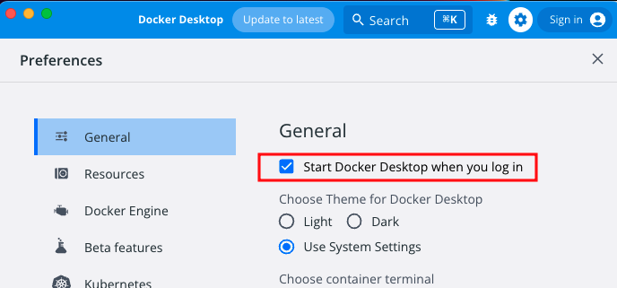

## Docker 엔진 시작하기/종료하기

- 도커 엔진: 자동 실행 설정 활성화시, 컴퓨터를 켰을 때 함께 자동으로 실행
    - Docker Desktop은 도커 엔진 자동으로 실행하도록 설정 되어있음.
        
        
        
    - 리눅스 명령어로 엔진 시작, 종료, 자동 실행 설정 방법
        - systemctrl: 서비스 시작 및 중지 관련 리눅스 명령어 (system control)
        
        ```bash
        # 엔진 시작
        sudo systemctl start docker
        # 엔진 종료
        sudo systemctl stop docker
        # 자동 실행 설정
        sudo systemctl enable docker
        ```
        
- 컨테이너: 실행시킬 스크립트가 따로 필요. 컴퓨터를 켰을 때 함께 자동으로 실행 되지 않음.

## 컨테이너의 기본적인 사용 방법

- 컨테이너를 다루는 모든 명령어는 `docker` 명령어로 시작
- 도커 명령어 구성: `docker 커맨드(무엇을 어떻게) 대상`
    - \+ 옵션, 인자: `docker 커맨드(무엇을 어떻게) 옵션 대상 인자`
    - 상위 커맨드는 생략 가능하다?!  ex) docker run, docker start
        - 커맨드(무엇을 어떻게)는 상위커맨드와 하위커맨드로 나뉘어짐.
        - container 상위 커맨들를 생략하는 경우가 있음.
        - 도커 1.13부터 커맨드가 재편되면서 상위 커맨드와 하위 커맨드의 조합 형태로 일원화 되고 일부 커맨드는 커맨드 자체가 변경되기도 했음. 이전 커맨드와 호환성을 유지하기 위해 상위 커맨드가 없는 명령어로도 실행 가능하지만 언제 수정될지 모르니 이사실을 기억하고 있자!
- 리눅스 관련 깨알지식
    - 옵션
        - \- or —로 시작하는 것이 일반적이지만, -를 붙이지 않는 경우도 있음. 커맨드 작성자 취향
        - 옵션 뒤에 옵션의 값을 지정: 커맨드에 어떤 값을 전달하고 싶은 경우. ex) —name penguin
        - -를 하나만 사용하는 옵션은 한꺼번에 모아쓸 수 있음. ex) -dit = -d + -i + -t
    - 인자
        - 옵션이랑 다른점이 모야? → 인자는 “대상에 전달할 값을 지정” ex) 문자 코드, 포트 번호
        - \- or —로 시작하는 경우가 많다
        - 예) —mode=1, —style nankyoku
    - 데몬
        - 유닉스, 리눅스에서 동작하는 프로그램 중에서 백그라운드에서 항상 동작하는 프로그램을 관례적으로 데몬(daemon)이라고 부름. ex)메일러 데몬
- 명령어 정리
    
    | docker 명령 | 상위 커맨드 | 하위 커맨드 |  | 주요 옵션 |
    | --- | --- | --- | --- | --- |
    | docker | container | start | 컨테이너 실행 | -i |
    |  |  | stop | 컨테이너 정지 |  |
    |  |  | create | (이미지로 부터) 컨테이너 생성 | —name, -e, -p, -v |
    |  |  | run | 세개의 명령을 하나로 합침(이미지 내려받기, 컨테이너 생성, 실행) <br/> docker image pull <br/>docker container create <br/>docker container start | —name, -e, -p, -v, -d, -i, -t |
    |  |  | rm | 정지 상태 컨테이너 삭제 |  |
    |  |  | exec | 실행중인 컨테이너 속에서 프로그램 실행 | -i -t |
    |  |  | ps <br/>ls (상위커멘드 생략 X) | (실행 중인)컨테이너 목록 출력 | -a (정지상태 컨테이너 포함) |
    |  |  | cp | 도커 컨테이너 - 도커 호스트 간에 파일 복사 |  |
    |  |  | commit | 도커 컨테이너를 이미지로 변환 |  |
    |  | image | pull | 도커 허브 리포지토리에서 이미지 다운 |  |
    |  |  | rm | 도커 이미지 삭제 |  |
    |  |  | ls | 내려받은 이미지 목록 |  |
    |  |  | build | 이미지 생성 | -t |
    |  | volume | create | 볼륨 생성 | —name |
    |  |  | inspect | 볼륨 상세 정보 |  |
    |  |  | ls | 볼륨 목록 | -a |
    |  |  | prune | 현재 마운트되지 않은 볼륨을 모든 삭제 |  |
    |  |  | rm | 볼륨 삭제 |  |
    |  | network | connect | 네트워크 연결 |  |
    |  |  | disconnect | 네트워크 연결 해제 |  |
    |  |  | create | 네트워크 생성 |  |
    |  |  | inspect | 네트워크 상세 정보 |  |
    |  |  | ls | 네트워크 목록 |  |
    |  |  | prune | 현재 컨테이너가 접속하지 않은 네트워크 모두 삭제 |  |
    |  |  | rm | 네트워크 삭제 |  |
- 특수 커멘드 (상위 커맨드 없이 단독. 주로 도커 허브의 검색, 로그인)
    
    
    | 단독 커맨드 | 내용 | 주요 옵션 |
    | --- | --- | --- |
    | login | 도커 레지스트리에 로그인 | -u, -p |
    | logout | 도커 레지스트리에 로그아웃 |  |
    | search | 도커 레지스트리 검색 |  |
    | version | 도커 엔진 및 명령행 도구의 버전 출력 |  |
- 주요 옵션
    - 컨테이너에 따라 지정 가능한 옵션/인자가 달라짐
    - 컨테이너는 ‘한 번만 실행되는 컨테이너’와 ‘데몬 형태로 동작하는 컨테이너’가 있음.
    
    | 옵션 형식 | 내용 |
    | --- | --- |
    | —name 컨테이너_이름 | 컨테이너 이름 지정 |
    | -p 호스트_포트번호:컨테이너_포트번호 | 포트번호 지정 <br/>(—publish 생략형) |
    | -v 호스트_디스크:컨테이너_디렉터리 | 볼륨 마운트 <br/>(—volume 생략형) |
    | —net=네트워크_이름 | 컨테이너 네트워크에 연결 |
    | -e 환경변수_이름=값 | 환경변수 설정 <br/>(—env 생략형) |
    | -d | 백그라운드로 실행 <br/>(—detach 생략형) |
    | -i | 컨테이너에 터미널(키보드)을 연결함  <br/>(—interactive 생략형) |
    | -t | 특수 키 사용 가능 <br/>(—tty 생략형) |
    | -help | 사용 방법 안내 메시지 |

## 컨테이너 생성, 삭제, 실행, 정지

```bash
docker run (옵션) 이미지 (인자)
docker stop 컨테이너_이름
docker rm 컨테이너_이름
docker ps -a
```

예제

- 아파치 이미지(httpd)
    - `docker run --name apa000ex1 -d httpd`
    - -d: —detach 백그라운드로 실행