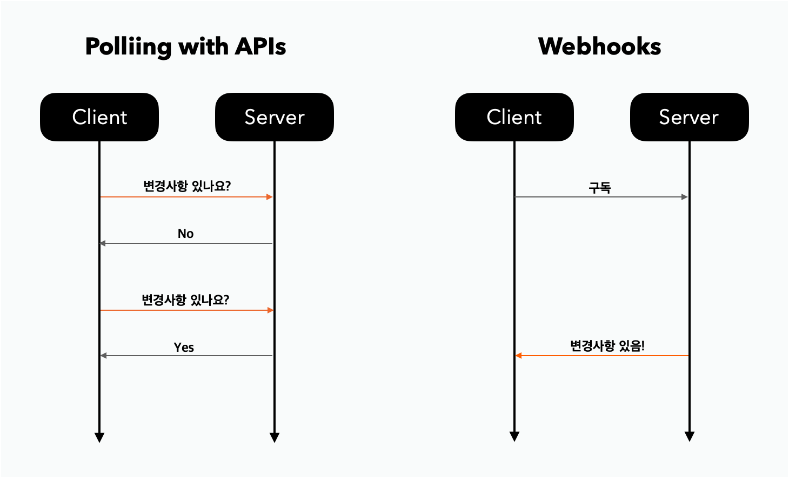
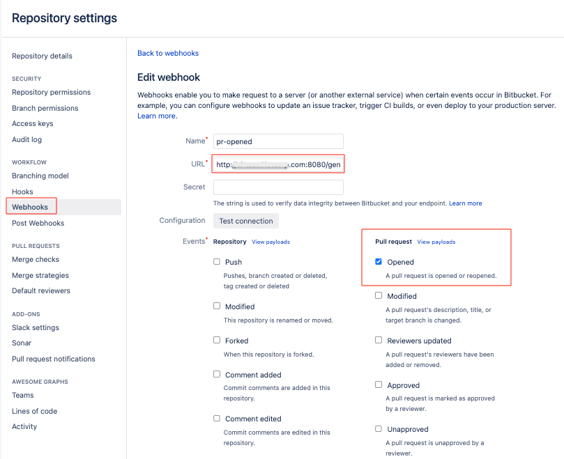
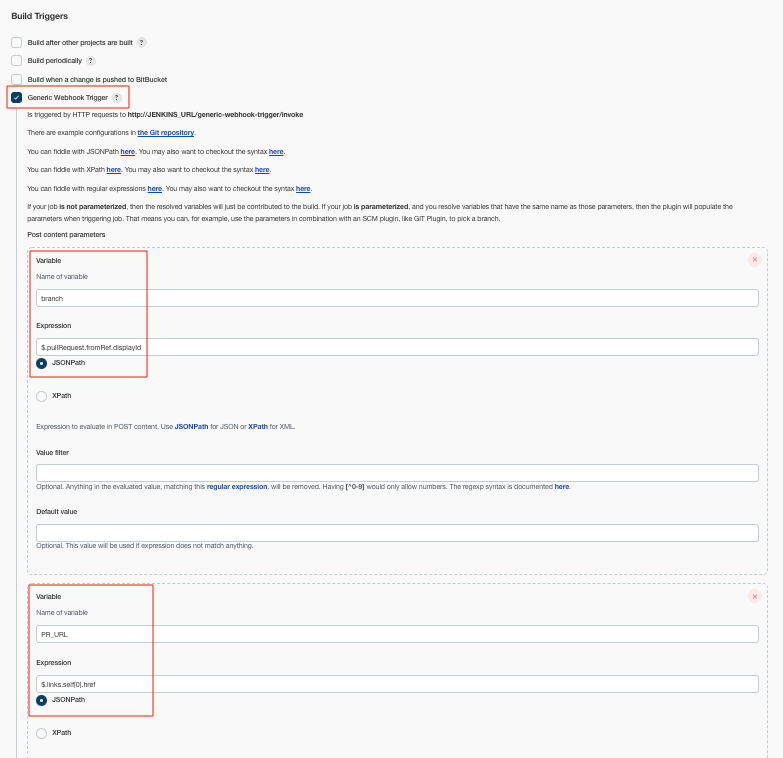

## 목표

Jenkins pipeline을 이용하여, bitbucket에서 PR 생성시 Jenkins job을 실행시키고 그 결과를 slack으로 전송한다.

(Jenkins 내의 credential 설정이나 자세한 Jenkins 플러그인 설정 사항은 해당 글에서 포함하지 않음.)

## Webhook

웹훅이란 뭘까? 위의 목표를 이루려면 우리는 웹훅이 필요하다.

> 어플리케이션에 한정하여 특정 이벤트가 발생할 때 지정된 URL로 `push` 알림을 보내는 것이 webhook이다. callback 이랑 비슷한데, 조금 더 작은 범위라고 생각하면 된다.
> 

이 방법은 주기적으로 검사하여 변경 사항이 있는지 확인하는 것보다 훨씬 효율적이다.




## 구현 방법

우리는 bitbucket에서 PR이 생성되었을때 Jenkins 플러그인인 Generic Webhook Trigger를 호출 하고, Jenkins Job 실행이 끝났을 때 slack Webhook을 호출 할 것이다.

### 1. Jekins에서 Generic Webhook Trigger 플러그인 설치

Bitbucket에서 PR이 생성 되었을때 알림을 받기 위해 [Generic Webhook Trigger 플러그인](https://plugins.jenkins.io/generic-webhook-trigger/)을 설치한다.

- [Bigbucket 플러그인](https://plugins.jenkins.io/bitbucket/) vs [Generic Webhook Trigger 플러그인](https://plugins.jenkins.io/generic-webhook-trigger/)
    - Bitbucket 플러그인 사용도 고민하긴 했으나 PR이 오픈시, 현재 작업 branch가 무엇인지? 작업자가 누구인지? 등등 세부 데이터가 필요했는데 이 부분에 대한 문서나 블로그 포스팅이 많이 부족했다.
    - PR 오픈시 작업 브랜치를 기준으로 테스트 코드를 실행하고 그 결과를 slack 메세지로 만들어야 했기에 이런 자세한 정보를 제공해주는 Webhook이 없을까 찾던 중 Generic Webhook Trigger 플러그인을 발견하게 되었다.
    

### 2. bitbucket에서 Webhooks(Generic Webhook Trigger) 연결

Jenkins에 플러그인 설치를 마쳤다면, bitbucket에 Generic Webhook Trigger Webhook 주소(`JENKINS_URL/generic-webhook-trigger/invoke`)를 연결한다.

token 값이 필요한 경우 Jenkins에서 설정해주고 뒤에 parameter로 `?token=토큰명` 을 함께 전송해주면 된다.

- 예시
    
    > http://my-jenkins/generic-webhook-trigger/invoke?token=cute
    > 



### 3. Webhook 으로 전달 받은 데이터 변수화 하기

이제 Bitbucket과 Jenkins의 Generic Webhook Trigger와 연결이 제대로 되었다면, PR 생성시 이벤트가 발생하고 관련 데이터가 전송 될 것이다.

내가 필요한 정보(`작업한 브랜치명, PR 링크`)를 얻기 위해 데이터를 파싱해서 변수화가 필요했다. 변수화 한 값을 이용하여 Jenkins pipeline을 구성할 수 있기 때문이다.

Tips

- Bitbucket 이벤트 payload API
    - [https://confluence.atlassian.com/bitbucketserver068/event-payload-981145451.html](https://confluence.atlassian.com/bitbucketserver068/event-payload-981145451.html)
- Jenkins 환경변수들은 따로 변수화 하지 않고도 사용할 수 있다.
    - `JENKINS_URL/env-vars.html` 경로에서 확인 가능!

Bitbucket 이벤트 payload API 를 통해서 데이터가 어떻게 넘어오는지 확인하였고, 내가 필요한 정보(`작업한 브랜치명, PR 링크`)를 변수화 했다.

- 작업한 브랜치명
    - `$.pullRequest.fromRef.displayId` → `branch` 라는 변수로 저장
- PR 링크
    - `$.links.self[0].href` → `PR_URL` 라는 변수로 저장



### 4. Pipeline 구성

위에서 변수화한 값을 가지고 해당 branch 기준으로  build를 실행한다.

- Tips
    - git 관련 credential이 필요한 경우 미리 젠킨스에 설정해둔 id 값을 적어준다.
        - `credentialsId: 'cute'`
    - node 환경 설정이 필요한 경우 버전을 명시하고 npm 명령어를 적어주면 된다.
        - `nodejs('nodejs 14.20.0')`
    

```bash
pipeline {
    agent any

    stages {
        stage('git clone') {
            steps {
                echo "브랜치  ${branch}"
                git branch: '${branch}', credentialsId: 'cute', url: 'ssh://git@bitbucket.abc123corp.com:1234/my-jenkins/react-project.git'
            }
        }
        stage('build') {
            steps {
                nodejs('nodejs 14.20.0') {
                    sh 'npm install'
                    sh 'npm run test'
                }
            }
        }
    }
}
```

### 5. slack 플러그인 추가 및 메세지 전송

Jenkins에서 [slack 플러그인](https://plugins.jenkins.io/slack/)을 먼저 설치하고, Credential 설정도 해주었다면 pipeline에 아래와 같은 코드를 추가해주면 된다. 

- 주의사항
    - message 작성시 `"` 큰 따옴표로 작성해야만, 정상 작동한다.
    - post 코드는 stages 와 같은 레벨에 작성한다. stage 가 끝나고 나서 실행하겠다는 코드이다.

```bash
pipeline {
		post {
		    success {
		        slackSend channel: '#test-bot', color: '#00eb23', message: "🧃 $JOB_NAME $BUILD_URL from $branch"
		    }
		    failure {
		        slackSend channel: '#test-bot', color: '#ff0000', message: "🧃 $JOB_NAME $BUILD_URL from $branch"
		    }
		}
}
```

## 최종 pipeline

최종으로 만들어진 pipeline은 아래와 같다.

```bash
pipeline {
    agent any

    stages {
        stage('git clone') {
            steps {
                echo "브랜치  ${branch}"
                git branch: '${branch}', credentialsId: 'cute', url: 'ssh://git@bitbucket.abc123corp.com:1234/my-jenkins/react-project.git'
            }
        }
        stage('build') {
            steps {
                nodejs('nodejs 14.20.0') {
                    sh 'npm install'
                    sh 'npm run test'
                }
            }
        }
    }

    post {
        success {
            slackSend channel: '#test-bot', color: '#00eb23', message: "🧃 $JOB_NAME $BUILD_URL from $branch"
        }
        failure {
            slackSend channel: '#test-bot', color: '#ff0000', message: "🧃 $JOB_NAME $BUILD_URL from $branch"
        }
    }
}
```

## 참고 자료

- [https://dev.to/rajitpaul_savesoil/bit-bucket-branch-based-generic-webhook-trigger-on-jenkins-3p8](https://dev.to/rajitpaul_savesoil/bit-bucket-branch-based-generic-webhook-trigger-on-jenkins-3p8)
- [https://i.stack.imgur.com/a4bkc.png](https://i.stack.imgur.com/a4bkc.png)
- [https://medium.com/@satyakikoley/parsing-github-web-hook-json-payload-in-jenkins-using-generic-webhook-trigger-plugin-b28d0a443240](https://medium.com/@satyakikoley/parsing-github-web-hook-json-payload-in-jenkins-using-generic-webhook-trigger-plugin-b28d0a443240)