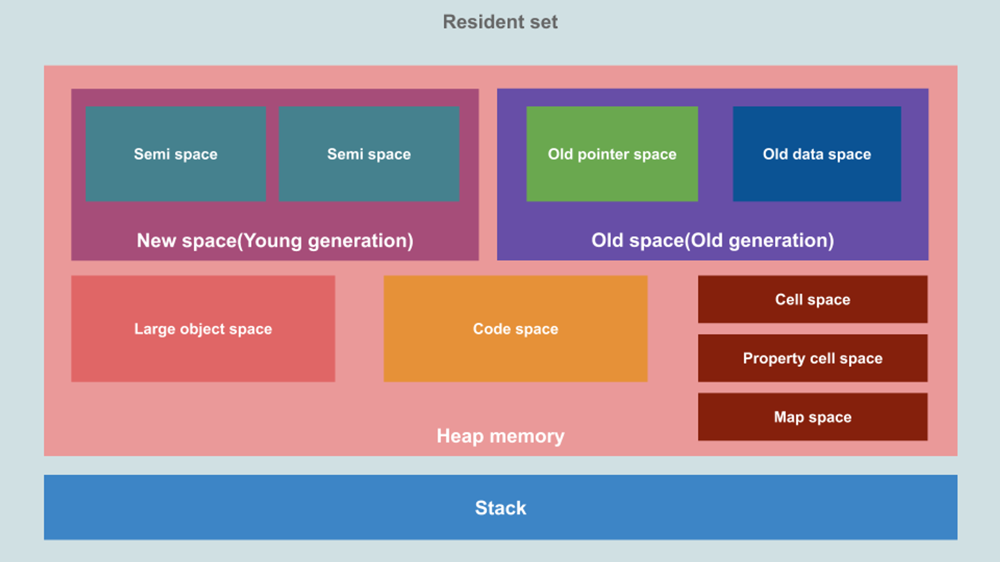
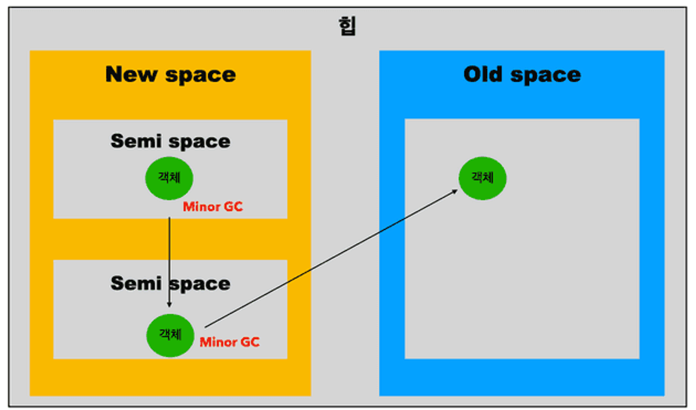

힙과 스택 메모리의 차이를 살펴보고, 자바스크립트 대표 엔진인 V8의 Resident set 구조와 Minor GC, Major GC 의 동작 알고리즘에 대해서 자세하게 살펴 보도록 하겠습니다. 이 글이 가비지 컬렉터가 어떻게 동작하는지 이해하는데 도움이 되길 바랍니다.

## V8 메모리 구조 (feat. Resident set)

Resident Set은 실행 중인 프로그램의 메모리 관리를 위해 사용되는 용어로, 현재 V8 프로세스가 사용하는 모든 메모리를 나타냅니다. 이것은 JavaScript 코드, 객체, 함수, 변수 등을 저장하는 데 필요한 모든 메모리를 포함합니다. Resident Set은 다음과 같이 여러 세그먼트로 구성됩니다.

*출처: memory management in V8*

### stack vs heap

메모리 공간은 크게 스택 메모리(Stack memory)와 힙 메모리(Heap memory)로 구분되며, 힙 메모리는 다양한 목적으로 서비스하는 여러 공간으로 더 나누어집니다.

스택 메모리는 프로그램 실행 중에 사용되는 정적 데이터와 메서드 또는 함수 프레임, 기본값(primitive values), 그리고 객체에 대한 포인터가 저장되는 영역입니다. 코드가 실행되면 엔진은 새로운 데이터를 스택에 넣거나 함수를 호출할 때마다 해당 함수의 프레임을 스택에 추가(`push`)합니다. 각 프레임은 함수의 지역 변수, 인자, 반환 값 등과 같은 정보를 포함합니다. 함수 호출이 완료되면 프레임은 스택에서 제거(`pop`)하여 메모리 공간을 해제하므로 자동으로 메모리가 관리됩니다.

힙 메모리는 코드 실행 중에 언제든지 변경될 수 있는 **동적 데이터를 저장**하며, 가비지 컬렉션(GC)이 이루어지는 영역 입니다. 그러나 힙 메모리 전체가 가비지 컬렉션의 대상이 아니며, New space와 Old space만 가비지 컬렉션에 의해 관리됩니다. New Space는 새로운 객체가 존재하는 공간으로, 대부분의 객체가 짧은 수명을 가지고 있습니다. 이 공간은 작으며, 두 개의 semi-space로 구성됩니다. 이 공간은 **Scavenger(Minor GC)**에 의해 관리됩니다. Old Space는 두 번의 Minor GC 주기 동안 New Space에서 생존한 객체들이 이동하는 공간입니다. 이 공간은 **Major GC(Mark-Sweep-Compact)**에 의해 관리됩니다. 

*출처: 카카오엔터테인먼트 기술블로그*

## Minor GC (Scavenger)

Minor GC(Scavenger)은 V8 엔진에서 new space를 유지하고 정리하는 방법입니다. 객체 생성시 new space에 할당되며, 할당 포인터를 사용하여 새 객체를 위한 공간을 예약할 때마다 할당 포인터를 증가시킵니다. 할당 포인터가 new space의 끝에 도달하면, 더 이상 객체를 할당할 공간이 없는 것이므로 마이너 가비지 컬렉션이 트리거됩니다. 이러한 과정은 **Cheney 알고리즘**을 구현한 Scavenger(청소부)라고 합니다. 

아래 예제를 이용하여 Minor GC(Scavenger)의 과정을 조금 더 자세히 살펴보면,

스택 포인터(GC root)를 시작으로 from-space에 있는 객체 그래프를 재귀적으로 탐색하여 사용 중인 객체 또는 살아있는 객체(used memory)를 찾습니다. 이러한 객체들은 to-space로 이동하고, 이들이 참조하는 다른 객체들도 같이 이동되며 포인터가 업데이트됩니다. 이렇게 from-space의 모든 객체들이 스캔되면, to-space는 자동으로 컴팩트되어 조각화(fragmentation)가 줄어들게 됩니다. 이후 from-space는 더 이상 사용되지 않는 객체들이 모여있는 쓰레기가 되고 비워집니다. 이렇게 to-space와 "from-space"를 교환하여 다음 객체들을 위한 공간을 확보합니다. 이 과정을 반복하여 new space를 유지하고 정리하는 것이 마이너 가비지 컬렉션의 역할입니다.

## **Major GC (Mark-Sweep-Compact)**

Major GC는 오래된 세대 공간을 유지하고 정리하는 유형의 가비지 컬렉션입니다. 이것은 마이너 가비지 컬렉션 사이클로부터 오래된 공간이 충분하지 않다고 판단되면(동적으로 계산된 한계에 따라) 트리거됩니다.

*출처: memory management in V8*

Major GC는 Old space를 주로 관리하며, 메모리가 부족해지면 주요 GC를 수행하여 메모리 공간을 정리합니다. Scavenger 알고리즘은 작은 데이터 크기에 적합하지만 큰 힙에는 비실용적이므로, 오래된 공간은 메모리 오버헤드가 발생하는 Mark-Sweep-Compact 알고리즘을 사용합니다.

1. 마킹(Marking): 먼저, GC는 사용 중인 객체와 사용하지 않는 객체를 구별합니다. GC 루트(주로 스택 포인터)에서부터 도달 가능한 객체들을 재귀적으로 마킹하여 "살아있는" 객체로 표시합니다. 이는 힙의 객체들을 그래프로 살펴보는 과정으로 생각할 수 있습니다.
2. 스위핑(Sweeping): 마킹이 끝나면, GC는 힙을 훑어다니면서 마킹되지 않은 객체들의 메모리 주소를 기록합니다. 이러한 객체들은 더 이상 사용되지 않는 "쓰레기" 객체로 간주되며, 해당 메모리 공간은 다시 사용 가능한 상태가 됩니다.
3. 컴팩팅(Compacting): 스위핑이 끝난 후, 살아남은 객체들은 필요에 따라 인접한 위치로 이동하여 조각화를 줄입니다. 이렇게 하면 메모리 공간이 더 효율적으로 사용되며, 새로운 객체를 할당하는 성능이 향상됩니다.

## 상호참조가 있는 경우에도 GC가 제대로 될까?

상호참조가 있는 경우에도 Cheney 알고리즘과 Mark-Sweep-Compact 알고리즘은 사용중인 객체와 사용하지 않는 객체를 식별하는 과정에서 처리할 수 있습니다. 이러한 알고리즘들은 객체들을 순회하면서 각 객체가 접근 가능한지 여부를 판단하여 사용중인 객체들을 마킹(Marking)하고, 마킹되지 않은 객체들은 가비지로 간주하여 해제하는 방식으로 동작합니다.

Cheney 알고리즘과 Mark-Sweep-Compact 알고리즘은 모두 어떤 객체를 사용 중인지 여부를 판단하는 과정에서 root를 기준으로 객체의 접근 가능성을 확인합니다. 상호참조가 있더라도 어떤 객체가 마킹되면 해당 객체를 참조하는 다른 객체들도 마킹됩니다. 따라서 상호참조를 가진 객체들 중에서 하나라도 사용중인 객체로 판단되면 모든 상호참조된 객체들이 마킹되어 메모리 누수를 방지하고 가비지 컬렉션을 정확하게 수행할 수 있습니다.

Mark-Sweep-Compact 알고리즘의 경우는 마킹 단계에서 객체의 접근 가능성을 확인하고, 마킹되지 않은 객체들을 스위핑(Sweeping)하여 가비지로 간주하고 메모리를 해제합니다. 이 때 상호참조가 있는 경우에도 모든 상호참조된 객체들이 마킹된 상태라면 모든 객체들이 적절하게 스위핑되고 메모리가 해제됩니다.

결론적으로, Cheney 알고리즘과 Mark-Sweep-Compact 알고리즘은 상호참조가 있음에도 사용중인지 아닌지를 판단하여 가비지 컬렉션을 정확하게 수행할 수 있습니다. 이러한 알고리즘들은 상호참조로 인한 메모리 누수를 방지하고 메모리를 효율적으로 관리하는데에 효과적입니다. 다만, 알고리즘의 성능과 효율성은 객체들의 관계와 데이터 크기에 따라 달라질 수 있으므로, 특정 상황에 맞춰 적절한 알고리즘을 선택하는 것이 중요합니다.

## 참고

- https://ko.javascript.info/garbage-collection
- https://ui.toast.com/weekly-pick/ko_20200228
- https://ui.toast.com/weekly-pick/ko_20200228
- https://yceffort.kr/2020/12/javascript-garbage-collection
- https://betterprogramming.pub/deep-dive-into-garbage-collection-in-javascript-6881610239a
- [A Deep Dive Into Garbage Collection in JavaScript](https://betterprogramming.pub/deep-dive-into-garbage-collection-in-javascript-6881610239a)
- https://www.memorymanagement.org/
- [A tour of V8: Garbage Collection](https://jayconrod.com/posts/55/a-tour-of-v8-garbage-collection)
- [Memory Management in V8, garbage collection and improvements](https://dev.to/jennieji/memory-management-in-v8-garbage-collection-and-improvements-18e6)
- [🚀 Visualizing memory management in V8 Engine (JavaScript, NodeJS, Deno, WebAssembly)](https://deepu.tech/memory-management-in-v8/)