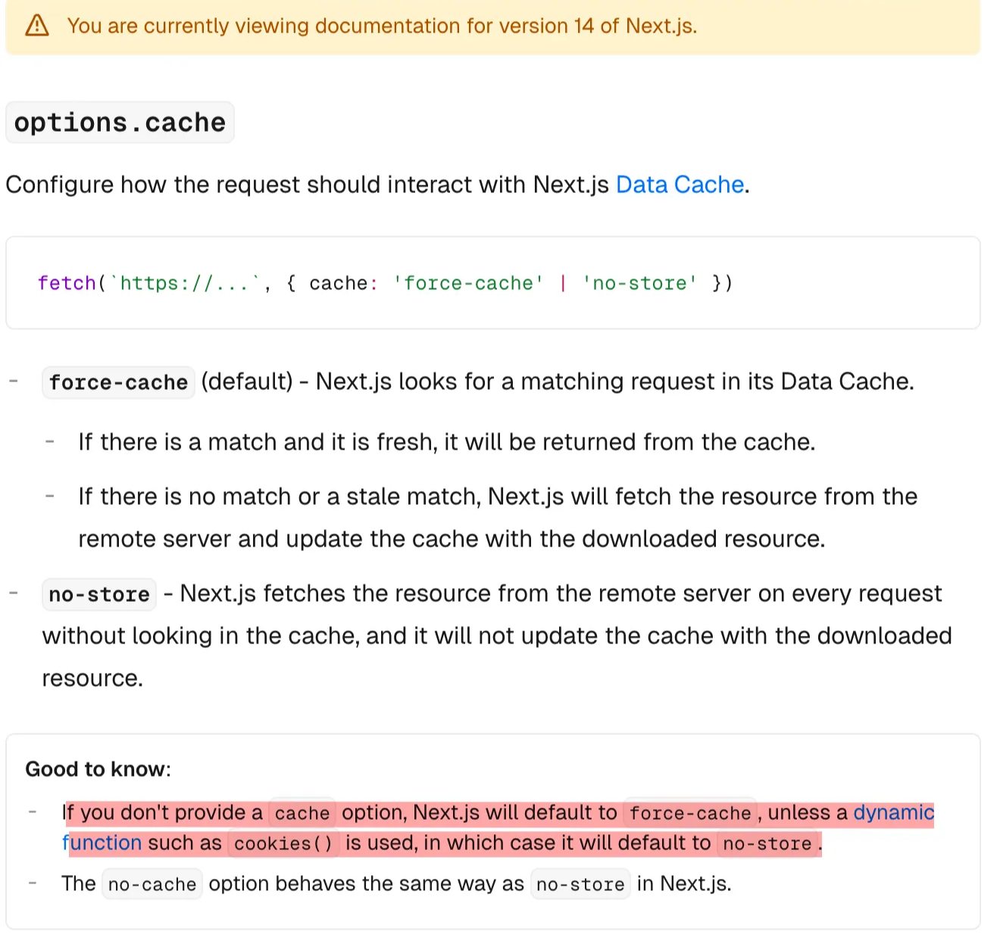
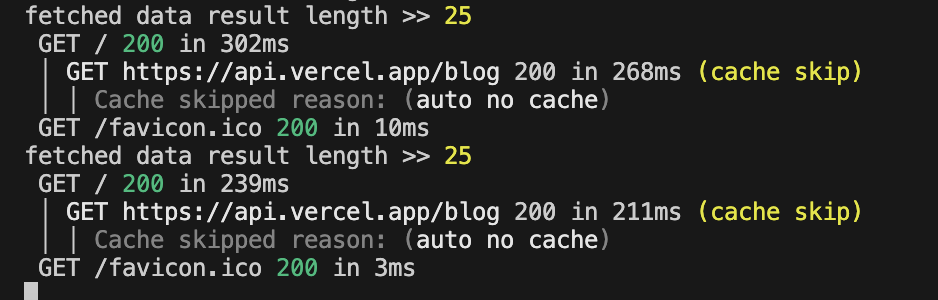
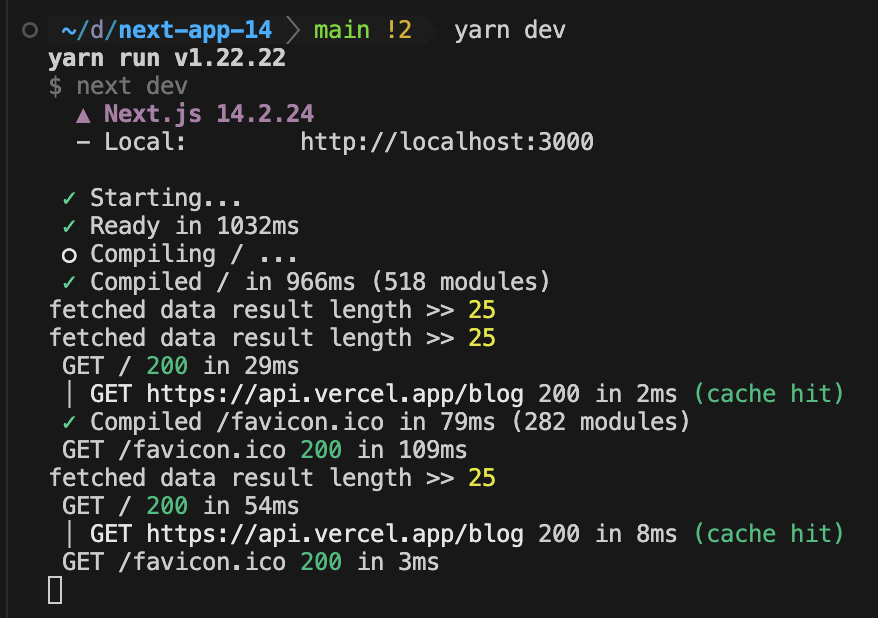

서버사이드 렌더링을 지원하는 Next.js와 같은 프레임워크에서는 캐싱이 필수적입니다. 캐싱을 하지 않으면 동일한 요청이 반복 실행되어 비효율적인 네트워크 사용과 과도한 서버 부하가 발생하기 때문입니다.

Next.js는 기본적으로 fetch 요청을 캐싱하지만, 특정 조건에서는 자동으로 캐싱이 해제될 수 있습니다. 특히 `cookies()` 함수를 사용하면 fetch 요청이 `no-store`로 설정되는 문제가 발생하여 의도치 않게 캐싱이 비활성화(Opt-out)되고, 이로 인해 서버 부하가 증가할 수 있습니다.

또한, Next.js 14와 15 버전에서는 캐싱 기본 정책이 완전히 달라졌습니다. 이 글을 통해 두 버전에서 캐싱 방식이 어떻게 달라졌는지 함께 살펴보겠습니다.

## Next.js 14의 기본 fetch 캐싱 동작

Next.js 14에서는 `fetch` 요청 시 기본적으로 `force-cache`가 적용됩니다. 즉, 명시적으로 캐싱을 비활성화하지 않으면 Next.js가 요청을 캐싱하여 응답 속도를 최적화합니다.

그러나 특정 조건에서는 `fetch` 요청이 자동으로 캐싱되지 않으며, 그중 하나가 `cookies()` 함수를 사용하는 경우입니다.

[v14의 공식문서 참고](https://nextjs.org/docs/14/app/api-reference/functions/fetch#optionscache)



즉, `cookies()`를 호출하는 순간 해당 요청은 캐싱되지 않으며, 이후에 실행되는 `fetch` 요청도 캐싱되지 않는 영향을 받게 됩니다.

### [Next.js 14에서 `fetch`가 캐싱되지 않는 조건](https://nextjs.org/docs/14/app/building-your-application/data-fetching/fetching-caching-and-revalidating#opting-out-of-data-caching)

이외에도 fetch가 캐싱되지 않는 여러 조건이 존재합니다.

- `cache: 'no-store'` 옵션이 포함된 경우
- `revalidate: 0` 옵션이 적용된 경우
- `POST` 메서드를 사용하는 API Route 핸들러 내에서 호출된 경우
- `headers()` 또는 `cookies()`를 사용한 후 실행된 경우 ✔️
- `dynamic = 'force-dynamic'`을 사용한 경우
- `fetchCache` 옵션이 캐시를 건너뛰도록 설정된 경우
- `Authorization` 또는 `Cookie` 헤더가 포함된 `fetch` 요청이고, 컴포넌트 트리 상단에서 이미 캐싱되지 않은 요청이 있는 경우

## Next.js 15에서 완전히 변경된 캐싱 방식

Next.js 15에서는 `fetch` 요청이 **기본적으로 캐싱되지 않는 방식**으로 변경되었습니다. 즉, 별도의 설정 없이도 `no-store`가 기본 적용되며, 명시적으로 캐싱을 활성화해야 합니다.

1. **기본 캐싱 방식 변경**
    - Next.js 14에서는 `fetch`의 기본 `cache` 값이 `force-cache`였지만, Next.js 15부터는 기본값이 `no-store`로 변경되었습니다.
2. **세부적인 캐싱 설정 추가**
    - `fetch` 요청에서 `cache: 'force-cache'` 또는 `next: { revalidate: X }` 옵션을 명시적으로 설정해야만 캐싱이 유지됩니다.
3. **서버 컴포넌트에서의 캐싱 개선**
    - Next.js 15에서는 서버 컴포넌트에서 `fetch` 요청을 보다 세밀하게 제어할 수 있도록 최적화되었습니다.

## 예시

먼저 next.config.js에서 다음과 같이 설정하면 fetch 된 url과 캐싱 hit/miss 까지 모두 확인 할 수 있습니다.

```tsx
/** @type {import('next').NextConfig} */
const nextConfig = {
  logging: {
    fetches: {
      fullUrl: true,
    },
  },
};

export default nextConfig;

```

임의로 Cookie 값을 조회하여 fetch에 실어보내야 하는 상황을 연출해보았습니다.

```tsx
import { cookies } from 'next/headers';
import styles from "./page.module.css";

 async function getData() {
  const cookieStore = cookies();
  const authToken = cookieStore.get('authToken')?.value || '';

  const res = await fetch('https://api.vercel.app/blog', {
    method: 'GET',
    headers: {
      'Authorization': `Bearer ${authToken}`,
      'Content-Type': 'application/json',
    },
  });

  if (!res.ok) {
    throw new Error('Failed to fetch data');
  }

  return res.json();
}

export default async function Home() {
  const result = await getData();
  console.log('fetched data result length >>', result.length)
  return (
    <div className={styles.page}>
    </div>
  );
}

```

다음 예시는 Next.js 14에서 위의 코드를 요청을 할때마다 캐싱되지 않고 새로 API를 호출하는 것을 볼 수 있습니다.



그러나 다음과 같이 코드를 수정하여 Cookie를 실어보내지 않는 경우 캐시가 hit 되어 매번 API를 요청하지 않는다는 것을 알 수 있습니다.

```tsx
import styles from "./page.module.css";

 async function getData() {

  const res = await fetch('https://api.vercel.app/blog', {
    method: 'GET',
    headers: {
      'Content-Type': 'application/json',
    },
  });

  if (!res.ok) {
    throw new Error('Failed to fetch data');
  }

  return res.json();
}

export default async function Home() {
  const result = await getData();
  console.log('fetched data result length >>', result.length)
  return (
    <div className={styles.page}>
    </div>
  );
}

```



## 마무리

Next.js에서의 캐싱 전략은 성능 최적화와 서버 부하 감소에 중요한 역할을 합니다. Next.js 14에서는 `fetch` 요청이 기본적으로 `force-cache`를 사용하여 캐싱되지만, `cookies()` 등의 특정 함수가 포함되면 자동으로 캐싱이 해제될 수 있습니다. 반면, Next.js 15에서는 기본 `fetch` 캐싱 방식이 `no-store`로 변경되어, 캐싱을 원할 경우 명시적으로 설정해야 합니다.

이러한 변화는 데이터 무결성과 실시간성을 보장하는 데 유리하지만, 불필요한 API 호출을 방지하기 위해 개발자가 직접 캐싱 설정을 조정해야 합니다. 따라서, 프로젝트의 요구 사항에 맞춰 적절한 `cache` 옵션과 `revalidate` 값을 설정하는 것이 중요합니다. 캐싱 정책을 제대로 이해하고 적용하면 서버 리소스를 절약하고 응답 속도를 향상시킬 수 있습니다.