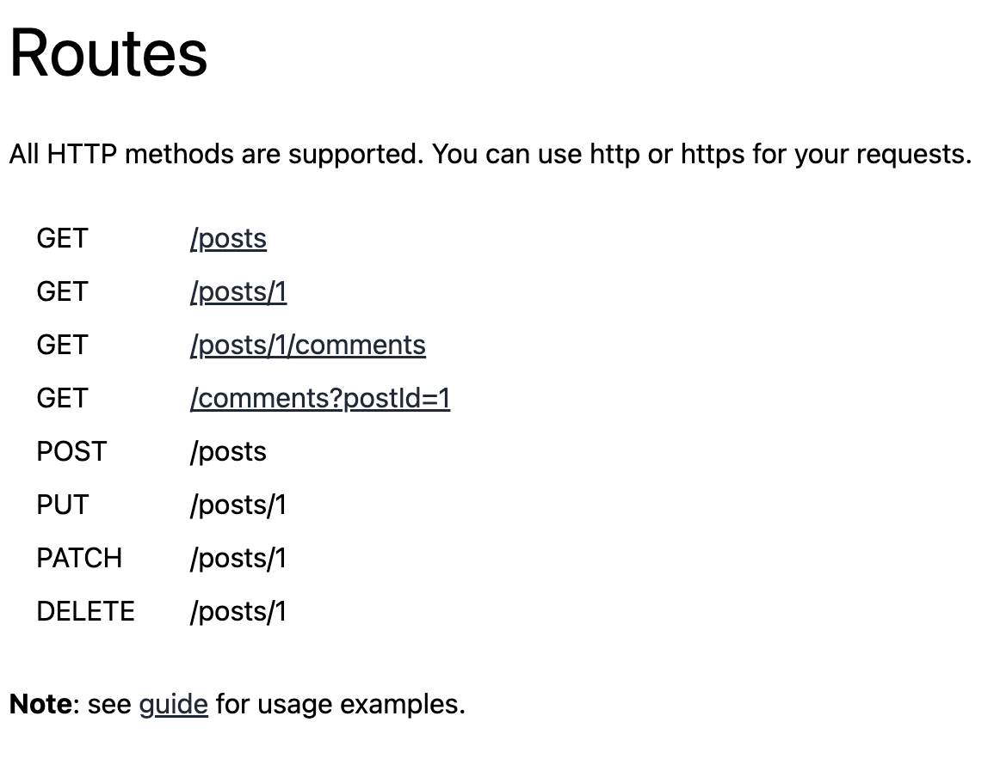
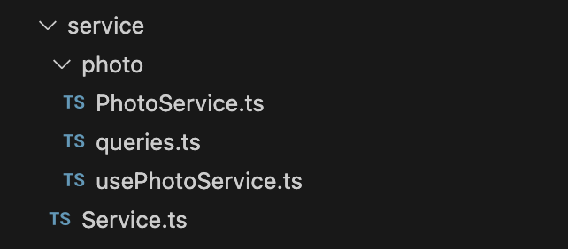
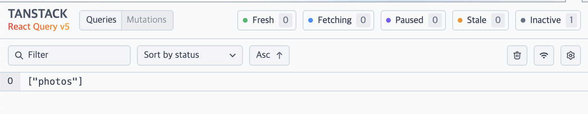
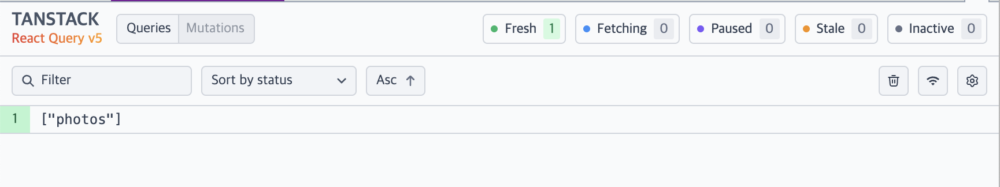
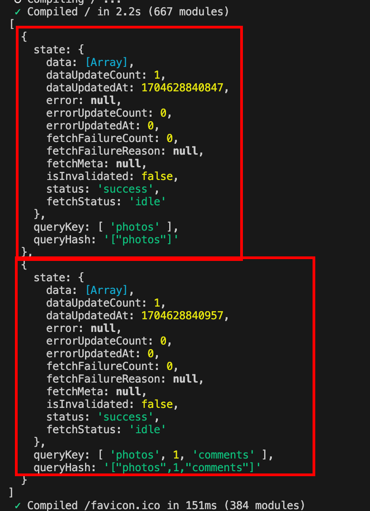

지난 글에서 react-query의 hydrate, dehydrate을 통해 서버에서 prefetching 한 데이터 사용하는 방법에 대해서 살펴보았습니다.

> [서버에서 prefetching 한 데이터 사용하기](https://soobing.github.io/react/server-rendering-and-react-query/)

오늘은 조금 실용적으로 Next.js 13, 14 버전의 app router에서 react-query를 어떻게 사용하고 세팅하면 좋을지 고민했던 내용에 대해서 이야기해보도록 하겠습니다.

> 해당 글은 23년 10월에 메이저 버전 업데이트된, [Next.js 14](https://nextjs.org/blog/next-14)와 [React-Query 5](https://tanstack.com/blog/announcing-tanstack-query-v5) 를 기준으로 작성된 글입니다.

> 예시로 보여주는 코드는 저의 [next-14-react-query](https://github.com/soobing/next-14-react-query) repo에서 확인 할 수 있습니다.

제가 크게 고민했던 문제는 아래 세 가지입니다.

- `Hydrate` vs `ReactQueryStreamedHydration` 두 가지 API 중에 어떤 것을 채택할까?
- Hydration API 사용 시에 RSC, RCC 모두에서 깔끔한 코드를 유지하려면 queryOption은 어떻게 정의하는 게 좋을까?
- `dehydrate(queryClient).queries`에는 현재 기준 prefetch 된(?) 모든 쿼리들이 다 따라온다 😱

[jsonplaceholder API](https://jsonplaceholder.typicode.com/) 서버의 photo 서비스를 사용하는 것을 예시로 프로젝트 구조를 어떻게 설계했는지, 그리고 위에서 했던 고민들에 대한 이야기를 나눠 보도록 하겠습니다.

## 초기 환경 세팅

```tsx
/** hooks/useReactQuery.tsx */

'use client'

import { useState } from 'react'
import { QueryClient, QueryClientProvider } from '@tanstack/react-query'
import { ReactQueryDevtools } from '@tanstack/react-query-devtools';

export default function ReactQueryProviders({ children }: React.PropsWithChildren) {
  const [queryClient] = useState(
    () =>
      new QueryClient({
        defaultOptions: {
          queries: {
            // With SSR, we usually want to set some default staleTime
            // above 0 to avoid refetching immediately on the client
            staleTime: 60 * 1000,
          },
        },
      }),
  )

  return (
    <QueryClientProvider client={queryClient}>
      {children}
      <ReactQueryDevtools initialIsOpen={false} />
    </QueryClientProvider>
  )
}
```

```tsx
/** app/layout.tsx */

import ReactQueryProviders from '@/hooks/useReactQuery'

export default function RootLayout({ children }: React.PropsWithChildren) {
  return (
    <html lang="en">
      <head />
      <body>
        <ReactQueryProviders>{children}</ReactQueryProviders>
      </body>
    </html>
  )
}
```

## 클라이언트, 서버 모두에서 사용될 수 있도록 서비스 설계하기

[jsonplaceholder API](https://jsonplaceholder.typicode.com/) 페이지를 가보면, 서비스 별로 다음과 같은 라우터 구조를 가지고 있다고 명세되어 있습니다.



저는 photo 서비스를 기준으로 아래와 같이 폴더를 생성해 보았습니다.



API의 서비스별로 따로 관리하면 가독성과 유지 보수에 좋습니다. 그래서 PhotoService를 작성하면 아래와 같습니다.

```tsx
/** service/photo/PhotoService.ts */

import Service from '@/service/Service';
import {Photo} from '@/model/photo';

class PhotoService extends Service {
  getPhotos() {
    return this.http.get<Photo[]>(
      `/photos`,
    );
  }

  getPhoto(photoId: number) {
    return this.http.get<Photo>(
      `/photo/${photoId}`,
    );
  }

  getComments(photoId: number) {
    return this.http.get<Comment[]>(
      `/photo/${photoId}/comments`,
    );
  }

  getComment({photoId, commentId}: {photoId: number, commentId: number}) {
    return this.http.get<Comment[]>(
      `/photo/${photoId}/comments/${commentId}`,
    );
  }
}

export default new PhotoService();
```

그리고 react-query의 useQuery를 사용 할 때, 필요한 곳에서 직접적으로 호출해서 사용하기보다는 이 또한 서비스별로 Colocate 시켜서 가독성과 유지 보수하기 좋도록 설계했습니다.

> 관련해서 유명한 글인 [Maintainability through colocation](https://kentcdodds.com/blog/colocation) by [Kent C. Dodds](https://twitter.com/kentcdodds)를 읽어보는 것을 추천합니다.


```tsx
/** service/photo/usePhotoService.ts */

import { useQuery } from '@tanstack/react-query';
import queryOptions from '@/service/photo/queries';

export function usePhotos() {
  return useQuery(queryOptions.all());
}

export function usePhoto({photoId}: {photoId: number}) {
  return useQuery(queryOptions.detail(photoId));
}

export function useComments({photoId}: {photoId: number}) {
  return useQuery(queryOptions.comments(photoId));
}

export function useComment({photoId, commentId}: {photoId: number, commentId: number}) {
  return useQuery(queryOptions.comment({photoId, commentId}));
}
```

여기서 queries라는 파일에서 queryOption을 빼오고 있는데, 해당 파일에서는 QueryKey와 QueryOption을 모두 관리하고 있습니다. 이것은 react-query의 메인테이너인 TkDodo’s blog에서 효율적으로 [React Query Key 관리하는  법](https://tkdodo.eu/blog/effective-react-query-keys) 이라는 글을 참고하여 작성했습니다.

```tsx
import PhotoService from '@/service/photo/PhotoService';

const queryKeys = {
  all: ['photos'] as const,
  detail: (photoId: number) => [...queryKeys.all, photoId] as const,
  detailComments: (photoId: number) => [...queryKeys.detail(photoId), 'comments'] as const,
  detailComment: ({photoId, commentId}: {photoId: number, commentId: number}) => [...queryKeys.detailComments(photoId), commentId] as const,
};

const queryOptions = {
  all: () => ({
    queryKey: queryKeys.all,
    queryFn: () => PhotoService.getPhotos(),
  }),
  detail: (photoId: number) => ({
    queryKey: queryKeys.detail(photoId),
    queryFn: () => PhotoService.getPhoto(photoId),
  }),
  comments: (photoId: number) => ({
    queryKey: queryKeys.detailComments(photoId),
    queryFn: () => PhotoService.getComments(photoId),
  }),
  comment: ({photoId, commentId}: {photoId: number, commentId: number}) => ({
    queryKey: queryKeys.detailComment({photoId, commentId}),
    queryFn: () => PhotoService.getComment({photoId, commentId}),
  }),
};

export default queryOptions;
```

위의 글에서는 queryKey 관리에 대한 이야기만 나와있지만, SSR이나 RSC에서 Hydrate API를 사용하는 경우가 많아져서, queryKey와 비슷하게 queryOption도 함께 관리하도록 추가했습니다.

## 서버에서 Prefetching 하고 데이터 de/hydration 하기

hydration에 대한 개념적인 설명은 지난 글을 참고해 주시면 좋을것 같습니다. 서버에서 prefetch 한 쿼리들을 dehydrate 시켰다가 클라이언트에서 hydration 시켜줘야 합니다. 이렇게 해주면 서버에서 prefetch 하여 react-query로 캐싱 한 쿼리들을 클라이언트에서 사용할 때도 유지되어서 refetch 하지 않습니다.

```tsx
import {
  HydrationBoundary,
  QueryClient,
  dehydrate,
  QueryState,
  QueryKey
} from '@tanstack/react-query';
import { cache } from 'react';
import { isEqual } from '@/utils';

export const getQueryClient = cache(() => new QueryClient());

type UnwrapPromise<T> = T extends Promise<infer U> ? U : T;

interface QueryProps<ResponseType = unknown> {
  queryKey: QueryKey;
  queryFn: () => Promise<ResponseType>;
}

interface DehydratedQueryExtended<TData = unknown, TError = unknown> {
  state: QueryState<TData, TError>;
}

export async function getDehydratedQuery<Q extends QueryProps>({
  queryKey,
  queryFn,
}: Q) {
  const queryClient = getQueryClient();
  await queryClient.prefetchQuery({ queryKey, queryFn });

  const { queries } = dehydrate(queryClient);
  const [dehydratedQuery] = queries.filter((query) =>
    isEqual(query.queryKey, queryKey),
  );

  return dehydratedQuery as DehydratedQueryExtended<
    UnwrapPromise<ReturnType<Q['queryFn']>>
  >;
}

export const Hydrate = HydrationBoundary;

export default {};
```

위의 코드에서는 `getQueryClient`와 `getDehydratedQuery` 두 가지 함수를 유틸로 export 하고 있습니다. `getQueryClient` 유틸은 [공식 문서에서 권장](https://tanstack.com/query/latest/docs/react/guides/advanced-ssr#alternative-use-a-single-queryclient-for-prefetching) 하고 있듯이, 서버에서 데이터를 fetching 할 때 마다 필요한 queryClient를 cache 해서 사용할 수 있도록 했습니다.

`getDehydratedQuery`는 queryClient를 이용하여 서버에서 데이터를 prefetching 하고 dehydrate 한 결과물을 리턴하는 코드입니다. 

위 유틸을 사용하여 SSR을 수행하고 있는 page.tsx 파일에서 서버에서 prefeching 한 데이터를 hydration 시켰을 때 아래와 같이 inactive 상태로 보이는 것을 볼 수 있습니다.

```tsx
import Image from 'next/image'
import styles from './page.module.css'
import PhotoList from '@/components/PhotoList'
import queryOptions from '@/service/photo/queries';
import { Hydrate, getDehydratedQuery } from '@/utils/react-query';

export default async function Home() {
  const { queryKey, queryFn } = queryOptions.all();

  const query = await getDehydratedQuery({ queryKey, queryFn });

  return (
    <main className={styles.main}>
     ...

    {/* 서버 사이드 렌더링 & 서버 컴포넌트 */}
    <Hydrate state={{ queries: [query] }}>
      {/* Client Component 잠시 주석처리 */}
      {/* <PhotoList/> */}
    </Hydrate>
    </main>
  )
}
```



`Hydrate` 내부의 `<PhotoList/>`를 주석 해제해 보면, Client 컴포넌트에서 동일한 쿼리를 요청했을 때 active 상태로 바뀌는 것을 볼 수 있습니다.

```tsx
export default async function Home() {
  const { queryKey, queryFn } = queryOptions.all();

  const query = await getDehydratedQuery({ queryKey, queryFn });

  return (
    <main className={styles.main}>
     ...

    {/* 서버 사이드 렌더링 & 서버 컴포넌트 */}
    <Hydrate state={{ queries: [query] }}>
      {/* Client Component 잠시 주석처리 */}
      <PhotoList/>
    </Hydrate>
    </main>
  )
}
```



hydration이 제대로 된 것을 확인할 수 있습니다.

사실 hydration 목적 이외에도 prefetching 한 response 데이터를 미리 접근해서 사용할 수도 있습니다. `query.state.data`  형태로 직접 접근하여 사용할 수 있습니다. 

`dehydrate` 함수를 보면 queryClient로 prefetch된 모든 데이터를 전부 반환하므로 만약 필터링 없이 다음과 같이 모든 query를 리턴한다면 SSR을 하는 페이지 단에서, 그리고 내부에 서버 컴포넌트가 존재하는 경우 각각 dehydrate를 한다면해당 데이터를 미리 접근해서 사용하는 경우 순서를 알기 어려워 아래와 같이 유틸을 작성하지 않고 필터링하도록 구현했습니다.

```tsx
// [참고용] filtering 하지 않고 모든 dehydrated query를 반환하는 함수
export async function getDehydratedQueries<Q extends QueryProps[]>(queries: Q) {
  const queryClient = getQueryClient();
  await Promise.all(
    queries.map(({ queryKey, queryFn }) =>
      queryClient.prefetchQuery({ queryKey, queryFn }),
    ),
  );

  return dehydrate(queryClient).queries as DehydratedQueryExtended<
    UnwrapPromise<ReturnType<Q[number]['queryFn']>>
  >[];
}
```

위의 유틸을 사용한 `Comments` 컴포넌트를 살펴보면 아래 첨부한 이미지처럼 두 개의 데이터가 들어오고 있습니다.

```tsx
import {Photo} from '@/model/photo';
import {Hydrate, getDehydratedQueries} from '@/utils/react-query';
import queryOptions from '@/service/photo/queries';

export default async function Comments({id}: Pick<Photo, 'id'>) {
  const { queryKey, queryFn } = queryOptions.comments(id);
  const queries = await getDehydratedQueries([{ queryKey, queryFn }]);
  return (
    <Hydrate state={{ queries }}>
      comments
      {JSON.stringify(queries[0].state.data)}
    </Hydrate>
  )
}
```



## 덜 복잡한 코드를 작성할 순 없을까? (ReactQueryStreamedHydration)

끝으로, 이렇게 dehydrate, hydrate 직접 시켜줘야 하는 코드가 심플하지 못하다고 생각하여 더 좋은 방법이 없는가 검색하던 중에 [ReactQueryStreamedHydration](https://tanstack.com/query/v5/docs/react/guides/advanced-ssr#experimental-streaming-without-prefetching-in-nextjs)을 발견했습니다. prefetching 없이도 streaming SSR을 작동 시키는 방법인데, 이 패키지를 사용하면 초기 요청 동안 서버에서 데이터를 가져오고 (useQuery 훅에서의 API 호출이 서버에서 이루어짐) 데이터가 준비되면 QueryClient에 전달하여 root에서 hydration을 수행하기 때문에 컴포넌트에서 useSuspenseQuery를 호출하기만 하면 됩니다. CSR에서 react-query를 사용하듯이 코드가 엄청나게 간단해집니다. 이는 놀라운 개발 경험(DX)과 낮은 코드 복잡성을 제공합니다.

그러나 이 방법을 선택하지 않은 이유는, 실험 단계 인점이 가장 컸고 깊게 중첩된 쿼리가 없고 요청 최적화를 잘 관리하고 있는 경우 사용하기를 권장하고 있는데 따로 잘 관리할 자신이 없었던 점이 제일 컸습니다. 조금 더 자세히 알아보고 싶으신 분들은 공식 문서와 라이브러리 코드를 참고하시면 좋을 것 같습니다 :)

## 참고자료

- (공식문서) [Advanced Server Rendering](https://tanstack.com/query/latest/docs/react/guides/advanced-ssr)
- (공식문서) [Experimental streaming without prefetching in Next.js](https://tanstack.com/query/v5/docs/react/guides/advanced-ssr#experimental-streaming-without-prefetching-in-nextjs)
- 예제 코드 구현: https://github.com/soobing/next-14-react-query by soobing