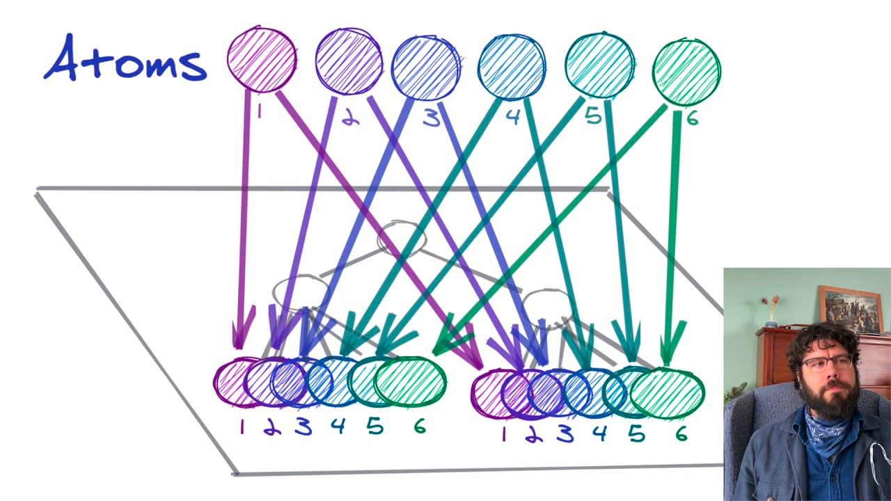
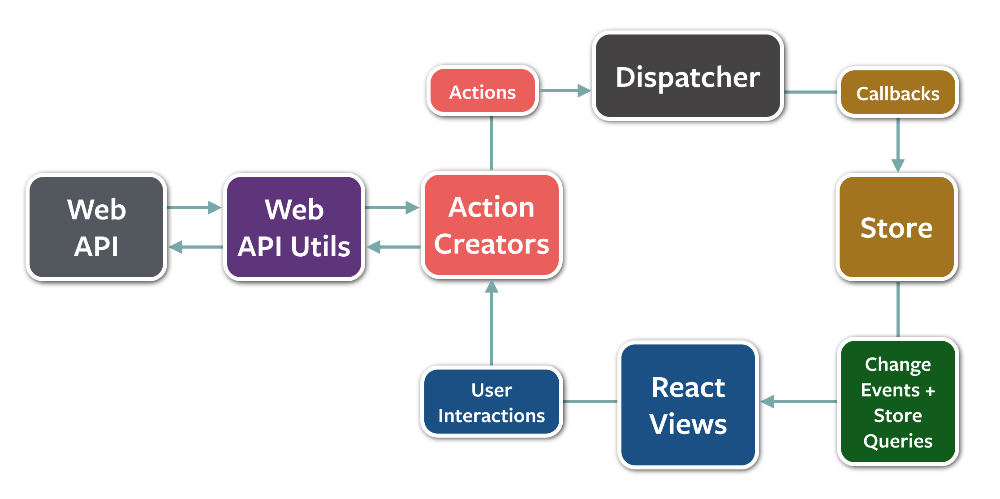

React 18로 버전업 하면서 프로젝트에 Recoil을 도입했는데, 그 과정에서 고민했던 내용을 기록차 남겨본다.


## TL;DR;

개념 정리나 장단점 비교에 대해서는 이미 알고 계신분들도 있을 것 같아서 폴더구조나 Redux를 대체하는게 맞는가에 대해서만 먼저 간단하게 요약한 내용을 공유한다.

### 1. 폴더 구조는 data source 별로 나누자

- [Suggested folder structure for atoms and selectors](https://github.com/facebookexperimental/Recoil/issues/27)
    - `recoil` 폴더 하위에 `data source` 별로 나누자
    - `data source` 하위에 `atoms, selectors, hooks`를 두자
    
    ```
    ├── App.tsx
    ├── index.tsx
    └── src
        ├── components
        │   └── TodoItem.tsx
        └── recoil
            |── todo
                └── atoms.ts
                └── selectors.ts
                └── useTodo.ts
    ```
    

### 2. concurrency mode 사용하려면 Redux는 버리고 Recoil로 넘어가야하나?

- [useSyncExternalStore](https://github.com/reactwg/react-18/discussions/86) hook 을 사용해서 Redux에서도 동시성 모드를 사용할 수 있다.
- 이 부분에 대해서 고민해 본 내용은 아래에..

## Recoil 도입 배경

Recoil은 Facebook에서 개발한 상태 관리 라이브러리다. 이전에는 Facebook에서 React 애플리케이션의 상태 관리를 위해 [Flux 아키텍처](https://github.com/facebookarchive/flux)를 구현한 Redux, MobX와 같은 라이브러리를 사용했었다. (사실 아직도 사용하는 곳이 많음) 그러나 아래 표를 보면 알겠지만, Flux 아키텍처를 구현하기위해서 복잡하고 번거로운 코드를 작성해야하므로 Facebook은 더 간편하고 직관적인 상태 관리 라이브러리를 고민하게 됬다고 한다. 


- 번거로운 코드?
    - Redux를 예시로 설명하면 애플리케이션의 상태를 하나의 객체로 관리하고, 상태 변경을 발생시키는 액션(Action)과 상태 변경을 처리하는 리듀서(Reducer)를 사용하여 데이터를 관리하므로 이와 관련된 코드들이 추가적으로 필요하다.



Recoil은 React의 Hook 기능을 사용하여 상태를 관리하므로 코드를 간결하고 직관적으로 작성할 수 있다. 또한, 상태의 종속성 관계를 자동으로 추적하고 캐싱하여 상태 변경이 발생할 때 효율적인 업데이트를 수행할 수 있다. 이러한 이유로 Recoil은 React 애플리케이션에서 Global 상태 관리를 위한 매우 간편하고 유연한 도구로 인기를 얻고 있다.

## Recoil 장단점

### 장점

1. 편리한 비동기 처리
    - 비동기 처리를 위한 복잡한 중간 처리기 작성 필요 없음
        - 보통 redux-thunk, redux-saga, redux-observable 등의 별도의 라이브러리를 이용하여 복잡한 중간 처리기를 작성해야 했지만, Recoil에서는 이러한 복잡한 작업을 하지 않아도 된다.
    - 비동기 데이터 흐름 제어 용이
        - useRecoilState나 useRecoilValue등의 API를 사용하여 비동기 데이터를 상태로 관리하면서도 간단하게 데이터 흐름을 제어할 수 있다.
    - Async/await 문법 사용 가능:
        - 비동기 처리시 async/await 문법을 사용할 수 있다.
        - redux-saga 에서는 generate로 비동기 처리 코드를 작성해야 하는데, 이와 비교해보면 코드의 가독성과 편리성이 훨씬 높다.
2. 유연한 상태 관리
    - atom, selector, atomFamily, selectorFamily API를 통해 쉽게 상태를 정의하고 읽고 쓸 수 있음
        - -Family: 매개변수로 파라메터 전달
    - 상태 관리의 대상이 되는 컴포넌트를 명시적으로 지정할 필요 없음
        - Redux 7.1 버전 이전에는는 컴포넌트가 Redux store의 상태 값을 사용하기 위해 connect 함수를 사용하여 컴포넌트와 상태 값을 연결해주어야 했다. 그러나 이후버전 부터는 Redux에서도 **`useSelector`, `useDispatch`** 와 같은 hook을 제공
3. DevTools 지원
    - 애플리케이션의 상태 변화 디버깅 가능
4. 성능
    - Recoil은 Concurrency Mode를 통해 **동시성 처리를 지원**
    - 특정 상태의 변경이 발생할 때 해당 상태를 사용하는 컴포넌트들만 다시 렌더링되도록 최적화

### 단점

1. 상태 관리 패턴의 변경
    - Redux와 같은 상태 관리 라이브러리에서의 경험을 적용할 수 없으므로 러닝커브 존재
2. 문서와 커뮤니티
    - Recoil은 비교적 최신 라이브러리 이므로 문서와 커뮤니티의 규모가 Redux 보다 작다.
3. 다른 라이브러리와의 호환성
    - Recoil은 React와 함께 사용하기 위한 라이브러리이므로, 다른 라이브러리와 함께 사용하는 경우 호환성 문제가 발생할 수 있음.
4. 상태 변화 추적
    - Recoil은 Atom과 selector에서만 상태 변화 추적을 지원하므로, 기존의 React 컴포넌트에서 상태 변화를 추적하는 것과 다른 방식으로 접근해야 할 수 있다.

## Recoil은 concurrency mode를 지원한다고 하는데, 그렇다면 Redux는 버려야하나?

- [useSyncExternalStore](https://github.com/reactwg/react-18/discussions/86) hook 사용하면 Redux를 사용하면서 concurrency mode를 사용할 수 있다.
    - `Redux + useSyncExternalStore` 관련 자료
        - [useMutableSource → useSyncExternalStore #86](https://github.com/reactwg/react-18/discussions/86)
        - [React 18 milestone: React-Redux adopts useSyncExternalStore](https://dev.to/sebastienlorber/react-18-milestone-react-redux-adopts-usesyncexternalstore-102b)
- 그렇지만, useSyncExternalStore를 사용한다고 state 변경시 update 일어나는 로직이 Recoil과 동일하지는 않다.
    - Redux + useSyncExternalStore 훅을 사용하는 경우, Redux의 상태 업데이트가 완료되는 시점에서 React의 렌더링이 일어나지만,
    - Recoil은 내부적으로 React의 상태 감지 기능을 사용하여 상태 업데이트가 발생하면 즉시 React의 렌더링을 트리거한다.
    - 성능 차이는 미미하겠지만 정확히 이야기하면 Recoil은 Redux보다 더 빠른 상태 업데이트와 더 높은 성능을 제공할 수 있다.
- 추가적으로, concurrency mode 이외에도 Redux와 Recoil는 차이점이 존재한다.
    
    위에서 비교한 장단점 코너와 중복되는 이야기가 많으므로 간략하게만 이야기하면..
    
    - Redux의 flux 패턴은 Recoil의 atom/select 패턴과 비교했을때 추가적인 코드가 더 많이 필요
    - Redux는 비동기 데이터 흐름을 제어하기 위한 API를 제공하지 않는다. → redux-saga와 같은  middleware를 사용해야 한다.
    

### 내 생각

- 신규 프로젝트이고 React 18을 사용한다면 Recoil을 한번 사용해보는 것을 추천한다.
- 기존 프로젝트에서 이미 Redux를 사용중이고 React 18 버전을 사용한다면, useSyncExternalStore를 사용하여 concurrency mode를 함께 사용해보면 좋을 것 같다.

## 개념정리

정확한 개념은 [공식문서](https://recoiljs.org/ko/docs/introduction/motivation/)를 참고하도록 하자. 간략하게 전반적인 개념정리를 하기 위한 코너.

### State

- Atom, Selector
    - Atom: 가장 작은 state 단위
    - Selector: 파생된 state. atoms나 다른 selectors를 입력으로 받아들이는 순수 함수(pure function)
    - key값 (전역적으로) 고유해야함
- Loadable
    - atom 혹은 selector의 최신 상태를 대표. `state`와 `contents` 두 가지 데이터를 가짐.
        
        
        | state | contents |
        | --- | --- |
        | hasValue | 실제 값 |
        | hasError | Error 객체 |
        | loading | toPromise()
        를 사용하여 값의 Promise
        를 얻을 수 있음 |

### Hooks

- state 관련
    - [useRecoilState()](https://recoiljs.org/ko/docs/api-reference/core/useRecoilState): 읽기, 쓰기 가능
    - [useRecoilValue()](https://recoiljs.org/ko/docs/api-reference/core/useRecoilValue): 읽기 전용(getter return)
    - [useSetRecoilState()](https://recoiljs.org/ko/docs/api-reference/core/useSetRecoilState): 쓰기 전용(setter return)
    - [useResetRecoilState()](https://recoiljs.org/ko/docs/api-reference/core/useResetRecoilState): default state로 리셋
    - [useRecoilStateLoadable()](https://recoiljs.org/ko/docs/api-reference/core/useRecoilStateLoadable): 비동기 selector의 값 읽기, 쓰기 가능. Loadable 객체 반환
    - [useRecoilValueLoadable()](https://recoiljs.org/ko/docs/api-reference/core/useRecoilValueLoadable): 비동기 selector의 값 읽기 전용. Loadable 객체 반환
    - [useGetRecoilValueInfo()](https://recoiljs.org/ko/docs/api-reference/core/useGetRecoilValueInfo): 하나의 atom 혹은 selector의 현재 상태, 값,기타 다른 정보 peek
    - [useRecoilRefresher()](https://recoiljs.org/ko/docs/api-reference/core/useRecoilRefresher): 연관된 모든 캐시를 삭제하고 selector를 호출할 수 있는 콜백을 반환
    - [isRecoilValue()](https://recoiljs.org/ko/docs/api-reference/core/isRecoilValue): value가 atom이나 selector일 경우 true 반환
- concurrency mode 관련
    - useRecoilTransaction()
- 기타
    - useRecoilCallback()

### Utils

- [atomFamily()](https://recoiljs.org/ko/docs/api-reference/utils/atomFamily): atom과 유사하지만, 매개변수로 전달한 키를 이용하여 동일한 상태를 가진 여러 개의 atom 생성 가능
- [selectorFamily()](https://recoiljs.org/ko/docs/api-reference/utils/selectorFamily/): selector와 유사하지만,  get, set, selector의 콜백을 매개변수로 전달하여 동일한 상태를 가진 여러개의 selector 생성 가능.
- constSelector()
- errorSelector()
- noWait()
- waitForAll()
- waitForAllSettled()
- waitForNone()
- waitForAny()

## 폴더구조

`recoil` 폴더 아래 data source 별로 나누고, 하위에 `atoms, selectors, hooks` 를 두도록 폴더 구조를 설계하자. 또한 외부에서 recoil state를 사용할때 직접적으로 atoms, selectors를 접근해서 사용하는 방식이 아닌 관련 data Source의 custom hook을 접근해서 사용하는 방법을 추천하고 있다.

추가적인 내의견을 덧붙이면 hook 파일의 이름은 `use-` prefix 로 짓는 것이 가독성이 높은 것 같다.

- [Suggested folder structure for atoms and selectors](https://github.com/facebookexperimental/Recoil/issues/27)
    
    ```
    ├── App.tsx
    ├── index.tsx
    └── src
        ├── components
        │   └── TodoItem.tsx
        └── recoil
            |── todo
                └── atoms.ts
                └── selectors.ts
                └── useTodo.ts
    ```
    
    - recoil 하위에 data source 별로 나누자
    - data source 하위에 atoms, selectors, hooks를 두자
    - public interface에서는 atom이나 selector를 직접 import해서 사용하는 방식이 아닌, 한번 wrapping한 hook을 통해서 사용하기
    - + 내의견 = hook 파일명을 `use-` prefix를 사용해서 만드는 것이 가독성이 높음
- 참고자료
    - [Recoil Project Structure Best Practices](https://wes-rast.medium.com/recoil-project-structure-best-practices-79e74a475caa)
        - [좋은 예시](https://codesandbox.io/s/recoil-good-structure-iprvo?from-embed=&file=/src/recoil/example/index.ts), [나쁜 예시](https://codesandbox.io/s/recoil-bad-structure-91l7c?from-embed)
        - 가져올만한 교훈 = data source 별로 나누자

## 참고

- [https://recoiljs.org/](https://recoiljs.org/)