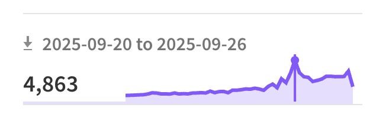

어느 회사 면접이었는지 기억나지 않지만, 내 회고글을 보고 비꼬듯 질문 받았던 경험 때문에 언제부턴가 회고글을 쓰지 않았다. 내 생각을 블로그에 남기지 않기로 마음먹었던 것 같다.

근데 경력이 쌓이면서 (벌써 7년차..) 매년 치열하게 살아왔는데도 기록해두지 않으니까 지난 일들이 잘 기억나지 않았다. 그리고 ChatGPT가 등장하면서 AI의 도움을 많이 받다 보니, 내 생각을 글로 정리하는 능력이 퇴화 하는게 느껴졌다. 단순히 기술을 소개하는 형태의 글 보다는 AI 시대일수록, 내 언어와 경험이 드러나는 기록이 더 중요해진 것 같다.

그래서 올해부터는 다시 회고글도 써보고,  내가 이해한 방식대로 기술 블로그도 써보려고 한다. 😊

---

## 0. 개요

올해는 오랫동안 진행해 온 Next.js 전환 프로젝트를 마무리하고, 그 경험을 카카오 테크블로그에 기록하며 하나의 큰 커리어를 마무리 했다. 동시에 임신·출산·육아를 겪으며 인생의 제 2막이 시작되는 느낌을 받았다.

육아로 인해 취미를 못 할까 걱정도 되었지만, 오히려 그 걱정 덕분에 테니스와 어반 드로잉을 시작을 하는 계기가 되었다. 한편, 빠르게 발전하는 AI를 보며 커리어에 대한 위기감도 느꼈지만, 위협으로만 보기보다 새로운 파도 위에 올라탈 방법을 고민하게 된 한 해였다.

## 1. Next.js 전환 프로젝트 마무리

올해는 카카오 메이커스 팀에 합류하고 2년반동안 진행했던 Next.js 전환 프로젝트를 배포해서 마무리를 짓는 한해였다. 처음 합류할때 Next.js 버전이 13 이었는데 16까지 나왔으니 시간도 빠르고 변화도 참 빠르다 ㅎㅎ 팀에서 함수형 React를 사용해보신 분들이 없어서 내가 조금 더 주도적으로 프로젝트를 진행할 수 있었는데 돌아보면 힘들었던 순간도 있었지만 그 경험이 매우 값진 경험이었다. 

### 1.1 디자인 시스템

이전 회사들에서 매번 디자인 시스템을 구축하려고 했지만, 커뮤니케이션에 지치면서 항상 반쪽짜리로 끝나는 느낌이었다. 그런데 이번에는 처음으로 제대로 디자인 시스템을 구축했다고 말 할 수 있을 것 같다. 디자인팀과 긴밀하게 협업하며 Atomic Design 패턴을 기반으로 따라 60개가 넘는 컴포넌트를 설계하고 라이브러리로 만들었다. 

가장 어려웠던 점은 Atomic Design 패턴이 어디까지나 멘탈 모델이었기 때문에, 기준을 명확히 정해두지 않으면 컴포넌트를 어느 레벨로 분류할지에 대한 기준이 작업자마다 달라질 수 있다는 점 이었다. 나조차 다른 프로젝트 작업을 하다가 다시 컴포넌트를 만드는 상황이 생기면 어?? 이 컴포넌트가 왜 molecules 레벨에 있지? 싶었던 순간이 몇번 있었다. 그래서 레벨을 더 명확하게 나누는 방법에 대해 고민 했었다. 관련해서는 [Atomic Design에서 명확한 기준점 찾기](http://localhost:8000/atomic-design-pattern-review/) 라는 글로 작성해두었다. 

### 1.2 라이브러리화

이전 회사에서는 이미 다른 선배 개발자가 라이브러리화 해두어서 패키징을 내가 할 일이 없었다. 근데 이번에는 디자인 시스템을 만들고 라이브러리로 구축해서 여러 프로젝트에서 쓸 수 있는 구조를 만들어야 했기 때문에 처음으로 라이브러리를 직접 패키징해 보았다. 이 경험도 매우 값진 경험이었다. React 18부터 서버컴포넌트가 나오다보니 패키징 할때 클라이언트 컴포넌트에는 ‘use client’라는 디렉티브가가 포함되어야하는데 Rollup은 기본적으로 모든 디렉티브를 제거하기 때문에  `'use client'` 디렉티브 역시 모두 제거 해버리는 이슈가 있었다. [rollup-plugin-preserve-directives](https://www.npmjs.com/package/rollup-plugin-preserve-directives) 라는 플러그인이 있어서 사용해보려고 했지만 PostCSS를 사용하고 있는 상황이라 `preserveModules` 옵션 설정에 충돌이 있었고 어쩔 수 없이 [rollup-plugin-preserve-use-client](https://www.npmjs.com/package/rollup-plugin-preserve-use-client) 플러그인을 개발해야 했었다. 관련해서는 [Rollup Plugin 개발기](https://soobing.github.io/rollup-plugin-development/) 라는 글로 작성해두었다.

다운로드 수가 많을때는 주간 약 5천까지 찍혀있다. (뿌듯)

### 1.3 배포와 장애 🤯

기존에 Nuxt로 운영 중인 서버에서도 이미 SSR을 사용하고 있었고, TPS(Transactions Per Second) 테스트도  모두 통과 했기 때문에 문제가 없을 것이라고… 안일하게 생각했다. 서버 인프라쪽은 업무를 많이 담당해보지 않아서 자신감이 부족하기도 했고, 팀에서 주로 담당해 주시는 분이 계서서 함께 꼼꼼히 살펴보기보다는 잘 되겠지라는 마음으로 지켜보기만 했던 것 같다. 

하지만 300만명 정도의 대규모 채널 메시지를 발송하니 순간적으로 다량의 트래픽이 몰리면서 결국 서비스 장애로 이어졌다. 이렇게 장애로 이어졌는데, 부끄럽지만 롤백 플랜을 치밀하게 세워두지 않아서 담당자 외에 나머지 동료들은 도와주고 싶어도 더 큰 문제를 만들까 싶어 뒤에서 땀만 흘리며 지켜볼 수 밖에 없었다. 

안일했다. 코드리뷰를 소홀히 했을 때 처럼, 서버 인프라 관련해서도 더 빡세게 리뷰를 하고 함께 집중해서 함께 살펴봤어야했는데 QA 대응하고 시간내에 개발하는 것에 급급해서 많은 부분을 놓쳤던것 같다.

### 1.4 성능 개선

옆팀에서 우리와 비슷한 경험을 먼저 한 덕분에 많은 조언을 얻을 수 있었다. 덕분에 서버 리소스를 많이 잡아먹는 부분을 빠르게 파악할 수 있었고, ISR로 전환하는 쪽으로 방향을 잡을 수 있었다. 조직 간에 기술 공유와 유대 관계가 잘 형성되어 있으면 문제를 훨씬 빨리 해결할 수 있다는 점을 느꼈다.

그렇게 Next.js의 SSR으로 구현했던 부분을 ISR로 전환했고, 운영 중인 서버가 수십 대이다 보니 외부 캐시핸들러를 두는 방식으로 성능 개선을 진행했다. 이외에도 정적 리소스 서빙 방식, 내부 메모리 캐싱과 외부 캐시의 성능 비교 등 여러 관점에서 실험해볼 수 있었다. 장애 때문에 마음은 죄송하고 계속 긴장됐지만… 동시에 꽤 재미있는 시간이었다.

이 과정을 겪다보니 서버 컴포넌트에 대한 기대가 많이 줄어들었다. ㅋㅋ 처음에는 최대한 서버 컴포넌트로 많이 개발해서 서버의 리소스를 적극 활용하자는 생각이었는데 역시 공짜는 없었다. 캐싱 전략이 제대로 설계되지 않으면 서버 비용과 리스크가 모두 커진다는 걸 몸소 느꼈다. 그리고 Next.js의 Dynamic API들이 캐싱을 하지 않도록 하고, 서버 리소스를 많이 사용한다는 점도 알게되었다.  ~~서버 리소스를 최대한 활용하자 주의에서 최소한으로 활용하자로 바뀌게 되…~~

이와 관련해서는 카카오 테크블로그에 “[Next.js ISR 전환과 Redis 외부 캐싱 (SSR 지옥 탈출기 시리즈 1)](https://tech.kakao.com/posts/743)” 라는 글로 경험을 자세하게 담았다. 

### 1.5 치밀한 배포/롤백 플랜 세우기

배포와 관련해서는 우리 팀 서버 개발자 분들에게 좋은 팁을 얻을 수 있었다. 이렇게 대규모의 개편을 배포할때는 보통 순차 배포로 진행한다고 했다. 먼저 전체 서버의 5%에 적용해 보고, 문제가 없으면 10% → 50% → 100% 이런식으로 점진적 배포하는 방법을 알려주셨다. 맨날 CSR 배포만 해봤더니.. 이런 순차배포는 생각지도 못했다. 지나고보니 무식하면 용감하다고.. SSR 기반 서비스를 한 번에 오픈했으니.. 되돌아보면 아찔하다.

롤백 플랜도 다시 고민했다. 최대한 빠르게 롤백할 수 있는 방법을 생각해냈다. 빌드 배포를 하지 않고 개선 전 프로젝트인 Nuxt로 트래픽을 돌릴 수 있도록 구성했다. 첫번째 배포 때는 문제가 생기면 Nuxt 프로젝트도 다시 빌드 · 배포 해야 해서 정말 절망스러웠는데(게다가 배포 시간도 매우 김…) 이 부분만 제대로 대비를 잘 해놨어도 쫄리는게 덜 했을 것 같다. 

이후에는 Nginx 설정만 변경하면 1분도 채 걸리지 않게 롤백할 수 있도록 해서, 두번째 배포 때는 마음이 훨씬 안심이 되었다.

### 1.6 모니터링 시스템 구축

모니터링 시스템도 구축했다. 사내 모니터링 서비스는 OS 레벨의 지표만 볼 수 있었기 때문에 실제 장애가 발생했을때 CPU 문제인지, 메모리 문제인지 원인을 정확히 파악하기가 어려웠다. 애초에 기존에는 제대로 된 모니터링 시스템이 없었냐고 묻는다면… 부끄럽지만 없었다... 😂 그래서 장애가 났을때 직접 서버에 접속해서 PM2 지표를 확인하는 방법밖에 없었다.

이번 장애를 계기로, 잠깐 합류했다 다른 조직으로 이동하신 시니어 개발자분이 조언을 주셔서 본격적으로 모니터링 시스템을 구축하게 되었다. 자세한 내용은 [Next.js SSR 서버를 위한 모니터링 시스템 구축 (SSR 지옥 탈출기 시리즈 2)](https://tech.kakao.com/posts/744) 사내 테크 블로그에 정리해두었다. 

모니터링 시스템을 처음으로 구축해 보면서, 짧은 기간이었지만 정말 많은 것을 배웠다. 모니터링을 위해 필요한 구성 요소들(Metrics Exporter, Scraping, 데이터 적재, 대시보드)을 알게 되었고, SPOF에 대비해 로그가 끊기지 않도록 설계하는 방법도 고민할 수 있었다. 

또 앞으로 계속 추가될 모니터링 서버들을 어떻게 하면 더 쉽게 적용할 수 있을지, 그리고 수집한 메트릭을 대시보드에서 어떻게 직관적으로 보여줄 것인지 등, 여러 가지를 깊이 고민해 볼 수 있었던 의미 있는 경험이었다.

## 2. 블로깅 & 발표

### 2.1 카카오 테크블로그 기고

카카오로 이직하면서 꼭 해보고 싶은 것이 있었다. 바로 테크블로그에 글 써보기 ✨

오랫동안 진행해온 프로젝트를 마무리하며 작성한거라, 프로젝트를 잘 마무리를 잘 짓는 느낌이었다. 특히 Next.js를 Vercel이 아닌 **사내 인프라 환경에서 직접 운영하며 겪은 경험**은 다른 회사에서 일하는 FE 개발자들에게도 도움이 될 것 같아서 글의 주제 선택도 꽤 만족스러웠다.

- [**Part 1. ISR 전환과 Redis 외부 캐싱**](https://tech.kakao.com/posts/743) - 카카오 인프라 환경에서 SSR을 운영하며 맞닥뜨린 한계와, 그 과정에서 얻은 Next.js 캐싱 인사이트를 공유합니다.
- [**Part 2. SSR 서버를 위한 모니터링 시스템 구축**](https://tech.kakao.com/posts/744) - PM2 운영 환경에서 OS를 넘어 프로세스 레벨의 모니터링 파이프라인을 만든 과정을 공유합니다

2편의 글을 작성했는데, 이번 성능 개선을 함께 진행했던 베리와 1편 2편을 나누어 작성했다. 베리와 함께 성능 개선을 진행하면서, 성능을 올릴 수 있는 여러 방법을 시도하고 테스트를 돌려 결과를 비교하며 이야기 나누는 과정 자체가 무척 즐거웠다. 부족했던 인프라 지식이나 문서를 정리하는 방식도 베리에게 많이 배웠다.

### 2.2 조직내 발표

디자인 시스템을 완성하면 꼭 해보고 싶은 것이 있었다. 바로 Figma 디자인에서 우리 디자인 시스템에 있는 컴포넌트에 맞춰 props까지 자동으로 설정된 코드가 생성되도록 하는 것이다. 

처음 디자인 시스템을 구축할 때만 해도 내가 플러그인을 직접 개발해야 했었다. 그런데 올해 Code Connect 라는 기능이 출시되면서, 코드와 Figma 컴포넌트를 잘 연결해두면 MCP를 활용해서 디자인으로 부터 코드를 생성하는 것이 가능해졌다. 그래서 이게 가능하다는 것을 팀에 발표했다. 발표 제목은 `Design To Code (디자인과 코드를 잇다)` 이다 ㅎㅎ

다만, 내가 샘플로 시연한 것은 우리 일부 컴포넌트 였기 때문에.. 이걸 실무에 적용하려면, 디자인팀과 협의해서 Figma 컴포넌트들을 React 컴포넌트 Props와 매핑할 수 있게 맞게 만들고 Figma내에서 라이브러리화 하여 디자인하도록 설득해야 한다. 그러려면, 나 역시 디자이너 못지않게 Figma를 잘 알고 있어야 한다. 

아직은 부족하다. 그래서 내년에는 이 부분을 좀 더 깊게 탐구해보고 싶다. 사이드 프로젝트에서는 Shadcn UI 같은 라이브러리를 활용하겠지만, 인하우스 환경에서는 서비스 특성에 맞는 UI가 반드시 필요할 것이기 때문에 디자인 시스템은 따로 무조건 존재할 것이며 이런 부분까지 잘 다룰 수 있으면 좋겠다는 생각을 했다.

### 2.3 블로깅

역시 글또가 끝나니 글을 쓰지 않았다. ^_^….. 그나마 글또 덕분에 4개의 글을 작성했다. 

아직 업로드하지 않은 글도 2개정도 있는데, 나를 강제하는 것이 없으니 글을 완성 하지 못하고 올해가 끝이 났다. 글또 활동도 더이상 하지 않는데 동기부여가 되는 활동이 무엇이 있을지 찾아봐야겠다.

새해에는 글또 활동할때 처럼 2주마다 글을 쓰지는 않아도 AI가 답변해 줄 수 없는, 경험과 내 색깔을 담은 글로 블로그로 계속 운영해보고 싶다.

## 3. 인간관계

### 3.1 동료들이 많이 떠났다..

올해는 여러 동료가 이직했다. 

IT 업계 특성상 낯선 일은 아니지만, 그래도 정들었던 사람들을 더 이상 보지 못한다는 것은 늘 아쉬움이 남는다. 송별회 겸 비공식 홈파티에 초대 받아서 다녀왔는데, 도심 한가운데서 바베큐를 굽고, 여유로운 동네 분위기 속에서 개발 이야기와 인생 고민을 나눌 수 있어 정말 즐겁고 기억에 남는 시간이었다.

그리고 우리팀에 굉장히 고수이신 분이 합류하셨다 금방 다른 곳으로 이직(?)하셨는데 짧은 기간이었지만 정말 많은 것을 배울 수 있었다. 나도 그런 시니어 개발자가 되고 싶다는 생각을 했다.

### 3.2 커피챗을 적극적으로

나는 글또 활동을 꽤 오랫동안 해왔다. 초반에는 오프라인 모임에도 적극적으로 나가고, 글쓰기 외의 활동도 열심히 했었다. 하지만 중니어가 되던쯤.. 오프라인에서 소비하는 에너지를 아껴 내실을 다져야 겠다고 마음 먹은 후 부터 글쓰는 활동에만 집중했다. 

그런데 이번 글또 10기 활동 중에 낙준님에게 처음으로 다이렉트 커피챗 요청을 받았다. 요즘 관심있는 기술 이야기부터, 왜 나한테 커피챗 요청을 주셨는지 ㅎㅎ 등등 즐겁게 이야기를 나눴다. 무엇보다 나 역시 커피챗을 해보고 싶은 분들이 있었지만 용기가 부족해 선뜻 시도하지 못하고 있었는데 나도 먼저 다가가 봐야겠다는 용기를 얻었다.

그렇게 해서 은찬님께 커피챗 요청을 드렸다. 나의 첫 커피챗 신청이었다. ㅋㅋ 은찬님은 글또에서 자동화 봇이나 여러 생산적인 오프라인 활동을 주도하시는 분이다. 그래서 어떻게 그런 에너지가 나오는지, 또 어떤 재미있는 사이드 프로젝트를 하고 계시는지 궁금했다. 특정 분야의 개발자로 자신을 한정짓기보다는 자신만의 서비스를 만들기위해 풀스택으로 개발하시는 모습이 특히 인상적이었고, 나 역시 스스로의 가능성을 한정짓지 말아야 겠다는 생각이 들었다. 

토스에도 커피챗을 다녀왔다. 링크드인을 통해 요청을 받아 평소에 정말 궁금했던 기업 토스에 직접 방문할 수 있었다. 아무래도 토스에 대해서는 이런저런 흉흉한 소문(?)을 많이 들어왔던 터라, 실제로는 어떻게 일하고 어떤 철학을 가지고 있는지 더 알고 싶었다. 커피챗 이후 궁금증이 오히려 더 커져서 [유난한 도전](https://product.kyobobook.co.kr/detail/S000200087711)이라는 책도 읽게 되었다. 출퇴근 시간에 시간가는 줄 모르고 정말 재미있게 읽었다. 뭔가 내 마음속에 사그라들어 있던 열정에 불을 붙여주는 책이었다. 그동안 선택의 기로에 섰을 때 안정적이고 네임밸류가 있는 쪽을 선택해왔고, 그 선택을 후회하지는 않는다. 하지만 앞으로 선택할 기회가 생긴다면 정말 가슴뛰는 무언가를 선택해볼 용기를 내고 싶다는 생각을 했다.

이후에도 글또 덕분에 커피챗을 적극적으로 했었다. 그중 하나가 “카카오따러가또” 라는 모임이었다. 카카오 계열사에 계신 분들과 가끔 점심과 커피챗을 함께했는데, 점심시간에 부담 없이 만날 수 있어서 좋았다. 그리고 다른 계열사에 궁금증을 자유롭게 나눌 수 있어서 이것 또한 정말 좋았다. 재미있었던 것은 네이버에 계신 경환님도 거의 항상 모임에 참석하셔서 시간을 보냈다는 점이다.ㅋㅋ 정말 편하고 재미있게 대화를 나누다 나중에 경환님이 꽤 연차가 있는 팀장님이라는 사실을 알고 깜짝 놀랐다. 나도 언젠가는 그렇게 편안하게 대화할 수 있는 시니어 또는 리더가 되고 싶다. 그 계기로 네이버에도 놀러갈 수 있었다. 종윤님이 재미있게 사옥 투어를 해주셨다.

그리고 카카오에 셨던 분 중 한 분은 호주로 이직하시며 마지막 인사를 나누고 떠나셨는데, 언젠가 해외에서 일해보고 싶다는 로망을 가진 나에게 또 하나의 신선한 자극을 주었다.

### 3.3 Baby 👶🏻

기술블로그다 보니.. 3.3의 작은 칸에만 담았지만, 사실 올해는 임신, 출산, 육아를 모두 경험한 한 해였다. 이것 하나만으로도 올 한해 나에게 정말 수고했다고 상을 주고 싶다.

인생은 계획대로 흘러가지 않는다는 사실을 몸소 깨달았고, 세상의 모든 엄마 아빠에 대한 존경심이 생겼다. 동시에, 세상 그 무엇과도 바꿀 수 없는 소중한 내 아기를 위해 앞으로도 더 열심히, 더 잘해내고 싶다는 다짐을 했다. 

이렇게 작고 아무것도 모르는 순수한 존재가 한 번 웃어줄 때마다 느끼는 행복은 그 어떤 도파민으로는 대신할 수 없는 감정인 것 같다.

## 4. 여행

태교 여행을 핑계로 올해는 해외여행 두번, 호캉스를 여러번 다녀왔다.

### 4.1 싱가폴

사실 여행이라기보다, 싱가포르에 사는 게 어떤지 잠깐 체험해 본 기분이었다. 언니네 집은 5성급 호텔에 있을법한 수영장이 2개나 있는 큰 콘도라서, 머무는 동안 조카와 수영도 많이하고 보드게임도 하며 즐겁게 보낼 수 있었다. 

조카가 다니는 국제학교에도 구경했는데, 푹푹 찌는 더위에도 아이들이 힘든 내색 없이 축구 훈련을 받는 모습을 보니 정신력이 정말 대단하다는 생각이 들었다. ㅋㅋ

언니랑 형부가 로컬 맛집부터 럭셔리한 곳까지 다 데려가 주고, 맛있는 것도 많이 사줘서 정말 행복한 시간이었다. 나도 나중에 내 친척 동생들에게 이렇게 잘해줄 수 있을까 싶을 정도로 세심하게 챙겨줘서 배려하는 마음도 배웠고, 나도 경제적으로 더 든든해지고 싶다는 생각이 들었다.

### 4.2 교토

오랜만에 가족여행으로 해외를 다녀왔다. 나의 첫 일본 여행이었는데, 그동안 방사능이 걱정돼 일본 방문을 미뤄오다가 임신 후기라 장시간 비행은 어려울 것 같아 태교여행으로 일본을 가게 되었다. 그런데 막상 가 보니 완전히 반해 버렸다.

일본 특유의 깔끔함과 친절한 문화, 거기에 맛있는 음식과 디저트까지 2박 3일이 너무 짧게 느껴졌다. 이번에는 교토만 다녀왔는데, 고즈넉하고 전통적인 거리의 분위기가 내가 상상하던 일본 그대로라 신기하면서도 좋았다. 다음에는 아기와 함께 일본 본토 곳곳을 여행해 보고 싶다는 계획도 세웠다.

자유여행으로 부모님을 모시고 간 데다 임신 후기라 몸도 무거웠지만, 많이 걷고 부모님을 챙기다 보니 하루에 한 번씩은 울었던 건 안 비밀… 🤫

## 5. 취미 생활

### 5.1 새로운 취미 시작

올해는 취미를 정말 많이 만든 한 해였다. 테니스와 어반 드로잉을 시작했다. 아기가 태어나면 육아를 하느라 한동안 새로운 취미를 만들기 어려울 수도 있겠다는 생각에, ‘시작이 반’이라는 마음으로 조금이라도 먼저 발을 담가 보기로 했다.

결과는 대만족이었다. 생각보다 취미 생활에 지출이 꽤 있긴 했지만, 은퇴 후에 탁구로 즐거운 시간을 보내고 계신 부모님을 보면서 취미가 인생을 풍요롭고 즐겁게 만들어 주는 중요한 도구라는 걸 알기에 올해 취미를 마음껏 즐긴 건 후회가 없다.

테니스를 하면서 가장 크게 배운 점은 힘을 빼야 한다는 것이었는데, 가만히 생각해 보니 인생의 중요한 일들에서도 힘을 빼는 게 참 중요한 것 같다. 그리고 어반 드로잉에서는, 망한 것 같아도 끝까지 완성해 보면 꽤 그럴듯해진다는 걸 알게 됐다. 나는 원래 금방 실증을 잘 내고, 초반에 마음에 들지 않으면 쉽게 그만두고 싶어하는 편인데, 이번에 미술학원을 다니면서 침착하게 끝까지 완성하는 연습을 많이 하게 되었다.

어쨌든 우리 감자 덕분에 미뤄두었던 취미 생활을 시작할 수 있어서 더 뜻깊었던 한 해였다.

### 5.2 독서

올해는 작년에 비해 독서를 많이 하지 못했다. (사놓기만 한 책이 몇 권…😅)

- [당신도 느리게 나이 들 수 있습니다](https://product.kyobobook.co.kr/detail/S000200484432)
- [하루 한 장 임신 출산 데일리북](https://product.kyobobook.co.kr/detail/S000217140753)
- [프레임](https://product.kyobobook.co.kr/detail/S000000711324)
- [영어 유치원이 고민된다면](https://product.kyobobook.co.kr/detail/S000216352675)
- [교육의 뇌과학](https://product.kyobobook.co.kr/detail/S000215748254)
- [내가 한 말을 오해하지 않기로 함](https://product.kyobobook.co.kr/detail/S000211654427)
- [나의 첫 번째 라인드로잉](https://product.kyobobook.co.kr/detail/S000001957296)
- [경량 문명의 탄생](https://product.kyobobook.co.kr/detail/S000217421954)
- [출산 동반자 가이드](https://product.kyobobook.co.kr/detail/S000001463708)
- [부모의 어휘력](https://product.kyobobook.co.kr/detail/S000213513428)

아무래도 출산이 다가오다 보니, 엄청나게 커지는 두려움 때문에 폭풍 공부를 했던 것 같다. 책 욕심이 많아서 사기만하고 끝까지 읽지 못한 책들도 꽤 있어서, 내년에는 완독을 목표로 하고 읽은 책에 대해 짧은 소감이라도 남겨 보려고 한다.

## 6. AI와 미래에 대한 생각들..

무섭다.. 미래가 ㅋㅋㅋ (아직까지) AI로 만드는 프로젝트들이 내 역할까지 커버할수는 없다고는 생각하지만 간단한 프로젝트를 만들기에는 초반 허들이 많이 낮아진 것 같다.

### 6.1 사내 스터디

회사에서 AI 관련 스터디를 할 수 있도록 지원해주는 제도가 있는데, 팀원 중 한 분이 RAG 스터디를 모집해 주셔서 참여하게 되었다.

덕분에 LangChain을 활용해 직접 RAG를 구현해보는 경험 을 할 수 있었고, 기본적인 Vector RAG 부터 Graph RAG 까지 살펴보며 RAG 전반에 대해 이해도를 높일 수 있는 유익한 시간이었다. 다만 프롬프트에 따라 결과가 천차만별로 달라지고, 왜 그런 결과가 나오는지 명확히 설명하기 어려운 부분도 많아 이 분야 역시 여전히 블랙박스 같고 쉽지 않다는 생각이 들었다.

스터디 과정에서 특히 재미있었던 점은, 모두가 공부할 때 AI를 적극적으로 활용했다는 것이었다. LLM을 통해 내용을 미리 학습해 오기도 하고, NotebookLM으로 개념을 정리해본 경험도 꽤 신선하고 인상적이었다.

### 6.2 주식

오클로.. 아이렌.. 로켓랩..

AI와 관련된 주식들로 롤러코스터를 제대로 탄 한 해였다 ㅋㅋ

연초에는 오클로로 미친 상승을 경험했고, 이후 아이렌으로 넘어가서 또 한 번 엄청난 상승장을 맞이했다. 많이 올랐을 때는 최대 4.5배 정도까지 오르기도 했다.

지금은 다시 많이 떨어졌지만, AI가 그만큼 핫했던 만큼 관련 주식들 역시 정말 대단한 한 해를 보냈던 것 같아서 이번 코너에 한 번 써봤다 ㅎㅎ

### 6.3 커리어에 대한 고민

AI로 인해 가장 먼저 대체될 수 있는 직군이 프론트엔드라는 기사를 봤다. 일자리를 잃을지도 모른다는 불안이 전혀 없었다고는 할 수 없지만, 파도에 휩쓸릴 것인가, 아니면 파도를 탈 것인가 선택의 기로에서 파도 위에 올라타는 사람이 되어야 하지 않을까 싶다.
내년에는 육아휴직으로 잠시 업무와 거리를 두게 되는데, 그 시간을 잘 활용해 나만의 시간을 만들고, 새로운 파도에 올라탈 수 있는 도약의 시간이 되길 스스로에게 기대해 본다.

## 7. 마무리

회고를 다시 시작할만큼 뜻깊은 한해였던 2025년.

올 한해 가장 큰 교훈을 정리하면, 인생은 계획되로 흘러가지 않지만, 완벽하지 않더라도 끝까지 해내면 그럴듯한 작품이 될 수 있다는 것이다.

2026년에도 지치지 않고, 꾸준히 나아가보자. 화이팅!