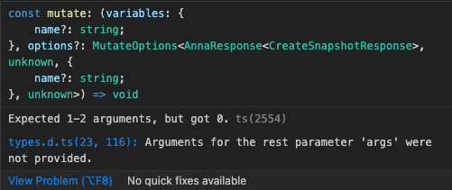

## Introduction
[#1077](https://github.com/TanStack/query/issues/1077) 이슈를 보면 mutateFn의 variable을 필수값으로 변경한 이력을 볼 수 있다.

mutation인데 왜 variable이 없냐고? 나의 경우에는 URL의 있는 queryParams를 읽어와서 데이터를 넘겨주면 되기 때문에 useSomething hook 안에서 처리하고 싶었다.


## 문제상황

`mutate()` 와 같이 variable에 아무 값도 넣지 않고 mutation 함수를 호출 할 수 없다.
TVariables 타입에 undefined도 줘보고 이래저래 별짓을 다해봐도 필수값을 optional 하게 바꿀수는 없었다. 
```tsx
// 정의
export function useSomething () {
  const {name} = useQueryParams(); // custom hook이 있다고 가정
  return useMutation({
    mutationFn: () => axios.post('/user', {name}),
  });
}

// 사용처
const {mutate} = useSomething();
const handleClick = () => mutate(); // 에러 발생
```

에러 발생



## 해결

실질적으로는 mute 함수에서 variable을 정의해서 넣어주는 것이기 때문에 그렇게 꼼수해결법도 아니다.

```tsx
// 정의
export function useSomething () {
  const {name} = useQueryParams(); // custom hook이 있다고 가정
  const mutation = useApiMutation({
    mutationFn: () => axios.post('/user', {name}),
  });
  const mutate = (variables = {}) => mutation.mutate(variables);

  return {...mutation, mutate};
}

// 사용처
const {mutate} = useSomething();
const handleClick = () => mutate(); // 에러안남
```

