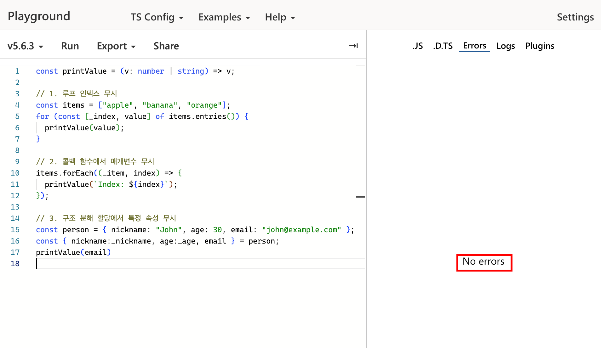
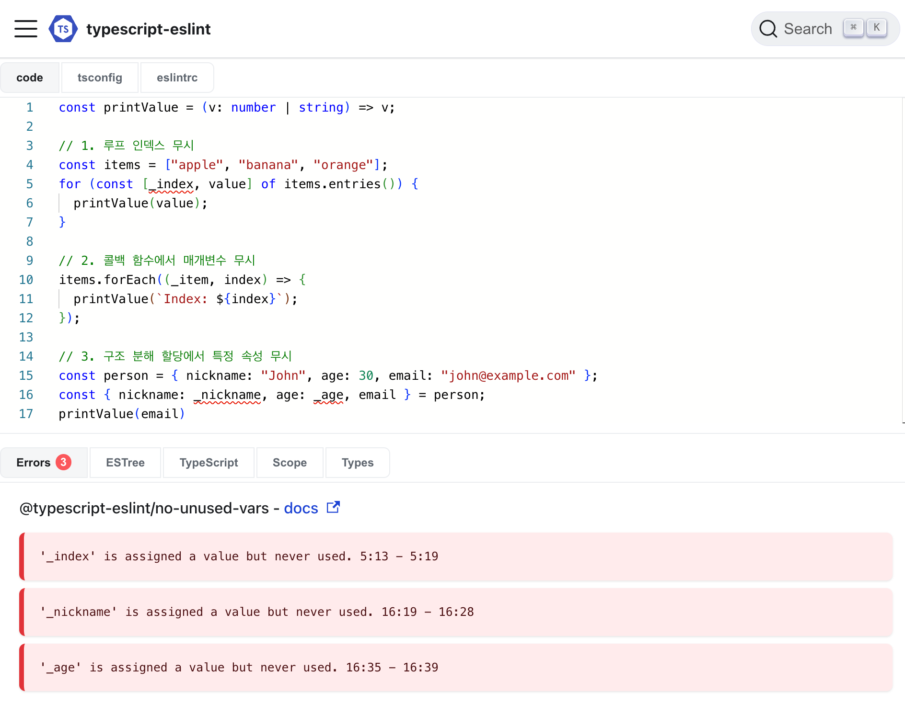

## TL;DR;

TypeScript와 ESLint는 "의도적으로 무시"하는 코드에 대해 다른 접근 방식을 가집니다. TypeScript는 언더스코어(`_`) 접두사로 시작하는 변수를 자동으로 무시하지만, ESLint의 `no-unused-vars` 규칙은 기본적으로 더 엄격하므로, 언더스코어로 시작하는 변수도 사용되지 않은 것으로 간주하여 오류를 발생시킵니다. 개발자는 **ESLint 설정을 통해  "의도적으로 무시"하는 코드에 대해 TypeScript와 유사한 동작을 구현하거나 더 세밀한 제어**를 할 수 있습니다.

## “의도적으로 무시”하는 코드

아래 예시와 같은 코드를 작성해본 경험이 있으신가요? 우리는 가끔 “의도적으로 무시” 하는 것으로 간주하는 코드를 작성해야 할 때가 있습니다. 

1. 루프 인덱스 무시: `_index`는 사용되지 않지만, `entries()` 메서드의 반환 값을 구조 분해하기 위해 필요

```tsx
const items = ["apple", "banana", "orange"];
for (const [_index, value] of items.entries()) {
  console.log(value);
}
```

2. 콜백 함수에서 매개변수 무시: `_item`은 사용되지 않지만, `index`에 접근하기 위해 선언

```tsx
const items = ["apple", "banana", "orange"];
items.forEach((_item, index) => {
  console.log(`Index: ${index}`);
});
```

3. 구조 분해 할당에서 특정 속성 무시: `_age`는 추출되지만 사용되지 않음을 명시

```tsx
const person = { name: "John", age: 30, email: "john@example.com" };
const { name, _age, email } = person;
console.log(name, email);
```

## TypeScript vs ESLint의 다른 견해

TypeScript 에서는 위의 예시와 같이 “의도적으로 무시”하는 코드를 작성하고 싶은 경우에  언더스코어(`_`) 접두사를 통해 변수를 선언하면 "이 변수는 의도적으로 사용되지 않음"을 나타냅니다. 따라서, **TypeScript 컴파일러**는 이에 대한 **미사용 변수 경고를 생성하지 않습니다**. 



그러나 우리의 코드 린팅 도구인 ESLint의  `no-unused-vars`의 [기본 옵션](https://eslint.org/docs/latest/rules/no-unused-vars#options)을 살펴보면, TypeScript와는 다르게 경고를 생성하고 있습니다. ESLint는 **모든 변수**의 사용 여부를 철저히 검사하고, 함수 매개변수에 대해서는 **마지막으로 사용된 매개변수**의 미사용에 대한 경고를 발생시키는 등 타입스크립트와는 다르게 조금 더 엄격하고, 세밀한 옵션을 가지고 있습니다. 



## typescript-eslint인데 왜 typescript를 안따라가지??

ESlint와 TypeScript의 “의도적으로 무시”하는 코드에 대한 다른 견해로 인해 개발자들은 조금 혼동이 오기도 합니다. 관련해서 검색하던 중 재미있는 [discussion](https://github.com/typescript-eslint/typescript-eslint/issues/8464)이 있어 이 내용을 소개합니다. 이 글을 통해 **TypeScript와 ESLint의 처리방식이 어떻게 다른지, 여러분의 의견은 어떤지, 어떻게 내가 원하는데로 ESLint 규칙을 설정 하면 될지** 소개하려고 합니다.

### `no-unused-vars` ignoring `_` prefixed variables 이슈 소개


이 이슈는 `typescript-eslint`의 `no-unused-vars` 규칙이 TypeScript의 기본 설정과 다르게 `_`로 시작하는 변수를 자동으로 무시하지 않는다는 점을 다룹니다. **Johnny Reilly**는 TypeScript에서는 `_`로 시작하는 변수가 의도적으로 사용되지 않는 것으로 간주되어 경고가 발생하지 않는데, `typescript-eslint`에서는 그렇지 않다는 점을 지적하고 있습니다.

이에 대해 메인테이너인 **Brad Zacher는** typescript-eslint가 기본 ESLint 규칙과 일치하도록 설정되어 있으며, 모든 불필요한 변수를 자동으로 잡아내도록 설계되어 있음을 이야기하면서 아래와 같은 이유로 ESLint의 기본 설정 그대로 제공해야하는 이유를 이야기했습니다.

- 기본 설정은 코드베이스의 표준에 대한 가정을 하지 않으며, 언더스코어를 사용한 변수 허용을 기본으로 제공하지 않음.
- 규칙이 엄격하게 설정되어 있어 잘못된 긍정(false positives)을 피할 수 있음.
- 사용자 정의 설정을 통해 필요한 경우 규칙을 완화할 수 있음.
- TypeScript의 관습을 이해하지만, 단일 문자로 예외를 만드는 것이 항상 좋은 것은 아님.

이에 대해 **ohnny Reilly**가 typescript의 기본값을 선호하는 사람들이 있을 수 있으며, 때로는 의도적으로 무시하는 코드를 작성해야 하는 경우가 있음을 이야기 합니다. 위에서 제가 예시로 든 “(3번) 구조 분해 할당에서 특정 속성 무시”에 관해 조금 더 구체적으로 이야기를 하는데, 여기에 대해 메인테이너는  [`ignoreRestSiblings`옵션](https://eslint.org/docs/latest/rules/no-unused-vars#ignorerestsiblings)에을 제공하고 있다고  안내하며 [typescript의 기본값대로 eslint를 설정하는 방법을 문서화](https://github.com/typescript-eslint/typescript-eslint/pull/8526)하는 형태로 이 이슈는 종료가 됩니다.

### 관련 내용

- Discussion: https://github.com/typescript-eslint/typescript-eslint/issues/8464
- PR: https://github.com/typescript-eslint/typescript-eslint/pull/8526
- https://johnnyreilly.com/typescript-eslint-no-unused-vars

## ESLint의 no-unused-vars 규칙

ESLint의 `no-unused-vars` 은 사용하지 않는 변수에 대해 많은 옵션을 제공합니다. 이 규칙의 [기본 설정](https://eslint.org/docs/latest/rules/no-unused-vars#options) 을 파악해 보면 “의도적으로 무시”하는 코드에 대해서 TypeScript의 컴파일러 옵션보다 더 세밀하게 옵션을 설정할 수 있습니다.

```json
{
    "rules": {
        "no-unused-vars": ["error", {
            "vars": "all",
            "args": "after-used",
            "caughtErrors": "all",
            "ignoreRestSiblings": false,
            "reportUsedIgnorePattern": false
        }]
    }
}
```

- `"vars": "all"`: 모든 변수의 사용 여부를 검사합니다. 전역 변수를 포함한 모든 변수가 대상이 됩니다.
- `"args": "after-used"`: 함수 매개변수에 대해서는 마지막으로 사용된 매개변수 이후의 미사용 매개변수만 경고합니다. 예를 들어, 첫 번째 매개변수가 사용되지 않더라도 두 번째 매개변수가 사용된다면 첫 번째 매개변수에 대해서는 경고하지 않습니다.
- `"caughtErrors": "all"`: catch 문의 에러 객체가 사용되지 않을 경우 경고합니다.
- `"ignoreRestSiblings": false`: 객체 구조 분해에서 나머지 연산자(...)로 할당된 속성을 무시하지 않습니다.
- `"reportUsedIgnorePattern": false`: `varsIgnorePattern`, `argsIgnorePattern` 등으로 무시되도록 설정된 변수가 실제로 사용되었을 때 이를 보고하지 않습니다.

## “의도적으로 무시”하는 코드, 린트 통과하도록 설정하기

일반적으로 사용되지 않는 지역 변수와 매개변수를 표시하기 위해서는, TypeScript 보다 더 엄격한 규칙을 적용하는 **ESLint `@typescript-eslint/no-unused-vars`를 사용하는 것을 권장**합니다.

하지만 개발자의 취향에 따라 “의도적으로 무시”하는 코드에 대해서는 린트를 통과하도록 설정하고 싶을 수 있습니다. 이런 경우 세부적인 규칙 설정이 가능한 ESLint를 활용하여, TypeScript의 컴파일러 옵션보다 더 구체적인 설정이 가능합니다.

```json
{
  "rules": {
    "@typescript-eslint/no-unused-vars": [
      "error",
      {
        "args": "all",
        "argsIgnorePattern": "^_",
        "caughtErrors": "all",
        "caughtErrorsIgnorePattern": "^_",
        "destructuredArrayIgnorePattern": "^_",
        "varsIgnorePattern": "^_",
        "ignoreRestSiblings": true
      }
    ]
  }
}

```

- `"error"`: 이 규칙을 위반하면 오류로 처리합니다.
- `"args": "all"`: 모든 함수 매개변수를 검사합니다.
- `"argsIgnorePattern": "^_":` 언더스코어로 시작하는 함수 매개변수는 무시합니다.
- `"caughtErrors": "all"`: 모든 catch 문의 에러 변수를 검사합니다. (기존대로 유지)
- `"caughtErrorsIgnorePattern": "^_"`: 언더스코어로 시작하는 catch 문의 에러 변수는 무시합니다.
- `"destructuredArrayIgnorePattern": "^_"`: 배열 구조 분해에서 언더스코어로 시작하는 변수는 무시합니다.
- `"varsIgnorePattern": "^_"`: 언더스코어로 시작하는 일반 변수는 무시합니다.
- `"ignoreRestSiblings": true`: 객체 구조 분해에서 나머지 연산자(...)를 사용한 후의 속성들은 무시합니다.

## Summary

TypeScript와 ESLint는 "의도적으로 무시"하는 코드를 다르게 처리합니다. TypeScript는 언더스코어(`_`) 접두사로 시작하는 변수를 자동으로 무시하지만, ESLint의 `no-unused-vars` 규칙은 기본적으로 더 엄격합니다. 

ESLint는 다양한 옵션을 통해 세밀한 제어가 가능하며, 개발자는 이를 활용하여 TypeScript와 유사한 동작을 구현하거나 자신의 선호도에 맞게 설정할 수 있습니다.

일반적으로 코드 품질 관리를 위해 ESLint의 `@typescript-eslint/no-unused-vars`를 사용하되, 필요에 따라 설정을 조정하여 개발 편의성과 코드 품질 사이의 균형을 유지하는 것을 추천합니다.