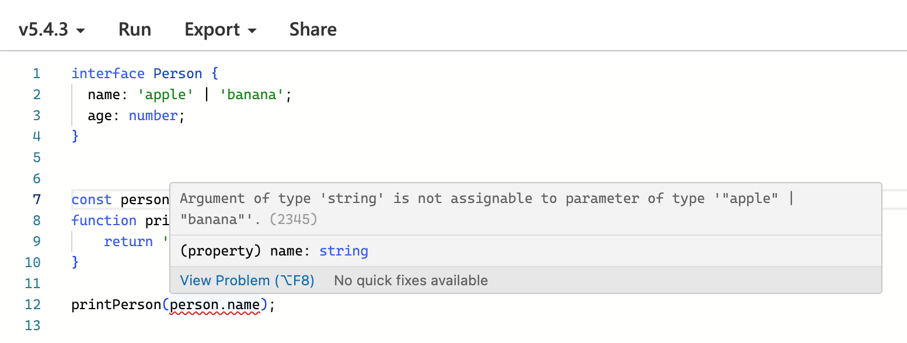

> Argument of type 'string' is not assignable to parameter of type '"apple" | "banana"'.(2345)

타입스크립트 사용시 때때로 예상치 못한 타입 호환성 문제에 직면하곤 합니다. 엄격한 타입 시스템을 가지고 있는 타입스크립트로 코드를 작성하다 보면 더욱 이러한 문제와 자주 직면합니다. 하지만 다행히도, 타입스크립트는 이러한 문제들을 해결할 수 있는 강력한 도구들을 제공합니다. 이 글에서는 타입 호환성 문제를 해결하는 데 있어 `as const`와 `satisfies`라는 두 가지 도구의 사용 방법과 각각의 장점에 대해 알아보겠습니다.

먼저 우리가 자주 마주할 수 있는 상황을 예시 코드로 살펴보겠습니다.

```tsx
interface Person {
  name: 'apple' | 'banana';
  age: number;
}

const person = { name: "apple", age: 28 };

function printPerson(name: Person['name']) {
    return 'hello ' + name;
} 

// 🥵 에러 발생
printPerson(person.name);
```

위에 에러 메시지는 함수의 인자로 예상되는 타입과 실제로 전달된 타입이 일치하지 않을 때 발생합니다. 이 경우, `printPerson` 함수는 `"apple"` 또는 `"banana"`라는 구체적인 문자열 타입을 기대하지만, `person.name`은 일반적인 `string` 타입으로 추론되어 타입 불일치 문제가 발생합니다.



이 문제는 `as const` 또는 `satisfies`를 통해서 해결할 수 있습니다.

```tsx
// 해결1
const person = { name: "apple", age: 28 } as const;

// 해결2
const person = { name: "apple", age: 28 } satisfies Person;

```

어떻게 `as const`와 `satisfies`를 통해서 문제를 해결할 수 있는지, 각각의 개념과 기능에 대해서 조금 더 자세히 알아보겠습니다.

## `as const` 사용하기

`as const`는 타입스크립트의 타입 단언(type assertion) 기능 중 하나로, 리터럴은 일반적인 원시 타입이 아닌 리터럴 그 자체로 유지하며, 배열은 가변 배열이 아닌 읽기 전용 튜플로 취급하고, 객체의 속성은 읽기전용으로 간주합니다.

### 장점

- **불변성 보장**: `as const`를 사용하면 객체의 속성이나 배열의 요소를 변경할 수 없게 됩니다.
- **정확한 타입 추론**: 리터럴 타입이 그대로 유지되기 때문에, 타입스크립트는 더 정확하게 타입을 추론할 수 있습니다.

### 사용 예시

```tsx
const person = { name: "apple", age: 28 } as const;
```

위 코드에서 `person` 객체는 읽기 전용(readonly)이 되며, `name` 속성은 `"apple"`이라는 리터럴 타입으로 추론됩니다.

## `satisfies` 사용하기

`satifies` 연산자는 타입스크립트 4.9 버전에서 도입된 새로운 기능으로, 변수나 객체가 특정 타입을 만족하는지를 검사할 때 사용됩니다. 이 연산자는 명시적인 타입 선언 없이도 타입의 호환성을 체크할 수 있게 해줍니다.

### 장점

- **명시적인 타입 체크**: `satisfies` 연산자를 사용하면, 개발자는 코드에서 명시적으로 특정 타입을 만족해야 한다는 것을 컴파일러에 알릴 수 있습니다.
- **코드의 읽기 쉬움**: 타입 체크가 코드 내부에서 이루어지므로, 다른 개발자가 코드를 읽을 때 해당 변수나 객체가 어떤 타입을 만족해야 하는지 쉽게 이해할 수 있습니다.

### 사용 예시

```tsx
const person = { name: "apple", age: 28 } satisfies Person;
```

이 경우, `person` 객체는 `Person` 인터페이스의 타입 요구 사항을 만족해야 합니다. (불만족시 에러 발생)

## 두 방법의 차이점

- **타입의 명시성**: `as const`는 타입스크립트에게 객체 리터럴의 모든 속성을 최대한 정확하게 추론하도록 합니다. 반면, `satisfies`는 개발자가 객체가 만족해야 할 명시적인 인터페이스 타입을 제공합니다.
- **용도와 적용 범위**: `as const`는 주로 값의 변동성을 제한하고, 리터럴 타입을 유지하려는 경우에 사용됩니다. 이에 비해 `satisfies` 연산자는 객체가 특정 인터페이스나 타입을 만족하는지를 확인하는 데 더 적합합니다.

## 결론

`as const`와 `satisfies`는 타입스크립트에서 타입 호환성 문제를 해결하는 데 유용한 도구입니다. 각각의 접근법은 상황에 따라 다른 장점을 제공하므로, 개발자는 문제의 맥락을 고려하여 가장 적합한 방법을 선택해야 합니다. 이러한 이해를 바탕으로, 우리는 타입스크립트의 타입 시스템을 보다 효과적으로 활용하여 안정적이고 유지보수하기 쉬운 코드를 작성할 수 있습니다.